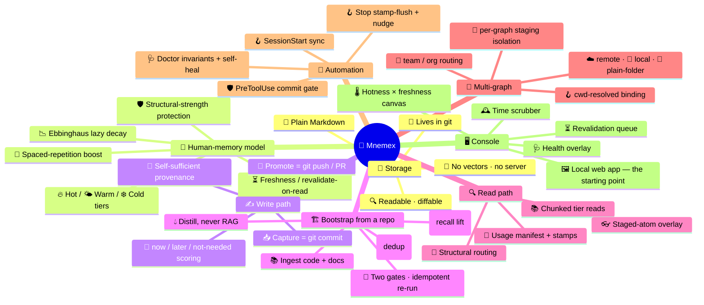
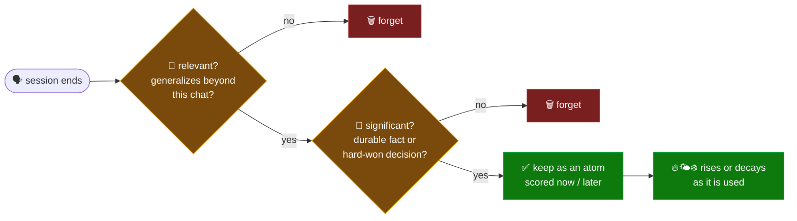
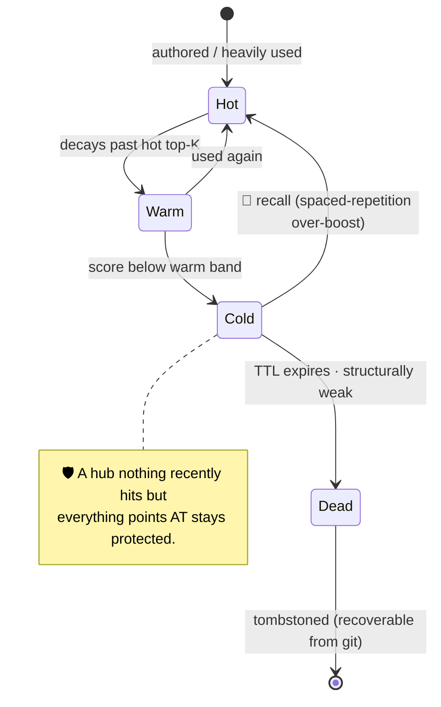
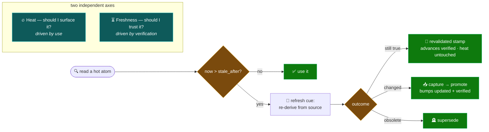
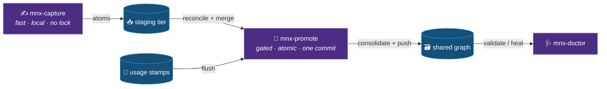
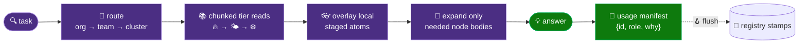
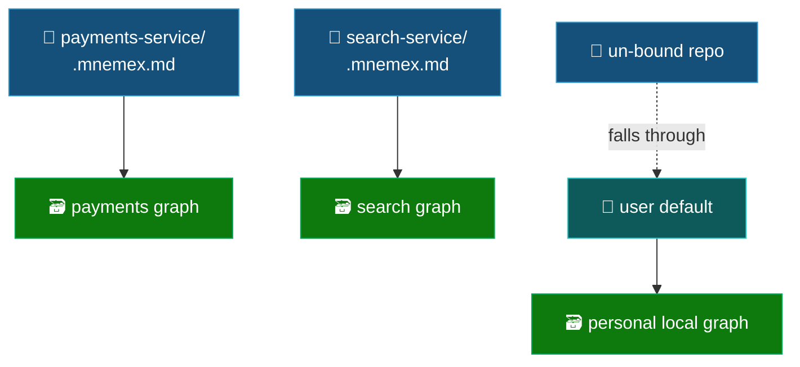

<div align="center">

# ✨ Mnemex — Feature Showcase

### 🧠 Auto-memory for LLM agents — it decides what mattered and keeps it, so you don't have to.

<p>
  
  
  
  
  
  
  
  
</p>

*A self-pruning, human-memory-modeled knowledge context graph — no embeddings, no database, no infra.*

</div>

---

## 🗺️ The whole feature map, at a glance



---

## 🌟 The headline: it remembers like you do

You never consciously decide to memorize everything in a conversation — your mind quietly judges what was
**significant** and keeps it. **Mnemex is auto-memory in exactly that sense.** When a session ends it asks
the questions a person would, and keeps only what passes:



> 🧭 **You build; Mnemex remembers what mattered.** And the judgment is reviewable — capture stages locally,
> you can inspect or un-stage anything before a deliberate promote. *Automatic, but never unaccountable.*

---

## 🧩 1 — Storage that's just files

| ✅ Feature | 💬 What it means for you |
|---|---|
| 📄 **Plain Markdown nodes** | Every knowledge unit is a human-readable `.md` file with YAML front-matter. |
| 🌿 **Lives in a git repo** | Every mutation is a reviewable commit — full history, blame, diff, revert. |
| 🚫 **No vector database** | No embedding pipeline, no index to operate, no opaque retrieval. |
| 🚫 **No server** | Nothing to deploy or keep alive; it's a Claude Code plugin over files. |
| 🧮 **One dependency** | `PyYAML`. Everything else is the Python standard library. |

---

## 🧠 2 — A memory that tiers, decays, and protects

Relevance is a **number computed on demand** from a usage log — modeled on the *Ebbinghaus forgetting curve*
and *spaced repetition*. Used things stay hot and cheap to reach; unused things drift down and eventually die
— **unless something structurally important still points at them.**



- 🔥🌤️❄️ **Hot / Warm / Cold tiers** — self-organizing, so the budget *is* the ranking *is* the forgetting.
- 📉 **Lazy decay** — nothing is written as time passes; score is `strength · exp(−λ·Δt)` at read time.
- 🔁 **Spaced-repetition boost** — recalling a cold node can shoot it back to hot.
- 🛡️ **Structural strength** — well-connected hubs survive even when rarely hit directly.
- 🧭 **Patterns outlive facts** — pattern nodes persist ~30% longer than domain facts (`pattern_halflife_bonus`).

---

## ⏳ 3 — Freshness: being *hot* doesn't make it *true*

Reinforcement makes a fact **loud**, never **correct** — so a frequently-read fact can quietly go out of date
while the graph vouches for it harder every time. Mnemex adds a **second axis, orthogonal to heat**: every atom
has a `verified` clock, and when it hasn't been re-confirmed within its horizon it is flagged **stale** on read —
even if it's hot — so the agent re-checks it against the source before relying on it.



- ⏳ **`fresh` / `stale`** — a validity label separate from `hot`/`warm`/`cold`; heat can never mask staleness.
- 🔔 **Revalidate-on-read** — the cue fires *only* when a stale atom is actually surfaced (no background sweeps).
- 💸 **Cheap when unchanged** — "still true" is one weight-0 `revalidated` stamp; no re-promote round-trip.
- 🎚️ **One knob, layered** — set `freshness_ttl_days` once; patterns get a longer horizon automatically; tag the
  rare outlier `volatility: volatile` (URLs, versions, prices) or `timeless`.
- 🗿 **`timeless` never dies** — an eternal definition is exempt from staleness **and** from auto-tombstoning; it
  can leave only by an explicit human supersede.

> 📖 The full model: [`docs/freshness-and-revalidation.md`](docs/freshness-and-revalidation.md)

---

## ✍️ 4 — Writing split like `git`: capture then promote

The write path is deliberately two halves — the **`git commit`** and the **`git push`/PR** of memory.



| Half | 🎛️ Command | Superpower |
|---|---|---|
| 📥 **Capture** | `/mnemex:mnx-capture` | Mines the *live transcript* (facts **and** review corrections) → scores each atom `now`/`later`/`not-needed` → stages locally with self-sufficient provenance. No lock, no push, fully reversible (`--drop` / `--discard-all`). |
| 🚀 **Promote** | `/mnemex:mnx-promote` | The single writer: flush stamps → reconcile + merge (clean-context sub-agent, **human gate on contradictions**) → consolidate (decay/re-tier/death/edge-hygiene/budget) → doctor → push → clear staging. Atomic + total; `--retry-push` lands a committed-but-unpushed merge without re-merging. |
| 🏗️ **Ingest** | `/mnemex:mnx-ingest <repo>` | **Bootstrap from an existing code/doc repo** (local or remote) — no live session. Walks → **distills** durable atoms (never transcribes) → dedups entities (one node per entity) → wikifies `[[links]]` → stages a labeled **bulk batch** that `mnx-promote --bulk` merges. **Two gates only**, idempotent on re-run (a deleted file → *orphan candidate*, never auto-death); only stages (promote is the sole writer), never reads secrets, never mutates the source. |

---

## 🏗️ 4½ — Bootstrap a whole graph from a repo you already have

You don't have to grow a graph one session at a time. Point Mnemex at a repository and it builds the memory
for you — **one command, no live session**:

```bash
/mnemex:mnx-ingest github.com/acme/payments-service     # or a local path
```

It reads the **entire code + doc corpus** and turns years of accumulated docs, ADRs, API contracts, and
code comments into a live, connected graph — the day-one graph and the hand-grown graph are the *same shape*.

| ✅ Feature | 💬 What it means for you |
|---|---|
| 💧 **Distills, doesn't dump** | An LLM mines each file for the durable *facts* and *decisions* worth keeping — the graph is *distilled memory*, **not** a vector/RAG index over your repo. Zero atoms from a boilerplate file is a valid answer. |
| 🧬 **One entity → one node** | Entity resolution collapses the same fact stated five ways (README + design doc + code comment) into **one well-sourced node** with unioned aliases — redundancy becomes provenance, never duplicate nodes. |
| 🔀 **Two gates, not a thousand** | Approve the scope + routing map **once** up front, then a single bulk summary at the end — **never** per-atom review. A monorepo is one decision. |
| ♻️ **Idempotent re-runs** | Run it again after the repo changes and it imports **only the diff**; a deleted source file becomes an *orphan candidate* you judge — never silent auto-death. |
| 🛡️ **Safe by construction** | Ingest **only stages** (promote stays the sole writer), **never reads secrets**, and **never mutates the source**. |
| 🔎 **Gleaning (recall lift)** | A bounded "what did I miss?" pass raises extraction completeness — and the same technique improves ordinary session capture too. |

Under the hood it's a **source adapter**, not a new subsystem: everything downstream — reconcile, merge, the
wiki mesh, consolidate, doctor, push — is the **same pipeline** your daily captures flow through, drained by
`mnx-promote --bulk`. Full model: [`docs/corpus-ingestion.md`](docs/corpus-ingestion.md).

---

## 🔍 5 — Reading without context bloat

`mnx-read` is *context-budget-aware*: it routes structurally and reads in chunks, expanding only the nodes
it actually needs.



- 🧭 **Structural routing** — match one-line index descriptions; no similarity search.
- 📚 **Chunked reads** — index heads first, node bodies only when needed — the budget stays small.
- 👓 **Staged-atom overlay** — reads see this session's un-promoted captures too.
- 🧾 **Usage manifest** — every loaded node gets `{id, role, why}`; no defensible *why* ⇒ unstamped.
- 🪝 **Pure w.r.t. knowledge** — the only write is an append-only usage stamp.

> 🪙 **Token-frugal by construction.** *Tier is read cost:* a read spends a few small index-head reads
> **plus only the node bodies it commits to** — never the whole corpus, never a wall of retrieved chunks.
> Because the hot routing head is capacity-bounded and the graph self-prunes, that cost stays small as the
> graph grows into the thousands of nodes — exactly where context-stuffing and vector-RAG get most expensive.

---

## 🔗 6 — Built for many graphs, teams & orgs

One author, many repos, a personal graph, and a team inside an org — all resolved without manual switching.



- 🪝 **cwd-resolved binding** — `.mnemex.md` → env → user config; the nearest one wins.
- 👥 **Org → team → cluster routing** — knowledge files itself by *what it's about*, with `default_team` fallback.
- 🧊 **Per-graph staging isolation** — captures for different graphs can never commingle or cross-promote.
- ☁️📂🧾 **Three graph kinds** — git-remote (clone + push), git-local (commit), plain-folder (audit log).
- 🛟 **No-auth fallback** — a failed remote pre-flight offers a local-folder graph instead.

> 📖 The full multi-graph model: [`docs/multi-graph-and-team-routing.md`](docs/multi-graph-and-team-routing.md)

---

## 🤖 7 — Automation that keeps the good habits for you

The hooks make sync, stamping, capture nudges, and the commit gate happen **without you remembering them** —
and every hook is *safe*: it syncs, warns, prompts, or gates, but never mutates knowledge on its own.

| 🪝 Hook | Fires when | Does |
|---|---|---|
| **SessionStart** | session begins | Syncs the graph to HEAD, asks **once** whether to use Mnemex, nags on pending work. |
| **Stop** | a turn ends | Flushes this turn's usage stamps and nudges you to capture. |
| **PreToolUse** | a graph `git commit` | **Denies** the commit if it would land an invariant error (fails open on any internal error). |
| **SessionEnd** | session closes | Flushes stamps, nudges capture, tidies markers. |

Plus the on-demand health tools:

- 🩺 **`mnx-doctor`** — checks every invariant (edge targets exist, index matches nodes, denormalized copies
  fresh, reverse map consistent) and `--fix` regenerates derived files *from the nodes* (truth is never auto-edited).
- 📊 **`mnx-status`** — what's bound, its kind, node/tier counts per team, pending stamps, last gc, health.

---

## 🖥️ 8 — The Console: your starting point, and the window into the memory

The **OpenMnemex Console** is where the journey begins — one command opens it, you add your
agents from its UI, and it stays your view into the graph they build (same engine underneath,
no separate database, no separate math):

```bash
uvx openmnemex        # bare command = open the Console; also: openmnemex console
```

| ✅ Feature | 💬 What it means for you |
|---|---|
| 🌡️ **Hotness × freshness canvas** | Node size + teal depth = how heavily used; amber/red dashed rings = due/overdue for a re-check. A **hot-but-stale** atom (big node, red ring) is unmissable — exactly the fact most likely to be confidently wrong. |
| 🔍 **Mesh, search, full atoms** | Click a node to light up its mesh; search the graph; open the fully rendered atom with clickable `[[wiki-links]]` — red-links show as ghosts ("not written yet, wanted by …"). |
| ⏳ **Revalidation queue** | Every atom with a freshness horizon, soonest-stale first — your "what should I re-check today" list, one click from its place on the canvas. |
| 🩺 **Health overlay** | Doctor findings pinned onto the affected nodes; fixing stays with `mnx-doctor --fix`. |
| 🕰️ **Time scrubber** | Drag up to a year ahead and watch the *same* graph age in place — the server recomputes every number at the projected date; nothing is written. |
| 🔌 **Add agents, one click** | The Add agents screen detects the coding agents on your machine and wires any of them to Mnemex with one click — the same write the CLI installer does, no commands to paste. For Claude Code it recommends the richer plugin route and shows the exact commands. |
| 🔒 **Knowledge stays view-only** | Browsing never changes a graph file. No edit buttons, no desktop app, no auth — local (`127.0.0.1`) and single-user by design (`LIMITATIONS.md` #5). |

> 📖 The full tour: [`docs/console.md`](docs/console.md)

---

<div align="center">

## 🚀 Ready to try it?

```bash
pip install pyyaml
/plugin marketplace add kritird/OpenMnemex
/plugin install mnemex@mnemex-marketplace
/mnemex:mnx-init
```

**📚 Go deeper:** [Overview](docs/overview.md) · [Rationale](docs/rationale-and-concepts.md) · [User Journey](docs/user-journey.md) · [Multi-Graph](docs/multi-graph-and-team-routing.md)

*Knowledge is files. Navigation is the filesystem. Relevance is a number you compute on demand.* 🧠

</div>
