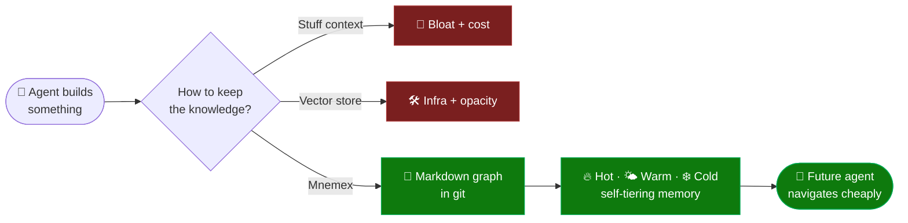
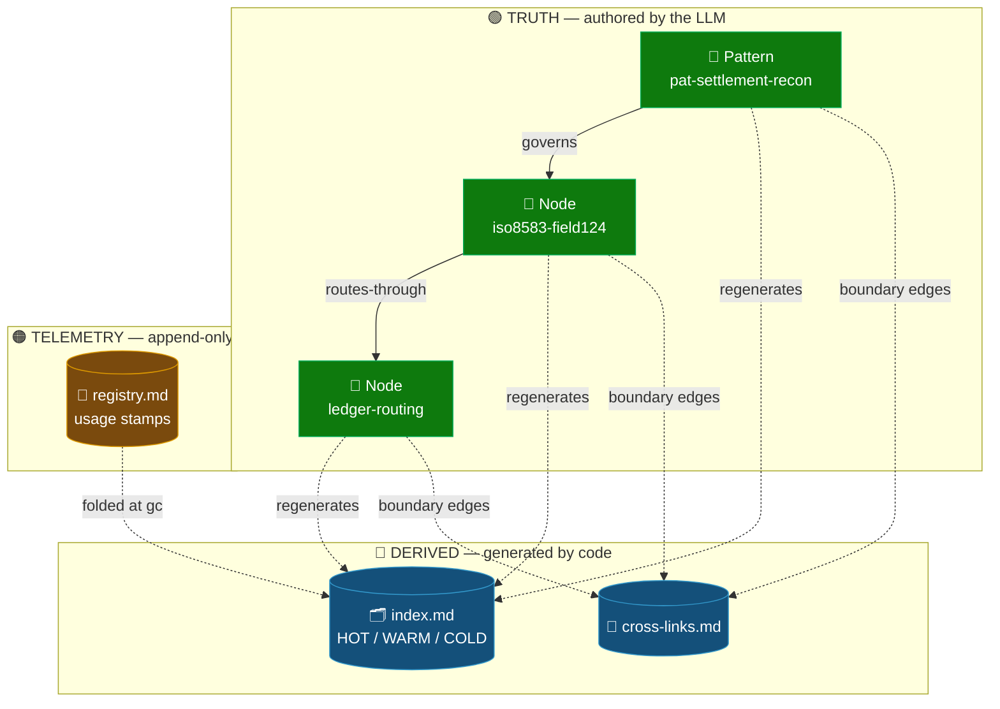
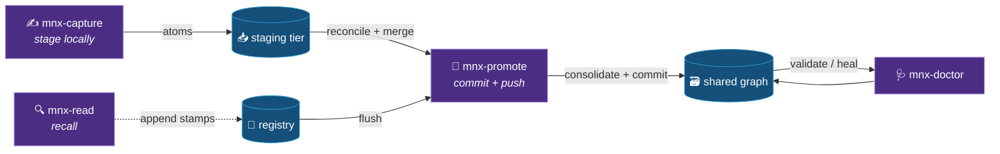

```
███╗   ███╗  ███╗   ██╗  ███████╗  ███╗   ███╗  ███████╗  ██╗  ██╗
████╗ ████║  ████╗  ██║  ██╔════╝  ████╗ ████║  ██╔════╝  ╚██╗██╔╝
██╔████╔██║  ██╔██╗ ██║  █████╗    ██╔████╔██║  █████╗     ╚███╔╝ 
██║╚██╔╝██║  ██║╚██╗██║  ██╔══╝    ██║╚██╔╝██║  ██╔══╝     ██╔██╗ 
██║ ╚═╝ ██║  ██║ ╚████║  ███████╗  ██║ ╚═╝ ██║  ███████╗  ██╔╝ ██╗
╚═╝     ╚═╝  ╚═╝  ╚═══╝  ╚══════╝  ╚═╝     ╚═╝  ╚══════╝  ╚═╝  ╚═╝
```

<p align="center"><b>Auto-memory for LLM agents — it decides what mattered and keeps it, so you don't have to. A self-pruning, human-memory-modeled knowledge context graph.</b></p>

<p align="center">
  
  
  
  
  
  
  
</p>

> 🧠 Self-curating, navigable, context-budget-aware **agent memory** that judges your session for
> what's worth keeping — with no vector database, no embedding pipeline, and no server. Just Markdown
> in a git repo. Works as a Claude Code plugin.

Mnemex (from *Mnemosyne*, the personification of memory, + the engineering suffix *-ex*) is a
specification **and** a Claude Code plugin for capturing the durable knowledge an agent produces —
the **what** (domain facts) and the **how** (the patterns and review decisions that govern good
work in a domain) — into a plain-Markdown graph that lives in a git repository, organizes itself
into human-like memory tiers (**🔥 hot / 🌤️ warm / ❄️ cold**), and forgets what stops being useful while
protecting what is structurally important.

It is designed to give agents long-term, navigable, *context-budget-aware* memory **without a vector
database, without an embedding pipeline, and without a server.** Routing is structural (folder +
index traversal), decay is lazy (computed, never swept), and every mutation is a reviewable git
commit.

---

<div align="center">

### 🧭 Start here

**[✨ Features](FEATURES.md)** &nbsp;·&nbsp; **[0️⃣ Overview](docs/00-overview.md)** &nbsp;·&nbsp; **[🏛️ Architecture](docs/02-architecture.md)** &nbsp;·&nbsp; **[🧭 User Journey](docs/12-user-journey.md)**

</div>

---

## 💡 Why this exists

Agents are excellent at producing knowledge inside a session and terrible at keeping it. The two
common fixes both have sharp costs:

| ❌ Common fix | 💸 The cost it carries |
|---|---|
| **Stuff everything into context** | Context bloat, cost, and attention dilution. |
| **Embed everything into a vector store** | Infrastructure, an embedding pipeline, an index to operate, and opaque retrieval you cannot read or diff. |

Mnemex takes a **third path**. Knowledge is **files**. Navigation is the **filesystem plus small index
files** you read in chunks. Relevance is a **number you compute on demand** from a usage log, modeled
on the *Ebbinghaus forgetting curve* and *spaced repetition*: things used often stay visible and
cheap to reach; things unused drift down the tiers and, eventually, die — unless something still
points at them. The result is a knowledge base that behaves like memory rather than a landfill.



The full reasoning behind each design choice is in
[`docs/01-rationale-and-concepts.md`](docs/01-rationale-and-concepts.md).

---

## 🧠 It remembers like you do — automatically

You don't consciously decide to memorize everything that happens in a conversation. Your mind
quietly judges, in the background, what was *significant* and what was noise — and keeps the former
without you ever asking it to. **Mnemex is auto-memory in exactly that sense.** You do the work; it
watches the session and decides what is worth keeping.

When a session ends, Mnemex looks at what actually happened and asks the questions a person would:

- **Is this relevant?** — does it generalize beyond this one conversation, or was it throwaway scaffolding?
- **Is this significant?** — a durable domain fact or a hard-won review decision, versus an incidental detail?
- **Is this novel?** — something the graph doesn't already know, versus a restatement of what's there?

It **captures the knowledge that passes** and **ignores the rest.** Concretely, capture extracts
candidate atoms from the session and scores each one `now` / `later` / `not-needed` — the explicit
keep / defer / forget judgment. The author doesn't curate, tag, or decide what to file away; that
salience call is Mnemex's job, and what survives later rises or decays on its own through the
🔥 hot / 🌤️ warm / ❄️ cold tiers as it gets used or stops being used.

And just like your own memory, being *frequently recalled* is not the same as being *still true*. Mnemex
tracks that too, on a **separate axis**: every fact carries a `verified` clock, and when it hasn't been
re-confirmed within a horizon you set (`freshness_ttl_days`), it's flagged ⏳ **stale** the next time it's
read — even if it's hot — so the agent re-checks it against the source instead of confidently repeating
something outdated. Confirm it's unchanged and the clock resets for one cheap stamp; find it's wrong and
the correction flows back in through capture. (Full model:
[`docs/14-freshness-and-revalidation.md`](docs/14-freshness-and-revalidation.md).)

The author doesn't worry about any of this. You build; Mnemex remembers what mattered — and flags what may
have gone stale. 🧭

> The judgment is reviewable, not a black box: capture stages locally and you can inspect or
> un-stage anything (`mnx-status`, `mnx-capture --drop`) before a deliberate `mnx-promote` commits
> it to the shared graph. *Automatic, but never unaccountable.*

---

## 🪙 Built to burn fewer tokens

A knowledge base is only worth having if *reading* it is cheap. The two usual approaches quietly tax
every single query: stuffing prior knowledge into the prompt pays for the whole pile on every turn, and
vector-RAG pastes the top-*k* retrieved chunks into context each time you ask. Both get **more** expensive
as the corpus grows.

Mnemex is architected the other way: **tier is literally read cost**, so the tokens a read spends scale
with the *path you take*, not the *size of the graph*. You navigate by reading tiny index heads and open
only the handful of node bodies you actually commit to.

| 🎯 Mechanism | 🪙 Why it spends fewer tokens |
|---|---|
| 🧭 **Route, don't retrieve** | You read one-line index heads to *pick a path* (org → team → cluster). Nothing is pasted into context on spec. |
| 🔥 **Hot = top-K, chunk 1** | The routing head is capacity-bounded — it stays small even in a huge graph, so the baseline read is bounded regardless of node count. |
| 📚 **Chunked tier reads, stop early** | Read **Hot** first; it's usually enough. **Warm/Cold** only on demand. You rarely load a whole index, never the whole graph. |
| 🏷️ **Match on denormalized summaries** | Each index row carries the node's `summary`+`aliases`, so you *match without opening a single node body*. |
| 🔎 **Expand only on commit** | Load only the bodies you'll actually use, within a per-hop token budget — beam search, not "load every neighbor". |
| 🗑️ **Self-pruning** | Decay + death keep the routing surface small over time — no landfill of dead knowledge to page through. |
| ⏳ **Trust the fresh, re-check only the stale** | A verified fact is used as-is; you don't re-derive known knowledge from scratch — only a *stale* atom triggers a re-check. |

> 💡 **The payoff:** a read is a few small index-head reads **plus only the node bodies you commit to** —
> not the corpus, not a wall of retrieved chunks. Retrieval stays cheap as the graph grows into the
> thousands of nodes, which is exactly where naive context-stuffing and RAG get most expensive.

---

## 🗺️ The shape in one screen

```
your-knowledge-repo/            ← a normal git repo you point Mnemex at
  index.md                      ← org router (which teams exist)
  mnemex.config.md              ← your tunable parameters (half-life, budgets, cadence …)
  .mnemex/                      ← protocol state (locks, high-water marks, version stamps)
  team-payments/
    index.md                    ← team router (which domains)  +  HOT / WARM / COLD sections
    registry.md                 ← append-only usage log (the write buffer)
    cross-links.md              ← GENERATED: inter-cluster edges within this team
    settlement/
      index.md                  ← domain sub-index (chunked: routing head, then node table)
      registry.md
      iso8583-field124.md       ← a NODE (pure knowledge; no bookkeeping inside)
      ledger-routing.md
      pat-settlement-recon.md   ← a PATTERN node (a "how", with a trigger)
```

### How the three file kinds relate



Three kinds of file, three jobs (this separation is the core of the design):

| File | Holds | Mutated when |
|---|---|---|
| 📄 **Node** (`*.md`) | Pure knowledge: summary, body, edges, provenance. | Only on author / re-author / supersede / death / revalidation (`verified`). |
| 🗂️ **Index** (`index.md`) | Derived navigation + materialized memory state (strength, tier). | Only by the maintenance pass (and write-apply). |
| 📝 **Registry** (`registry.md`) | Append-only usage stamps. | Appended on confirmed use; truncated only by checkpointed compaction. |

---

## ⚙️ The four operations

Four of Mnemex's skills are memory operations, each fronted by a slash command. They map to the verbs of
a memory system (two more skills, `mnx-init` and `mnx-status`, handle setup and status — see below).
Knowledge writing is split **capture / promote** — the `git commit` vs `git push`/PR of memory.

| 🎛️ Command | Skill | What it does | Mutates? |
|---|---|---|---|
| 🔍 `/mnemex:mnx-read` | `mnx-read` | Route → read tiered indexes in chunks → **overlay** local staged atoms → expand only needed nodes → **flag stale atoms** for revalidation → emit a **usage manifest** → append stamps for nodes actually used. | Registry append only (pure w.r.t. knowledge). |
| ✍️ `/mnemex:mnx-capture` | `mnx-capture` | Capture the **current session** (artifact + human review points) → extract atoms → **score** each `now/later/not-needed` → **stage** locally with self-sufficient provenance. Cheap, local, no lock. Also **curates** staging: `--drop <id>` / `--discard-all` un-stage (review via `mnx-status`) — the local un-stage and the hard-cap escape valve. | No — writes only the local staging tier. |
| 🚀 `/mnemex:mnx-promote` | `mnx-promote` | The deliberate merge: flush stamps → **reconcile + merge** staged atoms (clean-context sub-agent, HITL on contradictions) → **consolidate** the post-merge graph (decay/re-tier/death/edge-hygiene/budget) → doctor → push → clear staging. If a push fails after commit, `--retry-push` lands the existing commit (never re-merges). | Yes — gated, atomic, one commit. |
| 🩺 `/mnemex:mnx-doctor` | `mnx-doctor` | The validator: checks every invariant (edge targets exist, index matches nodes, denormalized copies are fresh, reverse map consistent, no dangling edges) and can self-heal derived files. | Repair mode only. |

The maintenance pass (`mnx-consolidate`) is **internal** — the back half of `mnx-promote`, with no
standalone slash command.



Two further skills round out the surface. `/mnemex:mnx-init` is the setup/preflight: it **binds** a
project (or your user account) to a graph repo — creating and scaffolding a new graph, or pointing at an
existing one — and is what every other command resolves first. For a git-remote graph it runs a
read-only reachability/auth pre-flight before binding and, on failure, offers a no-auth local-folder
fallback. `/mnemex:mnx-status` is a read-only at-a-glance status: what graph is bound, its kind,
node/tier counts per team, pending usage stamps, last gc, and a health summary. See
[`docs/10-binding-and-graph-sync.md`](docs/10-binding-and-graph-sync.md).

Phase-by-phase breakdowns are in
[`docs/04-skills-commands-hooks.md`](docs/04-skills-commands-hooks.md) and
[`docs/05-maintenance-pass-algorithm.md`](docs/05-maintenance-pass-algorithm.md).

---

## 📦 Install

```bash
# 1. Install the one runtime dependency (Python standard library covers everything else):
pip install pyyaml

# 2. In Claude Code, add this repo as a marketplace, then install the plugin:
/plugin marketplace add kritird/Mnemex-Context-Graph
/plugin install mnemex@mnemex-marketplace

# 3. Scaffold or bind a knowledge repo (the binding step every other command resolves):
/mnemex:mnx-init
```

> [!TIP]
> Requirements: Claude Code and Python 3.9+. The only third-party Python package is
> [`PyYAML`](https://pypi.org/project/PyYAML/) (`pip install pyyaml`); everything else is the
> standard library. If `PyYAML` is missing, the Mnemex commands report it and tell you to install it
> rather than failing cryptically.

A complete walkthrough — from install to daily usage, with the hooks that fire automatically — is in
[`docs/12-user-journey.md`](docs/12-user-journey.md). 🧭

---

## 📚 Read the standard

The documents in [`docs/`](docs/) are written to be self-explanatory and read in order. Every acronym
is expanded on first use and collected in the appendix.

| # | Document | What it covers |
|---|---|---|
| 0️⃣ | [`00-overview.md`](docs/00-overview.md) | The thesis and the design goals, in brief. |
| 1️⃣ | [`01-rationale-and-concepts.md`](docs/01-rationale-and-concepts.md) | Every core concept and *why* it is shaped that way. |
| 2️⃣ | [`02-architecture.md`](docs/02-architecture.md) | The three-layer model, memory tiers, lazy-decay math, and *budget = ranking = forgetting*. |
| 3️⃣ | [`03-data-model-and-schemas.md`](docs/03-data-model-and-schemas.md) | Exact file formats for node, index, registry, cross-links, config, and staged atom. |
| 4️⃣ | [`04-skills-commands-hooks.md`](docs/04-skills-commands-hooks.md) | The skills, their command surfaces, and the hooks that do what skills cannot. |
| 5️⃣ | [`05-maintenance-pass-algorithm.md`](docs/05-maintenance-pass-algorithm.md) | The snapshot-then-apply algorithm in full, with ordering guarantees. |
| 6️⃣ | [`06-script-contracts.md`](docs/06-script-contracts.md) | Deterministic helper contracts (signatures, I/O, invariants). |
| 7️⃣ | [`07-configuration.md`](docs/07-configuration.md) | The config schema, derived half-life, and config-version re-normalization. |
| 8️⃣ | [`08-invariants-and-failure-modes.md`](docs/08-invariants-and-failure-modes.md) | The validator invariant list and the failure-mode register with mitigations. |
| 9️⃣ | [`09-appendix-glossary-acronyms.md`](docs/09-appendix-glossary-acronyms.md) | Glossary, acronym expansions, parameter reference, FAQ, references. |
| 🔟 | [`10-binding-and-graph-sync.md`](docs/10-binding-and-graph-sync.md) | How an author in any repo binds to a separate knowledge-graph repo. |
| 1️⃣1️⃣ | [`11-staging-and-promotion.md`](docs/11-staging-and-promotion.md) | The **capture / promote** split: staging tier, atom schema, budgets, read overlay, atomic promote. |
| 1️⃣2️⃣ | [`12-user-journey.md`](docs/12-user-journey.md) | 🧭 End-to-end journey: install → bind → daily read/capture/promote, with auto-hook touchpoints. |
| 1️⃣3️⃣ | [`13-multi-graph-and-team-routing.md`](docs/13-multi-graph-and-team-routing.md) | 🔗 Working across many graphs, teams & orgs: which-graph vs which-team, per-graph staging, worked example. |
| 1️⃣4️⃣ | [`14-freshness-and-revalidation.md`](docs/14-freshness-and-revalidation.md) | ⏳ The **freshness** axis: `verified` clock, `stale_after`, read-time refresh cue, `volatility`, timeless-never-dies. |

See also: [`FEATURES.md`](FEATURES.md) (feature showcase).

---

## 📄 License

MIT. See [`LICENSE`](LICENSE).
