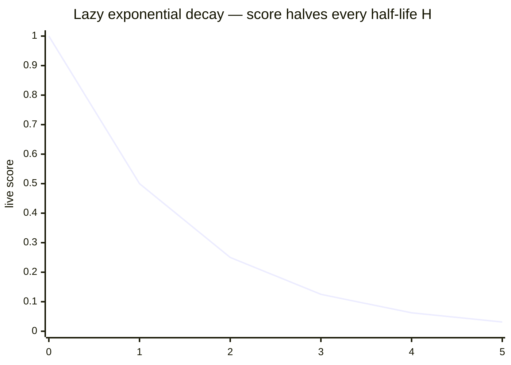
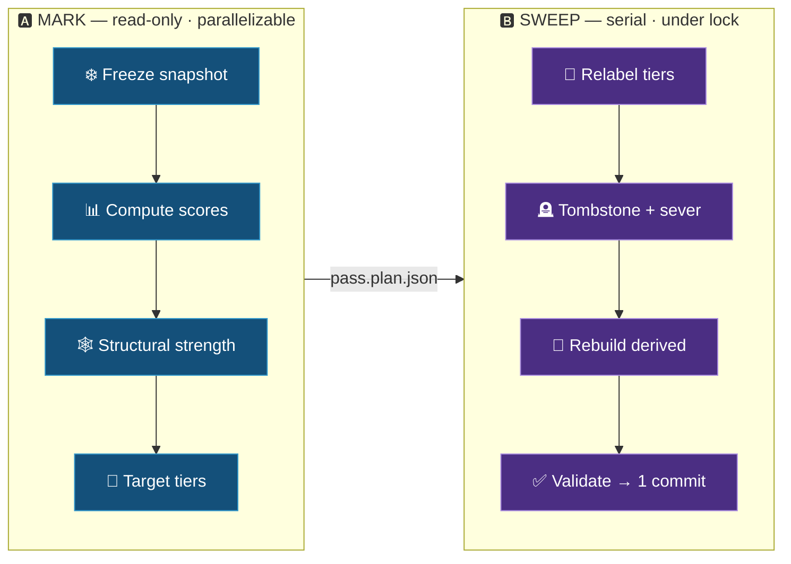

# ⚙️ 02 — Architecture: Memory Dynamics

This document specifies the *mechanics* — how relevance is computed, how the registry/index/compaction
interact, how tiering works without thrash, and why the whole thing costs almost nothing in read/write
cycles. Acronyms: **LSM** = Log-Structured Merge-tree; **WAL** = Write-Ahead Log; **TTL** = Time-To-Live;
**LFU** = Least-Frequently-Used; **MLFQ** = Multi-Level Feedback Queue.

---

## 1️⃣ Strength is computed, not stored-and-ticked

Each node has two materialized numbers **in the index** (not in the node): `strength` and
`last_update`. The live relevance at any instant is an exponential decay of strength since the last
update:

```
score(now) = strength · exp( −λ · Δt ),     Δt = max(0, now − last_update)
```



*(x-axis = elapsed time in multiples of the half-life `H`; the score halves at each step.)*

- **`λ` (decay constant)** is derived from a configured **half-life** `H`: `λ = ln(2) / H`. After
  `H` days an untouched node's score halves.

> [!WARNING]
> **`Δt` is clamped to ≥ 0** — this is non-negotiable. Timestamps come from different sessions and
> possibly different machines; clock skew or timezone error could otherwise make `Δt` negative and
> turn decay into *growth*. All timestamps are written in **UTC, ISO-8601**, by a single helper
> (`scripts/mnx_common.py`), and never hand-written by the model.

**The point:** decay is *free*. It is just the exponential evaluated at read time. Nothing is written
when time passes. The stored numbers change **only on a confirmed use event**:

```
on use (role r):
    s        = score(now)                      # decay the old strength to now
    strength = min( STRENGTH_MAX, s + boost(r) )   # saturating add
    last_update = now
```

This is exactly how Redis LFU eviction works: a counter plus a last-access time, decayed lazily on
access. No background sweep, no write amplification, no decay loop.

### 🧊 Strength saturation (prevents immortal nodes)

> [!IMPORTANT]
> The `min(STRENGTH_MAX, …)` is **load-bearing**. Without it, a daily-used node ratchets `strength`
> upward without bound until no realistic amount of decay can ever demote it — an **immortal node** that
> defeats the entire forgetting model.

The `min(STRENGTH_MAX, …)` is load-bearing. Without it, a daily-used node ratchets `strength` upward
without bound until no realistic amount of decay can ever demote it — it becomes immortal and defeats
the entire forgetting model. Saturation caps a node at “fully hot,” and from there decay still governs
it. Equivalently you may use a **diminishing boost** `boost(r) · (1 − strength/STRENGTH_MAX)`. Nodes
that *should* be sticky (foundational hubs) are kept sticky through **structural strength** (§5), which
is reasoned about deterministically, never through a runaway usage counter.

---

## 2️⃣ The registry is the write buffer; compaction is the LSM merge

```mermaid
flowchart LR
    READ([🔍 confirmed use]) -->|append {id, ts, weight}| REG[(📝 registry.md<br/><i>memtable / WAL</i>)]
    REG -->|replay deltas after HWM| COMP[♻️ compaction<br/><i>the LSM merge</i>]
    COMP -->|materialize strength + last_update| IDX[(🗂️ index.md<br/><i>SSTable</i>)]
    COMP -->|advance| HWM[/🚩 high-water mark/]
    HWM -. next gc replays only after this .-> COMP
    classDef r fill:#7a4a0d,stroke:#d90,color:#fff;
    classDef i fill:#14507a,stroke:#39c,color:#fff;
    classDef c fill:#4b2e83,stroke:#a98ce0,color:#fff;
    class REG r;
    class IDX i;
    class COMP,HWM c;
```

Reads do not update `strength` directly — that would rewrite the index on every read. Instead:

- **Registry = the LSM memtable / WAL.** Each confirmed use appends one line `{id, ts, weight}` to the
  cluster's `registry.md`. Appends are cheap, contention-free, and need no re-sort.
- **Index `strength`/`last_update` = the SSTable.** Durable, materialized, infrequently rewritten.
- **Compaction (inside `mnx-consolidate`, promote's back half) = the merge.** Replay the registry deltas onto the materialized
  strengths, recompute, write back to the index, and advance a **high-water mark**.

The live score at any instant is therefore:

```
score(now) = (materialized strength, decayed to now)  ⊕  (replay of registry deltas since last compaction)
```

so a read can compute a node's true current score without waiting for compaction, by folding in the
recent registry tail itself.

### 🚩 Checkpoint, never truncate (prevents the compaction race)

Compaction does **not** delete registry lines. It records a **high-water mark** — the timestamp/line
it replayed up to — in `.mnemex/`, and the next compaction replays only entries after the mark. This
is standard WAL-checkpoint discipline. A stamp appended *during* a compaction is simply picked up next
time; nothing is lost to a replay-then-truncate window, even with a read in one terminal and a `gc`
in another. (Optional housekeeping may trim registry lines strictly *below* a confirmed-applied mark.)

---

## 3️⃣ Tiering without thrash: discrete tiers, not a sorted list

Maintaining a globally sorted ranking and re-sorting on every access is exactly the write-thrash we
avoid. Instead, relevance is **discretized into tiers** (hot/warm/cold), like a generational garbage
collector or an OS Multi-Level Feedback Queue (MLFQ). A node changes tier **only when its decayed
score crosses a tier boundary** — rare relative to accesses. Within a tier, fine order barely matters.

- **Hot** is a **top-K capacity bound** (configurable `hot_k`), not a score threshold. This guarantees
  chunk 1 of an index is always ≤ K entries regardless of cluster size — the property that makes
  “read hot, stop early” a guarantee rather than a hope.
- **Warm** and **cold** are score-band or count-band sections below hot.

**Tier is materialized by the maintenance pass, not computed at read.** `mnx-consolidate` ranks and writes the
`hot`/`warm`/`cold` labels into the index; `mnx-read` just reads pre-labeled sections and never ranks.
Consequence to accept: tier labels are only as fresh as the last compaction. A node used heavily since
the last consolidation may still sit in the warm/cold section until the next pass — which is *why* the
compaction-due warning (§7) exists, and why `mnx-read` folds in the registry tail (§2) when it needs a
true current score.

---

## 4️⃣ The maintenance pass is one subsystem doing three jobs

`mnx-consolidate` performs **compaction + re-tiering + budget handling** as one pass, because they are the same
ranking viewed three ways (§ Overview). The pass is strictly **two-phase, snapshot-then-apply** —
this single principle resolves the majority of the failure modes in
[`08-invariants-and-failure-modes.md`](08-invariants-and-failure-modes.md):



- **Phase A — MARK (read-only).** Freeze a snapshot of the cluster(s) + `cross-links.md`. Compute
  *all* node scores, *all* structural strengths, and *all* target tiers against that frozen view. No
  mutation. Because every decision is made against the same snapshot, results are **deterministic and
  order-independent** — node A's demotion cannot retroactively change a structural strength that node
  B's decision already used.
- **Phase B — SWEEP (apply).** Apply every decision from Phase A: rewrite index tier sections,
  tombstone dead nodes, sever edges (intra- and cross-cluster) transactionally, update `cross-links.md`
  deltas, advance the registry high-water marks, stamp `last_compaction` + `config_version`, then run
  the validator, then **one git commit**.

Full algorithm with ordering guarantees: [`05-maintenance-pass-algorithm.md`](05-maintenance-pass-algorithm.md).

---

## 5️⃣ Structural strength (the deterministic counterweight)

Computed in Phase A from the **reverse-edge map** (who points *at* this node) plus the cross-links
file:

```
structural_strength(X) = g( local_in_degree(X) + cross_cluster_in_degree(X) )
```

It is cheap because the reverse map is built from front-matter the pass already loads, and
`cross-links.md` is small by construction (boundary edges only). Retention combines the two forces:

```
retention(X) = combine( score(X, now) , structural_strength(X) )
```

A node is eligible to demote (and ultimately die) only when **both** are low. Cross-team `references`
pointers (soft) contribute **nothing** here — by design (§ Concepts 12).

---

## 6️⃣ Half-life by node type (derived, single knob)

The user configures **one** half-life `H_domain`. Pattern nodes — the hard-won *how* — should persist
longer than lookup facts, so their half-life is **derived**:

```
H_pattern = H_domain · (1 + pattern_halflife_bonus)     # bonus default e.g. 0.30 → +30%
```

The user sets one number and is *informed at config time* that patterns get the bonus; they never have
to reason about two decay rates. See [`07-configuration.md`](07-configuration.md).

---

## 7️⃣ Compaction cadence and the “maintenance due” warning

`mnemex.config.md` sets a **compaction cadence** (e.g. every N days or every M writes).
`.mnemex/last_compaction` is stamped each `gc`. On invocation, `mnx-read`:

- compares `now − last_compaction` (and/or writes-since) against the cadence, and
- if overdue, **emits a notice** to the user — *“knowledge maintenance is N days overdue; run
  `/mnemex:mnx-promote`”* (consolidation is its back half) — and may append a single `maintenance-due`
  marker line to the registry (still append-only).

**`mnx-read` never performs compaction itself.** This is a hard rule. Letting a read compact would put
a *write* (node/index mutation, file rewrites, a multi-second pause, a dirty git tree) back on the
*read* path — the exact thing the architecture removes — and two concurrent reads could both decide to
compact and race. Detect-and-warn: yes. Act: never inline. The human (or a separate non-interactive
scheduled invocation) runs `gc`.

---

## 8️⃣ Config-version stamping (prevents retroactive drift)

Because decay is computed lazily against a *stored* strength, changing `λ` (editing the half-life in
config) silently re-interprets every stored number — a batch of nodes can flash from warm to cold
overnight. Guard:

- the **`config_version`** (and the `λ` in force) is stamped into `.mnemex/` at each compaction;
- on a config change, the **next** consolidation (in `mnx-promote`) performs a one-time **re-normalization** — recomputing
  stored strengths so live scores are *continuous* across the change — before making any tier
  decisions;
- `mnx-read` warns if the config's `λ` differs from the last-compaction `λ` (*“parameters changed;
  recompaction needed before scores are valid”*).

---

## 9️⃣ Concurrency: one team lock

The apply phase of `mnx-promote` (its merge **and** its folded `mnx-consolidate`) takes a **team-root
lock** (`.mnemex/team.lock`): one mutating operation per team at a time. This is trivial for a local tool
and removes an entire class of bugs — concurrent consolidations on different clusters racing on a shared
cross-cluster referrer node, or a merge colliding with a death-sever in a sibling cluster. **Reads need
no lock** (registry appends are append-only and commutative). Within the pass, **Phase A (mark) may be
parallelized** across clusters
by read-only sub-agents; **Phase B (sweep) is serial** under the lock. *Parallel mark, serial sweep.*

---

## 🔟 Atomicity and crash recovery (git as the transaction)

A maintenance pass touches many files. If the model dies mid-sweep (e.g. an API timeout), a naive
implementation leaves a half-applied graph. Discipline:

- Phase A writes a **plan file** (`.mnemex/pass.plan.json`) and a **pass-in-progress marker**.
- Phase B applies the plan, runs the validator, and only then issues **one** `git commit`.
- On the next invocation, if a pass-in-progress marker exists with an uncommitted dirty tree, the tool
  detects it and offers `git checkout .` to roll back to the last good commit, then replays from the
  plan. This makes “git is the audit log and the undo” true under failure, not only under success.

---

## 1️⃣1️⃣ Why this is cheap (the read/write-cycle accounting)

- **A read** writes at most a handful of append-only registry lines (the manifest). It rewrites **no**
  node and **no** index. Time passing writes nothing.
- **A write** rewrites only the affected nodes + the affected index sections + `cross-links.md` deltas,
  in one commit, behind a human gate.
- **A `gc`** rewrites node front-matter/index at **compaction cadence**, not at read cadence — the
  central efficiency win — and is bounded because **budget keeps each index small**, which keeps each
  tier-rewrite trivial, which keeps tiering churn effectively free. Budget and tiering reinforce each
  other: budget bounds the write/maintenance cost; tiering bounds the read cost.

---

## 1️⃣2️⃣ State isolation: the plugin code is read-only

> [!IMPORTANT]
> **No Mnemex process ever writes to the plugin's own directory or git.** The installed plugin is
> immutable code; all mutable state lives in one of exactly **three** locations, none of them the plugin.

| State | Location | Examples |
|---|---|---|
| 🗃️ **Graph state** | `<graph-repo>/` and `<graph-repo>/.mnemex/` | nodes, `registry.md`, indexes, `phonebook.md`, `cross-links.md`; locks, high-water marks, `config_version`, `history.log`, `last_compaction`, registry archive. Committed/pushed to the graph. |
| 🏠 **User state** | `~/.claude/mnemex/` (honors `$CLAUDE_CONFIG_DIR`) | user-default binding config, the local **staging tier** + held-contradictions queue, and per-session run-markers (mute / onboarding / stop-nudge). |
| 📌 **Project binding** | `<project>/.mnemex.md` | the one file that points a working repo at its graph; found by walking up from the cwd. |

The graph root is always resolved **explicitly** (binding file → environment → user-default config); it is
never the current working directory and never the plugin path. If nothing is bound, a command reports
"no graph bound" rather than writing anywhere. The plugin directory is referenced **read-only**: hooks
invoke the scripts via `${CLAUDE_PLUGIN_ROOT}`, and the merge-driver registrar reads its own path
(`__file__`) only to write a `git config` entry **into the graph repo** — never into the plugin.

**Why this matters:** the plugin can be reinstalled, upgraded, moved, or run from a read-only install
with no loss of state and no dirty tree in its own checkout. State portability and plugin immutability are
the same guarantee.
