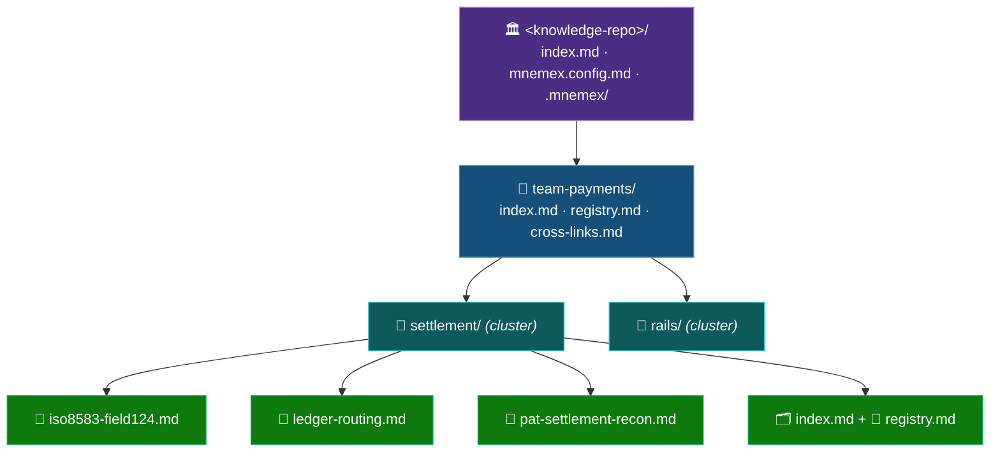

# 🗃️ 03 — Data Model and File Schemas

Exact on-disk formats for every file the protocol reads or writes. All front-matter is YAML; all
timestamps are UTC ISO-8601 (`2026-06-28T14:03:00Z`). Templates live in `templates/`.

> [!NOTE]
> 📄 **Node** = pure knowledge (truth) · 🗂️ **Index** = generated navigation + materialized state ·
> 📝 **Registry** = append-only telemetry · 🔗 **Cross-links** = generated boundary edges ·
> 📥 **Staged atom** = local, pre-promotion knowledge unit. The first three never blur into each other.

---

## 1️⃣ Repository layout

```
<knowledge-repo>/
  index.md                 # ORG index: lists teams
  cross-links.md           # GENERATED (per team root in multi-team; org-level lists soft refs only)
  mnemex.config.md         # config (see 07)
  .mnemex/                 # protocol state (not knowledge)
    last_compaction        # ISO ts of last gc per team:  "team-payments=2026-06-20T...Z"
    config_version         # version + λ in force at last compaction
    highwater/             # per-cluster registry high-water marks
      team-payments__settlement
    team.lock              # present only while a mutating op holds the lock
    pass.plan.json         # present only during an in-progress maintenance pass
  team-<name>/
    index.md               # TEAM index: lists domains (child folders)
    registry.md            # usage log for nodes directly in this folder (usually empty here)
    cross-links.md         # GENERATED: edge instances crossing cluster boundaries within this team
    <domain>/
      index.md             # DOMAIN index: HOT / WARM / COLD node sections (the materialized state)
      registry.md          # append-only usage log for this cluster
      <node-id>.md         # a node (domain or pattern)
      ...
```

A **cluster** = a leaf folder containing nodes (e.g. `team-payments/settlement/`).



---

## 2️⃣ Node file

A node is **pure knowledge**. It carries **no** `strength`, `last_update`, `tier`, or `last_used` —
those are materialized in the index. The node's front-matter copies that the *index* needs for
matching (`summary`, `aliases`) are authored here and denormalized into the index by the write/gc
apply step (the validator keeps them in sync — see Doc 08).

```markdown
---
id: iso8583-field124            # stable slug, NEVER changes. The spine.
type: domain                    # domain | pattern
title: ISO 8583 Field 124 — stablecoin routing instructions
summary: One line that lands in the index verbatim (the match + routing surface).
aliases: [field 124, DE124, data element 124, stablecoin routing field]
domain: [settlement]            # may be a LIST: a node can belong to >1 sub-index (routing DAG)
status: active                  # active | superseded | archived | dead
confidence: high                # high | medium | low
trigger: null                   # REQUIRED for type: pattern; null for domain (see below)
edges:                          # OUTGOING edge instances, owned by this node
  - { to: ledger-routing,    type: routes-through }
  - { to: pat-settle-recon,  type: governed-by }
  - { to: iso8583-spec,      type: defined-in }
references:                     # SOFT, cross-TEAM pointers ONLY. Not integrity-guaranteed.
  - { to: risk-settlement-finality, team: team-risk, note: "related finality model" }
provenance:
  artifact: tap-vic-settlement-spec      # what build produced this
  reviews: [r3, r7]                       # which human review points fed it
  session: 2026-06-01T09:12:00Z
created: 2026-06-01T09:12:00Z
updated: 2026-06-01T09:12:00Z   # meaning-change timestamp (NOT usage)
---

## Summary
<one-paragraph head — read first on a body expansion>

## What            # for domain nodes
<the domain knowledge>

## How / Notes      # for pattern nodes, this is the prescriptive content
<the procedure / the rule / the rationale>

## Provenance
<why this node exists; traceable to the artifact and the specific human reviews>
```

### Pattern nodes

For `type: pattern`, **`trigger` is required** — the *when* clause, the condition under which the
pattern applies. Matching of patterns is on `trigger` (structured), not on prose, to prevent sprawl.

```yaml
type: pattern
trigger: "curating or reviewing a settlement specification"
edges:
  - { to: iso8583-field124, type: governs }
```

### Tombstone (dead) node

```yaml
status: dead
supersedes: null
superseded-by: iso8583-field124-v2   # if replaced; else null
died: 2026-09-01T00:00:00Z
# body cleared on tombstone (default). Front-matter + id retained for audit.
```

---

## 3️⃣ Index file (`index.md`)

The index is **generated**. It is chunked so chunk 1 is enough to route. It carries the **materialized
memory state**.

```markdown
# settlement — domain index
> ISO 8583 messaging and settlement nodes for the payments team.   <!-- chunk 1: route on this -->

## Children                          <!-- chunk 1 continues: sub-folders, if any -->
- (none — this is a leaf cluster)

## Hot                               <!-- chunk 1 tail: top-K by live score; ALWAYS small -->
| id | type | summary | aliases | strength | last_update |
|----|------|---------|---------|----------|-------------|
| iso8583-field124 | domain | ISO 8583 Field 124 — stablecoin routing… | field 124; DE124 | 0.94 | 2026-06-20T… |

## Warm                              <!-- chunk 2: read only if routed here -->
| id | type | summary | aliases | strength | last_update |
| ledger-routing | domain | Ledger routing topology for… | ledger routing | 0.55 | 2026-05-30T… |

## Cold                              <!-- chunk 3+: deep search / edge-reached only -->
| id | type | summary | aliases | strength | last_update | expires |
| legacy-de124-fmt | domain | Pre-2024 Field 124 layout… | old de124 | 0.08 | 2026-02-01T… | 2026-08-01T… |
```

Notes:
- `summary` and `aliases` are **denormalized copies** of the node's values — the validator enforces
  `index.summary == node.summary` and `index.aliases == node.aliases`.
- `strength`/`last_update` are the materialized decay state (Doc 02).
- Hot = top-K (`hot_k`); the line count of the Hot section is therefore bounded.
- **Chained index.** When the Cold tier outgrows `index_chunk_rows`, the head keeps Hot + Warm + the
  first cold chunk and a `## Continuations` list, and the overflow spills into ordered continuation
  files `index.001.md`, `index.002.md`, … (B-tree-leaf style). One head-read still routes; a deep cold
  search walks the chain. Consumers needing the full node-set merge head + continuations
  (`mnx_index.index_node_ids`). See [`11-staging-and-promotion.md`](11-staging-and-promotion.md).

---

## 4️⃣ Registry file (`registry.md`)

Append-only. The write buffer / WAL. One event per line. Human-readable but treated as a log.

```markdown
# registry: team-payments/settlement   (append-only — do not edit by hand)
iso8583-field124    2026-06-20T14:03:00Z    contributed    1.0
ledger-routing      2026-06-20T14:03:01Z    consulted      0.5
iso8583-field124    2026-06-25T09:00:00Z    contributed    1.0
__maintenance-due__ 2026-06-27T08:00:00Z    flag           0
```

Columns: `id`, `ts` (UTC ISO-8601), `role`, `weight`. The `__maintenance-due__` sentinel is the
read-skill's overdue flag (Doc 02 §7). Compaction replays lines **after** the cluster's high-water
mark and advances the mark; it does not delete (Doc 02 §2).

---

## 5️⃣ Cross-links file (`cross-links.md`)

Per **team root**. **Generated/incrementally maintained.** Lists only edge instances that cross
cluster boundaries *within the team*, so cross-cluster structural strength and death-severing stay
cheap without scanning sibling clusters.

```markdown
# cross-links: team-payments   (generated — regenerated by mnx-doctor; delta-updated by write/gc)
| from_id | from_path | type | to_id | to_path |
|---------|-----------|------|-------|---------|
| rails-topology | rails/rails-topology.md | routes-through | iso8583-field124 | settlement/iso8583-field124.md |
```

Each row carries both ids **and** paths, so death-severing can open exactly the referrer nodes without
loading whole clusters. **Cross-*team*** relationships are NOT here — they are soft `references` in the
node front-matter and carry a disclaimer; they never enter structural strength or severing.

---

## 6️⃣ Config file (`mnemex.config.md`)

Markdown with a YAML front-matter block (so it is human-readable *and* machine-parseable). Full schema
and defaults in [`07-configuration.md`](07-configuration.md). Sketch:

```markdown
---
config_version: 1
half_life_days: 180            # domain half-life H_domain (the ONE knob)
pattern_halflife_bonus: 0.30   # patterns get +30% half-life (derived, you are informed)
hot_k: 12                      # top-K hot per cluster
warm_band: 0.25                # score floor for warm; below → cold
cold_ttl_days: 120             # grace in cold before death
node_budget: 35                # split a cluster's index past this many nodes
node_body_max_chars: 6000      # soft per-node body budget; over → split into nodes + an edge (never truncate)
index_chunk_rows: 60           # cold rows per index file; over → chain index.NNN.md (B-tree leaf)
boost: { contributed: 1.0, consulted: 0.5, traversed: 0.0 }
cold_recall_multiplier: 1.6    # spaced-repetition over-reward for reviving a cold node
strength_max: 1.0
compaction_cadence_days: 14
reconcile_cold_on: update      # always | update | never  (lazy cold reconciliation)
purge_dead: false              # tombstone-and-retain (true = hard delete)
---
# Mnemex configuration
Human-readable notes about these values…
```

---

## 7️⃣ Staged atom (capture staging tier)

A **staged atom** is a provisional, local, pre-promotion knowledge unit written by `mnx-capture` and
consumed by `mnx-promote`. It lives **outside the graph** (per-author, never pushed) under
`~/.claude/mnemex/staging/<graph-slug>/atoms/<provisional-id>.md`, where the **provisional id** is a
content hash: `stg-` + the first 12 hex of `sha1(type|summary|body|aliases|domain|trigger)`. It must
**never** become a real node id or enter a read stamp; promotion mints a real slug id. Full model:
[`11-staging-and-promotion.md`](11-staging-and-promotion.md).

```markdown
---
provisional_id: stg-d3d3ad9d7fbe   # content hash, NEVER enters the graph
type: domain                       # domain | pattern
summary: One line — the match/routing surface.
aliases: [field 124, DE124]
domain: [settlement]               # routing key(s)
score: now                         # now | later  ('not-needed' is dropped, never staged)
urgent: true                       # sharpens the nag; never inline-pushes
trigger: "reviewing a settlement spec"   # REQUIRED for type: pattern
provenance:                        # self-sufficient to reconcile COLD (transcript gone by promote)
  artifact: tap-vic-settlement-spec
  reviews: [r3, r7]
  rejected: ["post-then-reconcile (orphans legs)"]
  session: 2026-06-29T09:12:00Z
  rationale: "human correction in review r7"
staged_at: 2026-06-29T10:11:21Z
---

The atom's knowledge body (kept under node_body_max_chars; split into atoms + an edge if larger).
```

---

## 8️⃣ `.mnemex/` state files

Small, machine-managed, **not knowledge** (safe to `.gitignore` the lock and plan; commit the
high-water/version stamps so state is reproducible across clones).

| File | Purpose |
|---|---|
| `last_compaction` | per-team ISO timestamp of last `gc`. Drives the overdue warning. |
| `config_version` | version + `λ` in force at last compaction. Drives re-normalization. |
| `highwater/<team>__<cluster>` | registry line/timestamp replayed up to. WAL checkpoint. |
| `team.lock` | present only while a mutating op holds the team lock. |
| `pass.plan.json` | Phase-A plan; presence + dirty tree ⇒ crash recovery on next run. |
