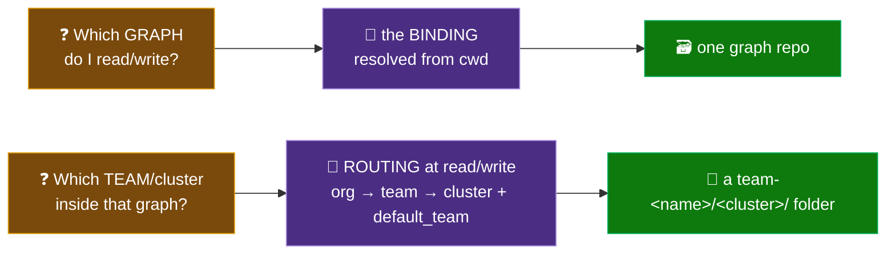
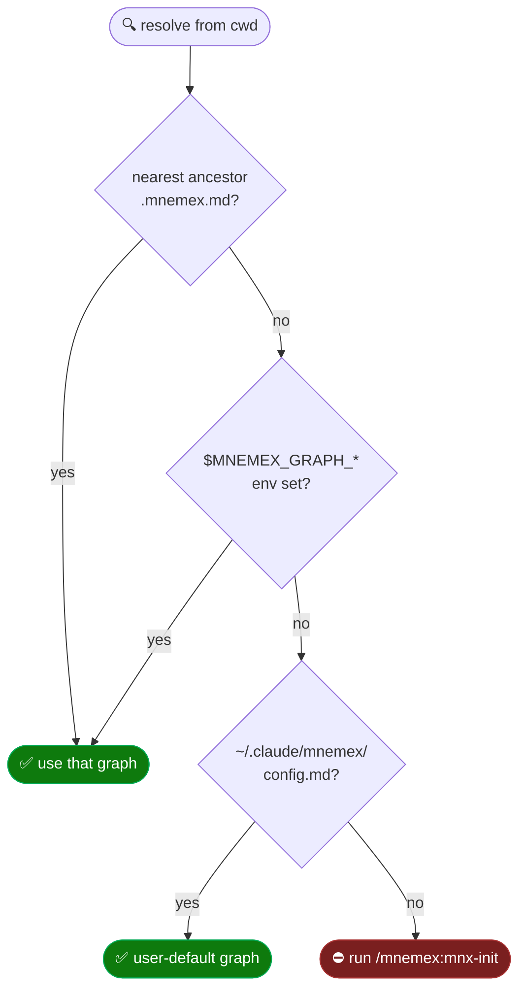
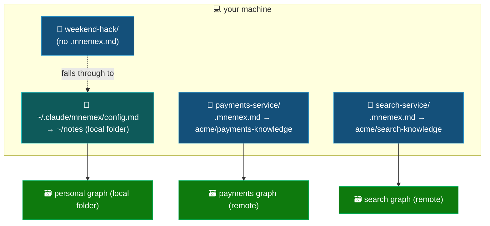
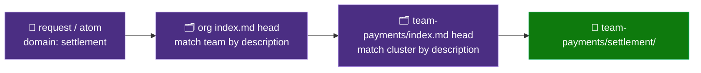
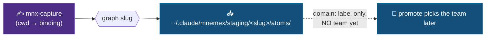
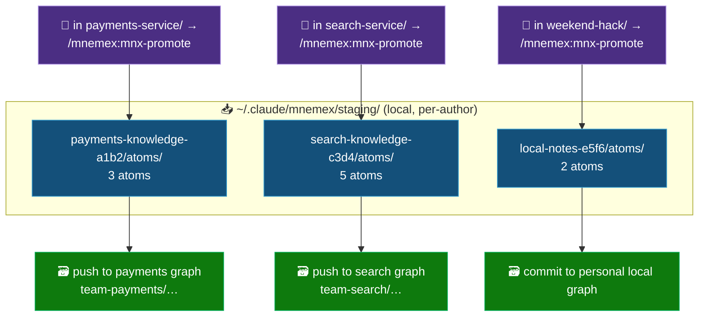
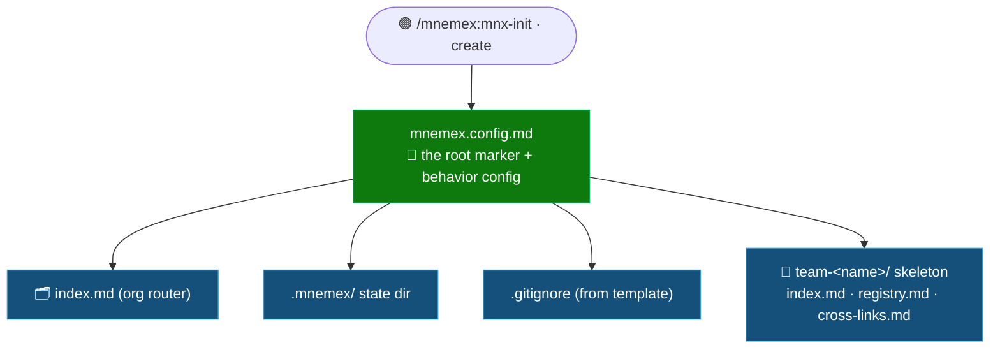

# 🧭 13 — Multi-Graph, Bindings & Team Routing

> Part of the **Mnemex Context Graph** standard. This document answers a question the other docs only
> touch in pieces: **when an author works across several repos — each bound to a different graph, plus a
> personal local graph, and a team within an org — how do `init`, `read`, `capture`, and `promote` know
> *which graph* and *which team* to write to?** It ties [`10-binding-and-graph-sync.md`](10-binding-and-graph-sync.md)
> (which graph) and [`11-staging-and-promotion.md`](11-staging-and-promotion.md) (capture/promote) together
> into one end-to-end mental model.

---

## 🧩 Two questions, two independent mechanisms

The whole design rests on separating two decisions that look like one:



| Question | Answered by | Scope | Decided **when** |
|---|---|---|---|
| **Which graph** do I read/write? | the **binding** (`.mnemex.md` → env → user config) | picks a whole graph repo | at every operation, from **cwd** |
| **Which domain** does this knowledge belong to? | the `domain:` routing key on the atom | a routing label | at **capture** time |
| **Which team/cluster** does it land in? | **structural routing** through the graph's org→team indexes + `default_team` fallback | a folder inside the graph | at **promote** time |

The key insight: **"which graph" is resolved from *where you are on disk*; "which team" is resolved from *what the knowledge is about*.** You never tell a command "graph X, team Y" by hand — cwd and content decide.

---

## 1️⃣ Which graph — the binding (resolved from cwd)

Every skill (`mnx-read`, `mnx-capture`, `mnx-promote`, `mnx-doctor`, `mnx-status`) begins by calling
`mnx_binding.py resolve`, which walks a **most-specific-wins chain**, starting from the current working
directory and walking *up* the filesystem:



Because the chain walks up from **cwd**, a machine with many repos resolves *different graphs* with zero
manual switching:



- **`payments-service/`** → its `.mnemex.md` binds the **payments** team graph.
- **`search-service/`** → a different `.mnemex.md` binds a **different** graph.
- **`weekend-hack/`** → no binding, so it falls through to your **user default** — a personal local-folder graph.

The binding also carries two routing-relevant fields: **`default_team:`** (the fallback team) and
**`author:`** (commit/stamp identity). Set exactly one of `graph_remote:` (git URL — cloned, synced,
pushed) or `graph_path:` (local folder — used in place). See
[`10-binding-and-graph-sync.md`](10-binding-and-graph-sync.md) for the full schema and graph kinds.

---

## 2️⃣ Which team — structural routing inside the graph

A graph is **one** repo, but internally it is an org router with `team-<name>/` subtrees:

```
graph-root/
  index.md            ← ORG router: one-line description per team
  mnemex.config.md    ← behavior config (decay/tiers) — owned by the graph
  team-payments/
    index.md          ← TEAM router: one-line description per domain cluster
    settlement/       ← a CLUSTER of node files
  team-search/
    index.md
    ranking/
```

Routing is **semantic and structural**, never hand-configured:



- **`mnx-read`** reads the org `index.md` head, picks the team(s) whose one-line description matches, then
  the team `index.md` head to pick the cluster(s). It matches on **meaning**, so a settlement question lands
  in `team-payments/settlement/` regardless of which team you nominally belong to.
- **`mnx-promote`** routes each staged atom's `domain` key the same way to decide the destination cluster.
  If the domain does not resolve to an existing cluster, **`default_team`** from the binding is the fallback
  team the new cluster is created under. Every placement is shown in the approval plan (`CREATE domain
  iso8583-field124 in team-payments/settlement`) before anything is written — routing is never silent.

---

## 3️⃣ Capture pins the graph, defers the team

A subtle but important point: **the graph is decided at capture time, not promote time.** Capture runs the
same binding preflight, then writes atoms into a staging folder that is **partitioned per graph** by slug:

```
~/.claude/mnemex/staging/<graph-slug>/atoms/<provisional-id>.md
```

So the moment you capture, the atom lands in a folder that belongs to exactly one graph — the one your cwd
resolved. What capture *doesn't* decide is the team: it only records the atom's `domain:` label, because
choosing a team requires reading the **shared** graph's index structure, and capture is forbidden to touch
the graph at all.



---

## 4️⃣ Worked example — three graphs captured, never promoted

This is the scenario the design is built to make safe. You worked across three contexts this week and
captured in each, but never promoted. Because staging is **per-graph**, you do not have one mixed pile —
you have **three separate staging stores**:



**Promote does not *choose* the graph — it inherits it.** `mnx-promote` resolves the binding from your
current cwd, then drains **only that graph's** staging store, takes **that graph's** team lock, and pushes
to **that graph's** remote. Consequences:

- To promote **payments** captures, run `/mnemex:mnx-promote` **from a directory bound to the payments
  graph**. It sees the payments staging store and nothing else.
- Standing in `search-service/`, promote is **blind** to the payments atoms — it only sees the search store.
- Three un-promoted graphs ⇒ **three separate promote runs, each from its matching binding context.** The
  partitioning makes it *structurally impossible* to promote one team's knowledge into another team's graph.

Within each run, team selection then proceeds as in §2: `domain` key → org/team index routing →
`team-<name>/<cluster>/`, with `default_team` as the fallback and the approval plan as the gate.

> [!IMPORTANT]
> 🧠 Because the graph is pinned by **cwd at capture time**, capturing from the wrong directory stages the
> atom against the wrong graph — and there is no "re-route to another graph" operation. The escape valve is
> `--drop` / `--discard-all` and re-capture from the right context. The upside of the same rule is total
> isolation.

---

## 5️⃣ When no graph exists yet — what `init` creates first

`mnx-init`'s **create-a-new-graph** mode scaffolds a graph. The **defining first artifact is
`mnemex.config.md`**, because that one file is *what makes a directory a graph*: `find_graph_root()`
identifies a graph root purely by the presence of `mnemex.config.md`. Until it exists, there is no graph
and every skill's `require_graph_root` fails; write it, and the folder *becomes* a graph. It doubles as the
home of the behavior config (half-life, tiers, `pattern_halflife_bonus`).



Deliberately **not** created yet: any **node files** (a fresh graph holds zero knowledge — nodes appear only
when your first `mnx-promote` drains staged atoms), and the **binding** itself (written as a separate step, so
a graph can exist before anyone points at it). Full scaffold contract:
[`10-binding-and-graph-sync.md`](10-binding-and-graph-sync.md) §Init flow.

---

## ➡️ Where to go next

- 🔗 The binding schema, resolution, sync, and graph kinds: [`10-binding-and-graph-sync.md`](10-binding-and-graph-sync.md)
- 📥 The capture/promote split and staging tier in depth: [`11-staging-and-promotion.md`](11-staging-and-promotion.md)
- 🧭 The whole arc, install → daily use: [`12-user-journey.md`](12-user-journey.md)
