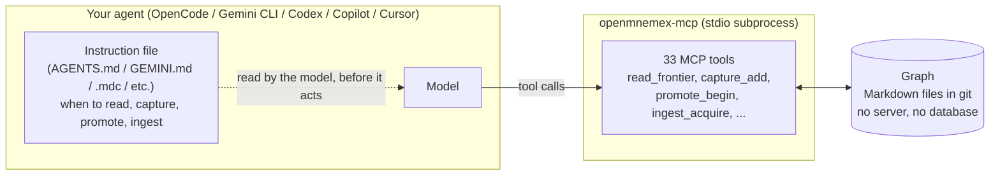

# Agent setup — quick start for every supported host

> [!TIP]
> The easiest path is the **OpenMnemex Console** (`uvx openmnemex`, [`console.md`](console.md)):
> its **Add agents** screen detects your agents and connects each with one click — it drives the
> exact same installer as every command on this page. This page is the CLI equivalent, for
> scripts, CI, or terminal preference.

Claude Code gets the full plugin experience (7 auto-hooks, skills, no MCP server required — see
[`docs/user-journey.md`](user-journey.md) for that path). This page is for everyone else:
**OpenCode, Gemini CLI, Codex CLI, GitHub Copilot (agent mode), and Cursor** — plus the MCP-only
alternative for Claude Code, if you'd rather run it that way. All six share the same one-command
installer and the same underlying Python engine; only the config file shape and how much of the
experience is automatic differ per host.

**No graph needed first.** Add `--init-graph` to the install command and the installer creates one
for you — a plain local folder under your mnemex home, scaffolded doctor-clean, bound as your user
default, and pinned into the agent's MCP entry, with zero prompts:

```bash
uvx openmnemex install --agent <agent> --init-graph --yes
```

A local folder needs no git remote and no credentials, so this always succeeds — no dead end on the
first read. Prefer a git remote (to share the graph across machines or a team) or a specific folder?
Run `mnx_init.py init --path <dir>` / bind a remote first, then install with `--pin-graph`.
`openmnemex install --check` (see [Verifying an install](#verifying-an-install) below) reports
clearly whether a graph is bound.

## How it plugs in

Every agent below talks to OpenMnemex over two channels: the **MCP server** (33 tools covering
read/capture/promote, bulk ingest (import an existing repo/docs — not a Claude-only feature, see
below), and binding/doctor/status/graph-discovery admin, spawned as a subprocess over stdio — no
daemon, no port, no database) for actual work, and an **instruction file** (`AGENTS.md`,
`GEMINI.md`, a `.mdc` rule, etc.) that tells the model *when* and *how* to use those tools, since
not every host has Claude Code's session hooks to nudge it automatically.



The instruction file is generated from the exact same source as Claude Code's skills and the MCP
tool descriptions (`templates/procedures/*.core.md` → `mnx_procedures.py build`) — there's one
prose source for the judgment procedure, not six hand-written copies that drift apart.

**Bulk import works on every host, not just Claude.** The sequence `ingest_acquire` →
`ingest_probe` → stage atoms (`capture_add(ingest_batch=...)`) → `er_resolve` → drain with
`promote_begin(ingest_batch=...)`/`promote_apply` walks a local path or git URL into candidate
atoms, proposes create/merge dispositions against anything already in the graph (a re-import
merges instead of duplicating), and lands them in one transaction — the same engine transaction
Claude's `/mnemex:mnx-ingest` skill drives, just called directly. See the "Ingest on non-Claude
hosts" section in [`corpus-ingestion.md`](corpus-ingestion.md) for the full tool sequence; there's
no dedicated `ingest-procedure` MCP prompt yet (unlike read/capture/promote), so today the
judgment guidance rides in each ingest tool's own description.

## Tiers: Full vs. Assisted

| Agent | Tier | What that means here |
|---|---|---|
| **Claude Code** (plugin) | Full | 7 lifecycle hooks: consent primer, per-prompt reminders, Stop capture nudge, compaction re-arm, session-end safety net — all automatic. |
| **Claude Code** (MCP-only) | Full | Same hooks, still via the plugin — the MCP entry below is an *alternative wiring*, not a replacement. |
| **OpenCode** | Full¹ | Hook plugin fires automatically, but only its *side effects* (graph sync, usage-stamp flush, crash-recovery bookkeeping) — the advisory nudges (consent primer, capture reminder) have no delivery channel in OpenCode's `event` hook and never reach the model. `AGENTS.md` carries the actual "when to act" instructions, same as any Assisted host. |
| **Gemini CLI** | Assisted | No lifecycle hooks at all. `GEMINI.md` is the only thing telling the model when to read/capture/promote — it has to be model-initiated. |
| **Codex CLI** | Assisted | Same as Gemini CLI, via `AGENTS.md`. |
| **Copilot (agent mode)** | Assisted | Same as Gemini CLI, via `.github/copilot-instructions.md`. Project scope only (see the Copilot section below). |
| **Cursor** | Assisted | Same as Gemini CLI, via a `.cursor/rules/*.mdc` file. |

¹ OpenCode is labeled Full because its hooks genuinely run automatically (unlike the other
Assisted hosts, which have no lifecycle hook surface at all) — but for anything that needs to
*tell the model* something (not just run a side effect), it behaves like Assisted. Full detail
in [`LIMITATIONS.md`](../LIMITATIONS.md), item 3 ("OpenCode's hook plugin runs side effects
only — it cannot deliver advisory text").

"Assisted" isn't second-class — every tool works identically. It just means the model has to be
told (once, via the instruction file already installed for you) to actually call them, rather
than being nudged by an automatic hook the way Claude Code and OpenCode's side effects are.

Bulk ingest in particular is unaffected by tier: it's plain tool calls with no lifecycle-hook
dependency, so seeding an empty graph from an existing repo works identically whether the host is
Full or Assisted — the difference above is only about automatic *nudges*, never about which
tools are available.

## Installing

Every agent below is installed the same way:

```bash
uvx openmnemex install --agent <agent> [--project|--user] [--pin-graph]
```

> [!NOTE]
> Not on PyPI yet — until it is, run it straight from the repo instead:
> `uvx --from git+https://github.com/kritird/OpenMnemex openmnemex install --agent <agent> ...`.
> JS-native users can use `npx openmnemex install --agent <agent> ...` once *that's* published
> too (it's a thin shim over the same package — see [the npm shim section](#the-npx-shim) below).

`--project` writes into the current directory (the config travels with the repo, in git);
`--user` writes to the agent's own global/user config, where supported. Add `--dry-run` to
preview the diff without writing, `--yes` to skip the confirmation prompt (useful in scripts),
and `--uninstall` to remove exactly the OpenMnemex entry/block later, leaving everything else in
the file untouched.

## Verifying an install

```bash
uvx openmnemex install --agent <agent> --project --check
```

This resolves the graph binding, lists every MCP tool the server would expose (33 of them:
`read_frontier`, `capture_add`, `promote_begin`, `ingest_acquire`, …), and reports whether the `mnx-regen` git
merge driver is registered for the graph repo (it regenerates derived/generated files from
source-of-truth during a git merge instead of letting them conflict; `mnx_init.py init` registers
it automatically for a fresh graph). If there's no bound graph yet, you'll see
`"binding": {"resolved": false, "hint": "...--init-graph..."}` — re-run install with `--init-graph`
(see the top of this page) to create and bind one; it's not a broken install. Once it's bound, restart the agent
(most hosts only read MCP config at startup) and ask it to read from or capture to memory —
that's the real end-to-end check.

---

## Claude Code (MCP-only alternative)

You almost certainly want [the plugin](user-journey.md) instead — it's the only path that gets
you the full 7-hook auto-capture experience. This is documented for completeness: if you'd
rather wire Claude Code up exactly like every other agent below (or run it side-by-side with the
plugin), it's supported.

**1. Install:**
```bash
uvx openmnemex install --agent claude-code --project --yes
```
`--user` scope shells out to the Claude CLI instead of writing a file:
`claude mcp add mnemex -- uvx --from openmnemex[mcp] openmnemex-mcp`.

**2. What changed:** a new `.mcp.json` in the project root:
```json
{
  "mcpServers": {
    "mnemex": {
      "command": "uvx",
      "args": ["--from", "openmnemex[mcp]", "openmnemex-mcp"]
    }
  }
}
```
No instruction-file block is written for claude-code — the plugin's `SKILL.md` files already
cover the judgment procedure, and installing the MCP entry doesn't remove or disable the plugin.

**3. Verify:** `uvx openmnemex install --agent claude-code --project --check`, then restart
Claude Code and confirm the `mnemex` tools show up alongside (or instead of) the plugin's.

**4. Tier:** Full — via the plugin, regardless of whether you also add this MCP entry.

---

## OpenCode

**1. Install:**
```bash
uvx openmnemex install --agent opencode --project --yes
```
Project scope writes `./opencode.json` (project config wins over the global one); `--user`
writes `~/.config/opencode/opencode.json` instead, and the instruction block goes to
OpenCode's global `~/.config/opencode/AGENTS.md` (not a file in your current directory).

**2. What changed:** three things, all in one run:
- `opencode.json` gets an `mcp.mnemex` entry:
  ```json
  {
    "mcp": {
      "mnemex": {
        "type": "local",
        "command": ["uvx", "--from", "openmnemex[mcp]", "openmnemex-mcp"],
        "enabled": true
      }
    }
  }
  ```
- `AGENTS.md` gets the generated instruction block, wrapped in
  `<!-- openmnemex:begin (generated; ...) -->` / `<!-- openmnemex:end -->` markers so a re-run
  updates it cleanly and anything else already in the file is left alone.
- **Project scope only:** `.opencode/plugin/mnemex.ts` — the hook plugin that wires OpenCode's
  `session.created`/`session.idle`/`session.compacted`/`dispose()` events into the engine's sync,
  usage-stamp-flush, and crash-recovery bookkeeping. (Installing from a `pip`/`uvx` package with
  no repo checkout on disk still works — the plugin ships as package data; if it were somehow
  missing, the installer would skip that one file with an explicit note rather than failing the
  whole install or copying nothing silently.)

**3. Verify:** `uvx openmnemex install --agent opencode --project --check`, then restart
OpenCode. The plugin's side effects (graph sync, stamp flush) run without you noticing; to
confirm the tools themselves work, ask OpenCode to read from or capture to memory and watch for
a `mnemex.*` tool call.

**4. Tier:** Full for side effects, Assisted for anything that needs to reach the model — see
the tier table above and [`LIMITATIONS.md`](../LIMITATIONS.md) item 3 for exactly why.

---

## Gemini CLI

**1. Install:**
```bash
uvx openmnemex install --agent gemini-cli --project --yes
```
Project scope writes `.gemini/settings.json`; `--user` writes `~/.gemini/settings.json`,
with the instruction block in Gemini's global `~/.gemini/GEMINI.md` (not a file in your
current directory).

**2. What changed:**
- `.gemini/settings.json` gets an `mcpServers.mnemex` entry:
  ```json
  {"mcpServers": {"mnemex": {"command": "uvx", "args": ["--from", "openmnemex[mcp]", "openmnemex-mcp"]}}}
  ```
- `GEMINI.md` gets the same generated instruction block described in the OpenCode section above.

There's no separate slash-command mirror (`~/.gemini/commands/mnx-*.toml`) — that was scoped as
optional and cut for this pass. The instruction block in `GEMINI.md` is what carries the
procedure; no slash commands are installed.

**3. Verify:** `uvx openmnemex install --agent gemini-cli --project --check`, then restart
Gemini CLI and ask it to read from or capture to memory.

**4. Tier:** Assisted — Gemini CLI has no lifecycle hook surface at all, so `GEMINI.md` is the
only thing telling the model when to act.

---

## Codex CLI

**1. Install:**
```bash
uvx openmnemex install --agent codex --project --yes
```
Project scope writes `.codex/config.toml`; `--user` writes `~/.codex/config.toml`, with
the instruction block in Codex's global `~/.codex/AGENTS.md` (not a file in your current
directory).

**2. What changed:**
- `.codex/config.toml` gets an `[mcp_servers.mnemex]` table:
  ```toml
  [mcp_servers.mnemex]
  command = "uvx"
  args = ["--from", "openmnemex[mcp]", "openmnemex-mcp"]
  ```
  The table key is `mcp_servers` (underscore) — Codex silently ignores a hyphenated
  `mcp-servers` key, so this matters if you're ever hand-editing the file instead of using the
  installer.
- `AGENTS.md` gets the same generated instruction block as OpenCode's (both hosts read the same
  file name).
- **Project scope note:** Codex only honors a project-scoped `.codex/config.toml` for projects
  it already trusts (its own upstream behavior, not something OpenMnemex controls) — if the
  entry doesn't seem to take effect, trust the project in Codex first.
- `--pin-graph` on Codex writes the resolved graph path as a literal TOML inline table
  (`env = { MNEMEX_GRAPH_PATH = "..." }`) rather than a nested `[mcp_servers.mnemex.env]` header
  — a real nested header would get picked up as a new table boundary on a re-run and orphaned.

**3. Verify:** `uvx openmnemex install --agent codex --project --check`, then restart Codex CLI
and ask it to read from or capture to memory.

**4. Tier:** Assisted — no lifecycle hooks, `AGENTS.md` carries the procedure.

---

## GitHub Copilot (agent mode)

**1. Install:**
```bash
uvx openmnemex install --agent copilot --project --yes
```
**Project scope only** — VS Code's *user*-scope MCP config has no fixed file path (it's edited
through the "MCP: Open User Configuration" command palette entry, not a static file), so
`--user` returns a clean, explicit `unsupported` result instead of guessing a path:
> copilot has no fixed user-config file path — VS Code's user MCP config is edited via the 'MCP:
> Open User Configuration' command palette entry, not a static file. Use `--project` (workspace
> `.vscode/mcp.json`), or add the server through that command.

**2. What changed:**
- `.vscode/mcp.json` gets a `servers.mnemex` entry — note the root key is `servers`, not
  `mcpServers` like every other host here, and VS Code requires an explicit `"type"` field
  (there's no inferred type the way Cursor/Claude Code have):
  ```json
  {
    "servers": {
      "mnemex": {
        "type": "stdio",
        "command": "uvx",
        "args": ["--from", "openmnemex[mcp]", "openmnemex-mcp"]
      }
    }
  }
  ```
- `.github/copilot-instructions.md` gets the same generated instruction block as the other hosts.

**3. Verify:** `uvx openmnemex install --agent copilot --project --check`, then restart VS Code
and ask Copilot (in agent mode) to read from or capture to memory.

**4. Tier:** Assisted — no lifecycle hooks, `.github/copilot-instructions.md` carries the
procedure.

---

## Cursor

**1. Install:**
```bash
uvx openmnemex install --agent cursor --project --yes
```
Project scope writes `.cursor/mcp.json`; `--user` writes `~/.cursor/mcp.json`.

**2. What changed:**
- `.cursor/mcp.json` gets an `mcpServers.mnemex` entry:
  ```json
  {"mcpServers": {"mnemex": {"command": "uvx", "args": ["--from", "openmnemex[mcp]", "openmnemex-mcp"]}}}
  ```
- **Project scope only:** `.cursor/rules/openmnemex.mdc`, an always-on rule:
  ```
  ---
  description: OpenMnemex memory tool usage
  alwaysApply: true
  ---

  ## Memory (OpenMnemex)
  ...
  ```
  (the body is the same generated instruction block as every other host). Cursor's rules
  directory is project-scoped only — `--user` installs the MCP entry alone, with no rule file,
  so you'd need to tell the model about the procedure yourself in that case.

**3. Verify:** `uvx openmnemex install --agent cursor --project --check`, then restart Cursor and
ask it to read from or capture to memory.

**4. Tier:** Assisted — no lifecycle hooks, the `.mdc` rule carries the procedure (project scope
only; see above for user scope).

---

## The npx shim

If you'd rather not know `uv`/`pipx` exist, `integrations/npm/` ships a two-command npm package
(name `openmnemex`, not yet published to the registry — same as the PyPI package):

```bash
npx openmnemex install --agent <agent> [--project|--user] [--pin-graph]
npx openmnemex-mcp
```

It has no logic of its own — both commands detect `uv` (preferred) or `pipx` on your `PATH` and
exec the real Python package through them (`uv tool run --from 'openmnemex[mcp]' <script>` /
`pipx run --spec 'openmnemex[mcp]' <script>`), forwarding your arguments, stdio, exit code, and
signals straight through. If neither `uv` nor `pipx` is on `PATH`, it prints install links and
exits rather than silently installing anything into your system Python. Until it's published,
run it straight from a checkout:
`node integrations/npm/bin/openmnemex.js install --agent <agent> ...`.

## Compared to claude-mem

If you've used claude-mem, the honest comparison: claude-mem runs a background worker process
with SQLite storage and Chroma for vector/semantic search, installed via a published `npx
claude-mem install`. OpenMnemex has no worker, no
database, and no vector store — the graph is plain Markdown files committed to git, read/written
directly by the MCP server on each tool call, with retrieval driven by explicit
frontier/cluster/node routing rather than embedding similarity. The trade-off: no semantic
fuzzy-match recall, but also nothing running in the background, nothing to lose track of, and a
graph you can read, diff, and review with `git log` like any other file in your repo. Both our
`uvx`/`npx` install paths are not yet on a public registry (see the notes above); claude-mem's
`npx` install is.
