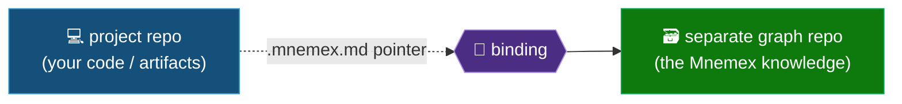
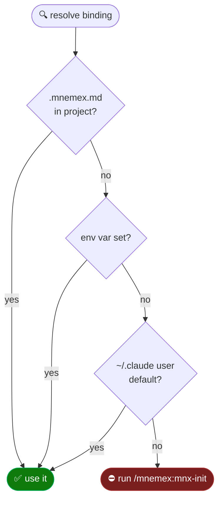

# 🔗 Binding and Graph Sync

> Part of the **Mnemex Context Graph** standard. This document specifies how an author working in **any**
> repository is connected to a **separate** knowledge-graph repository: where the binding configuration
> lives, how it is resolved, how the graph clone is synchronized each session, and how the `mnx-init`
> preflight establishes all of it.

## 🧩 The problem this solves

The author operates in a **project repo** (their actual code/artifacts). The Mnemex knowledge lives in a
**separate graph repo** — the graph is **not** the current working directory. Mnemex uses an explicit
**binding** so any project can read/write a graph that lives elsewhere, with configuration resolvable at
the **repo** or **user** level.



## 🗂️ Two configs, deliberately separated

| Config | Answers | Lives | Resolves user → repo? |
|---|---|---|---|
| **Binding** | *Which graph do I read/write, and as whom?* | Project `.mnemex.md` / user file / env | **Yes** |
| **Graph behavior** | *How does this graph remember and forget?* (`half_life_days`, tiers, budgets) | `mnemex.config.md` **inside the graph repo** | No — single source of truth |

The behavior config is a property of the **graph**, not the author or the project. It must not be
duplicated into the binding, or two authors binding to one graph could decay it differently. If it is
absent on first use, `mnx-init` creates it (see *Init flow*). See [`configuration.md`](configuration.md).

## ⚙️ Binding configuration

### 📋 Schema

A binding is Markdown with a YAML front-matter block. Set **exactly one** of `graph_remote` (a git repo)
or `graph_path` (a local folder):

```markdown
---
graph_remote: git@github.com:acme/payments-knowledge.git   # a git path (clonable & pushable)
# --- OR ---
graph_path: ~/knowledge/payments                           # a local folder, used in place
default_team: payments                                     # optional — default routing team
author: kriti                                              # optional — stamp/commit identity override
---
```

- `graph_remote` is a **git path**: the graph is materialized by cloning it to a local cache and kept in
  sync; writes commit and push.
- `graph_path` is a **local folder**: used in place — no clone, no sync, no push. This is the option for
  an author who has no git repo, just a working directory. (See *Graph kinds* below for how it persists.)
- If **both** are set, `graph_path` (local) wins and a warning is emitted.

### 📍 Locations

```
<project-repo>/.mnemex.md                      ← repo-level binding (committed or git-ignored, author's choice)
~/.claude/mnemex/config.md                     ← user-level binding + defaults (durable; survives plugin updates)
$MNEMEX_GRAPH_REMOTE / $MNEMEX_GRAPH_PATH (+ peers)  ← environment override
```

Two rules that matter:

- **Do not store user config in `${CLAUDE_PLUGIN_ROOT}`.** That folder is overwritten on plugin update
  and removed on uninstall. User config lives under `~/.claude/`.
- **`.mnemex.md` (a file) is not `.mnemex/` (a directory).** The graph repo uses an internal `.mnemex/`
  **state** directory for locks and high-water marks. The project-level **pointer** is the file
  `.mnemex.md`, to avoid confusing "this repo *is* a graph" with "this repo *points at* a graph".

### 🪜 Resolution chain (most-specific wins)

```
1. <project-repo>/.mnemex.md                       ← highest: the most intentional signal
2. $MNEMEX_GRAPH_PATH / $MNEMEX_GRAPH_REMOTE (env)  ← escape hatch / CI override
3. ~/.claude/mnemex/config.md                       ← user default
4. none found → STOP. Tell the user: "No Mnemex graph configured. Run /mnemex:mnx-init."
```



This resolver is the **preflight**: every skill (`mnx-read`, `mnx-capture`, `mnx-promote`, `mnx-doctor`)
runs it first. If it resolves, the skill proceeds silently; if not, the skill halts and points at
`mnx-init`. (`mnx-capture` needs only the resolved binding — it writes to the local staging tier, not the
clone — so it does not require a sync.) This is what makes the skills safe to compose inside an author's
*own* skills.

> **Implementation.** Resolution, sync, and persistence are implemented in `scripts/mnx_binding.py`
> (`resolve | sync | status | persist | push | graph-root | staging-path`). Every skill resolves the
> **`graph_root`** from it and operates there — never the working directory; the per-graph local
> **`staging_root`** (`~/.claude/mnemex/staging/<slug>/`) holds capture atoms + the stamp spill. The
> `SessionStart` hook calls `sync`, injects a one-time primer steering the agent to `mnx-read` before
> domain tasks and `mnx-capture` to stage knowledge, and emits staged-pending / consolidation-overdue
> nags; the `SessionEnd` hook prompts for `mnx-capture` (advisory, never auto-writes). `mnx-init` calls
> `resolve`/`sync`; `mnx-promote`/`mnx-doctor` call `persist`. See
> [`skills-commands-hooks.md`](skills-commands-hooks.md) §6 and
> [`script-contracts.md`](script-contracts.md).

## 🧬 Graph kinds and persistence

The binding resolves to a **`graph_root`** (the directory skills read/write) and a **`kind`** that
decides how a completed mutation is persisted:

| Kind | `graph_root` | Session start | Persist a promote |
|---|---|---|---|
| **git-remote** | clone cache `~/.claude/mnemex/graphs/<slug>/` | clone / hard-resync to remote HEAD | commit **+ push** (bounded retry) |
| **git-local** | the local folder (it is a git repo) | verify it exists | commit (no push) |
| **plain-local** | the local folder (not a git repo) | verify it exists | append an audit record to `<graph>/.mnemex/history.log` |

The plain-folder **audit trail** (`.mnemex/history.log`, one JSON line per mutation: `ts`, `message`,
`author`) preserves the "every mutation is reviewable" property when there is no git history to lean on.
A local folder that later becomes a git repo (`git init`) is automatically treated as `git-local`.

## 🔄 Graph sync

The graph clone is materialized at a stable, per-remote cache path so a crashed session's work is
recoverable:

```
~/.claude/mnemex/graphs/<slug-of-graph_remote>/     ← the clone (reset to remote HEAD each session)
~/.claude/mnemex/graphs.md                          ← the graph DISCOVERY registry (see below) — NOT a clone
~/.claude/mnemex/staging/<graph-slug>/              ← LOCAL side-store, OUTSIDE the clone, never reset:
    atoms/         capture staging atoms (un-promoted; survive the resync)
    stamps.jsonl   the usage-stamp spill (flushed to the registry + pushed at session end)
```

The staging side-store lives outside the clone **on purpose**: the clone is hard-reset to remote HEAD
every session start, which would otherwise destroy un-promoted captures and un-flushed stamps. It is
per-author and local — never part of the shared graph, never pushed. See
[`staging-and-promotion.md`](staging-and-promotion.md).

### ▶️ Session start (blocking)

```
1. Resolve the binding (chain above). If unresolved → halt with the mnx-init prompt.
2. Materialize the graph:
     - LOCAL (graph_path): verify the folder exists (no clone/reset). If missing → warn (run mnx-init).
     - REMOTE (graph_remote): materialize at the remote HEAD —
         · clone exists at the cache path → hard-resync (fetch + reset --hard origin/<branch>);
         · else → clone fresh.
3. REMOTE only: if the remote is unreachable → WARN and fall back to the existing local clone in
   read-only mode. Do not brick the session because the network is down.
```

> [!IMPORTANT]
> 🧨 For a **remote** graph the session always starts byte-for-byte at the remote HEAD — any local
> divergence left in the clone is **intentionally discarded** on resync. This is exactly why staged
> captures and un-flushed stamps live **outside** the clone: a capture is not a push, so it must survive
> the resync until a promote merges it.

**Persistence is the author's explicit act:** `mnx-promote` persists (see *Graph kinds*). If the author
did not push, it was not meant to persist — there is no salvage or auto-commit at session start.
Local-folder graphs are never reset, so nothing is discarded.

### 💾 Write-back

`mnx-promote` persists its result (the merge + folded consolidation) at the end of a successful apply,
the way the graph's **kind** dictates (commit+push / commit / audit-append — see *Graph kinds*).
`mnx-capture` never persists to the graph — it only writes the local staging tier. For a remote graph the
remote is the source of truth; a session that does not push has effectively not persisted, and reads
(`mnx-read`) flush their usage stamps with a `persist` so they survive the next resync. For local graphs
stamps are already on disk.

**Push conflict handling (idempotent, bounded retry).** Concurrent writers can cause a non-fast-forward
push rejection. Each promote commit is built to be safe to re-apply, so on rejection the skill:

```
for attempt in 1..3:
    fetch + rebase/replay the local commit onto origin/<branch>
    re-run the doctor invariant check (the rebased state must still be valid)
    push
    if push succeeds → done
→ after 3 failed attempts (or a rebase conflict): STOP. The local commit is preserved.
```

**Recovery is retry-push, never re-merge.** A failed push leaves the merge **committed but unpushed** in
the clone (`mnx_binding.unpushed_state` → `ahead > 0`). The promote already did the expensive part, so the
fix is to push *that* commit — not to redo the merge. `_push` therefore returns a **structured `recovery`
block** (not a bare "retry manually"): the `retry_command` (`/mnemex:mnx-promote --retry-push`), the
`clone_path`, `branch`, and a scoped `manual_fallback` (`git -C <clone> fetch / rebase / push`) as the last
resort. `mnx-promote`:

- **refuses a fresh promote** while `unpushed` is true (a blind re-promote would re-apply the still-full
  staging on top of the commit — a double-apply), and
- under `--retry-push` skips merge/consolidate, pushes the existing commit, and only then runs the
  deferred `clear` of staging.

Session start / end nag when an unpushed promote is detected, so a push that died on a network blip or a
crashed session surfaces next time instead of silently risking a double-apply.

## 🚀 Init flow (the preflight authority)

`mnx-init` is a branching command that detects state and offers:

1. **Create a new graph** — scaffold a graph (org `index.md`, `mnemex.config.md` from defaults,
   `.mnemex/` state, a first `team-<name>/` skeleton) either in a git repo or in a **local folder**
   (creating the folder if needed), then write a binding pointing at it.
2. **Bind this project to an existing graph** — write `<project-repo>/.mnemex.md` with `graph_remote`
   (git) **or** `graph_path` (local folder).
3. **Set my user-level default graph** — write `~/.claude/mnemex/config.md` (remote or local).

On first contact with a graph that has no `mnemex.config.md`, init also writes the behavior config from
defaults and tells the user that pattern nodes persist ~30% longer than domain facts and how to change
that.

## 📇 Graph registry & discovery

Binding resolves to exactly **one** active graph — but an author accumulates several over time (a
team graph, a personal default, one they tried once). Answering *"which graphs do I have?"* should not
require remembering paths or grepping the filesystem.

### 📒 The registry

`<mnemex home>/graphs.md` is an append-only ledger, one tab-separated line per graph (tabs, not
spaces, because a local `location` may contain them):

```
slug    kind    name    location    first_registered(UTC ISO-8601)
```

`mnx_binding.register_graph(binding)` writes it — best-effort, and a no-op if the graph's slug is
already listed (this is a discovery ledger, not a last-used tracker). Two moments trigger it:

- **`mnx_init.init_graph`** — a graph you just created or bound via guided setup.
- **`mnx_binding.sync`** — the one chokepoint the MCP session guard and the Claude SessionStart hook
  both already call before touching a graph, so a graph bound **by hand** (a hand-written
  `.mnemex.md`, an env var, a hand-edited user `config.md`) is registered the first time it is
  actually used too — not only graphs created through `init_graph`.

A failed registry write (read-only home, disk full, …) never fails the read/sync/init call it rides
along with — `register_graph` catches everything and reports `{"registered": false, "error": ...}`
instead of raising.

### 🔎 `list_graphs`

`mnx_binding.list_graphs()` returns the registry **unioned** with a scan of `graphs_cache_root()`
(`<mnemex home>/graphs/`, the remote-clone cache) for entries the registry missed — e.g. a clone made
before this registry existed. That scan is bounded to this **one** known directory — never a
filesystem-wide search for `mnemex.config.md` files.

Each entry is flagged `present`: for a `git-remote` graph, whether its clone still exists under the
cache; for a local graph, whether its folder still exists at `location`. A graph you registered but
later deleted still shows up (`present: false`) instead of silently vanishing.

Exposed as:

- **MCP:** the `list_graphs` tool — read-only, no binding required, works before `init_graph` has ever
  been called.
- **CLI:** `mnx_binding.py list-graphs`.
- **`mnx-status`** folds the same list into its `known_graphs` field, so a status check surfaces
  graphs used elsewhere even when the current project has no binding of its own.

## ✅ Session graph confirm & override (Phase 5)

Resolution answers *"which graph, deterministically"* — but a silent, correct-on-paper resolution can
still be the WRONG graph for what the user meant right now (a stale cwd, a personal default they forgot
they had, a repo shared by two unrelated efforts). Phase 5 adds two things on top of resolution: a
**confirm** the user sees before the first read/write each session, and a **session-scoped override** so
they can point at a different graph without editing any binding file.

### 🙋 Confirm, once per session

- **Claude:** the SessionStart hook (`mnx_hooks.core_session_start`) states the resolved
  `resolution_line()` up front and names the switch commands below, folded into the same message that
  asks for Mnemex consent — one combined ask, not two. Enter/"yes" accepts the resolved graph; asking for
  a different one routes to `use-graph` before consent is recorded. Composed **before** Phase 3's
  empty-graph fork: confirm the graph first, then (if it turns out to be empty) the fill offer follows —
  two ordered steps, never a collision.
- **MCP / Assisted hosts** (no session-start hook): the FIRST graph-touching tool call each server
  process makes carries `needs_graph_confirm: true` plus `resolution` in its result — a best-effort
  echo, not a hard gate (the call already executed; there is no way to pause an MCP tool call mid-flight
  the way a hook can inject context before any work happens). The generated instruction block tells the
  host model to relay it and offer `list_graphs` / `use_graph` when it appears. Fires once per process,
  same "once per session" contract as the sync-once guard.
- **When nothing resolves at all** (F1), this becomes pick-or-setup instead of a bare "run mnx-init":
  Claude's onboarding notice and the MCP `unresolved` error both check `list_graphs()` first and name
  known graphs (with the `use-graph` command to bind one) before falling back to plain setup guidance.

### 🔀 Session override — switching mid-session

A session may point itself at a graph other than what project/env/user resolution would give it:

```
mnx_binding.py use-graph <slug> --session <sid>            # slug from list-graphs
mnx_binding.py clear-graph-override --session <sid>         # revert to normal resolution
```

MCP tools: `use_graph(slug)` / `clear_graph_override()` (the session id is `$MNEMEX_SESSION_ID` /
`"default"`, same as the mute marker). Claude: the same CLI commands, with `<sid>` the id the
SessionStart hook showed the agent — a skill invocation is a fresh subprocess with no ambient session
id, so every preflight that wants override awareness must pass `--session <sid>` explicitly (all nine
skills' preflight lines do).

**Storage.** `<mnemex_home>/session-override/<session-id>.md` — same front-matter shape as `.mnemex.md`
(`graph_remote` **or** `graph_path`), plus an `expires` timestamp. Parsed by the same `_binding_from`
helper every other source uses; `Binding.source_kind()` reports `"override"`.

**Precedence.** An override OUTRANKS project `.mnemex.md`, env vars, and the user default — the
dangerous part, since a stale choice would otherwise silently misroute a capture or promote. It is made
safe three ways:
1. **TTL** — 12 hours by default (`mnx_binding._SESSION_OVERRIDE_TTL_HOURS`); an expired file is
   ignored and best-effort deleted the next time anything tries to read it.
2. **Explicit clear at session end** — Claude's SessionEnd hook deletes the override file alongside the
   mute/consent/stop markers it already tidies up; an override never intentionally outlives a session.
3. **The mismatch marker** — `mnx_binding.override_mismatch(binding)` returns a one-line *"writing into
   Y, NOT X"* warning whenever the active binding is an override that disagrees with what
   `resolve_project_only()` would give this project/user on its own. Every read/status surface that
   resolves a binding echoes it when present (`override_notice` in `status`/`resolve`/`sync`'s JSON and
   in every `sync_first` MCP tool result) — an override is never silent about being an override.

**The busy guard.** `use_graph` (`mnx_binding.set_session_override`) refuses with `action: "busy"` if the
graph currently in effect has any team with an open promote lock (`mnx_lock.held`) or in-flight plan
(`mnx_lock.in_progress`) — switching out from under a mid-transaction team would strand it. Finish or
abort (`mnx-promote`) first.

**Never durable.** There is no way to make an override stick beyond its TTL/session short of running
`/mnemex:mnx-init` for real (write a project `.mnemex.md` or the user default). That is deliberate — a
session override is for "just this once," not a quiet permanent re-point.

## 🔑 Auth & branch

- **Auth.** Clone/push rely on the author's ambient git credentials (SSH agent or HTTPS helper). The
  plugin adds no credential handling of its own.
- **Branch.** Binding tracks the graph's default branch.
