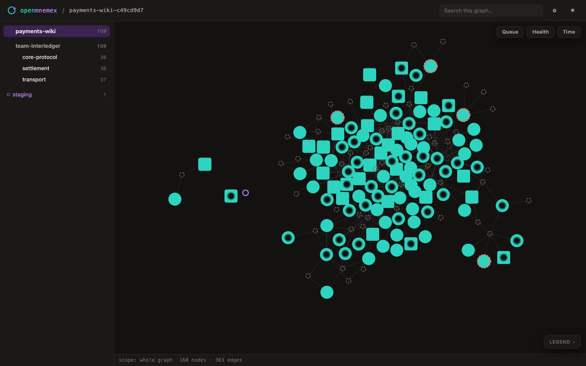

# 🖥️ The OpenMnemex Console (`uvx openmnemex`)

> Part of the **Mnemex Context Graph** standard. The Console is where your OpenMnemex journey
> **starts**: a local web app that opens with one command, guides you through creating a graph
> and connecting your coding agents, and then stays your window into the graph — which knowledge
> is hot, which is going stale, and how it all connects. Over knowledge it is **view-only**:
> agents write, humans read. (It grows: the Console is the layer where future human-facing
> capabilities land.)



## 🚀 Run it

```bash
# One-off, no install (needs Python 3.9+) — the bare command IS the Console:
uvx openmnemex

# Or install once, then:
pip install openmnemex
openmnemex                            # also: openmnemex console / openmnemex-console
```

It starts a **local single-user server** on `http://127.0.0.1:8765` (auto-increments if the port
is taken) and opens your browser. Flags:

| Flag | Meaning |
|---|---|
| `--port N` | Listen on port `N` instead of 8765 (still auto-increments when taken). |
| `--no-open` | Don't open the browser automatically. |
| `--graph PATH` | Register the graph at `PATH` before starting (useful for a folder the scan wouldn't find). |

Everything the Console needs (FastAPI + uvicorn) ships with the base package — no extra install
step, no bracket syntax. The request log is quiet by design: one line per API call, nothing for
static files.

## 🧭 The journey starts here

1. **Install & open** — `uvx openmnemex`. The welcome screen lists every graph on your machine;
   first run offers **Create your first graph**.
2. **Add agents** — the Add agents screen detects the coding agents installed on this machine and
   shows their connection state. Each detected-but-unconnected agent gets a one-click
   **Connect** — it writes the same machine-level config the CLI installer would
   (`openmnemex install --agent <a> --user`), then the row flips to connected.
   **Claude Code is special**: the Console recommends the **plugin** route (richer — 7
   auto-capture hooks, the full skill set) and shows the two `/plugin` commands to run inside
   Claude Code, with Connect-via-MCP as the secondary option. Plugins can only be installed from
   inside Claude Code itself, so that step is shown, not clicked.
3. **Work** — your agents read/capture/promote through MCP or the plugin; you watch the graph
   live in the Console.

Prefer the terminal? Every connect action is also `openmnemex install --agent <agent> …` — the
Console drives exactly that installer, so the two paths can never disagree.

## 🔍 How it finds your graphs

Three sources, combined on the welcome screen:

1. **Registry cache** — every graph the Console (or the engine) has seen before.
2. **Rescan this machine** — a bounded scan of the usual places (your mnemex home, bindings).
3. **Open a folder…** — point it at any folder that holds a `mnemex.config.md` (a server-side
   folder browser, because web pages can't read paths from the native picker).

First run with no graphs offers **Create your first graph** — only onto a new/empty folder (it
refuses anything with existing content). It uses the same `mnx_init` scaffolder as every other
surface, so the result is doctor-clean.

## 🖼️ The screens

| Screen | URL | What it shows |
|---|---|---|
| **Graphs** | `/` | Graph cards (nodes, clusters, staged count, last activity) + open/rescan/create + Add agents. |
| **Main view** | `/g/{graph}` | Folder tree · graph canvas · inspector. `?scope=` narrows to a team/cluster, `?sel=` pre-selects a node — URLs are shareable. |
| **Atom view** | `/g/{graph}/atom/{id}` | The full atom: rendered markdown, clickable `[[wiki-links]]`, front-matter table, breadcrumb, "reveal in canvas". |
| **Config** | `/g/{graph}/config` | Every effective knob with a plain-language explanation; customized values marked against their defaults. Read-only. |
| **Add agents** | `/connections` | Detected coding agents + connection state, one-click **Connect** for each, plugin-recommended flow for Claude Code. |

## 🎨 Reading the canvas (the visual encoding)

Two independent axes, kept independent on screen — exactly the engine's model:

| What you see | What it means |
|---|---|
| **Size + teal depth** | Hotness — how heavily the atom is used (decayed strength). Big and deep teal = hot; small and gray = cold. |
| **Amber dashed ring** | Due for reverification soon (freshness clock, separate from hotness). |
| **Red dashed ring** | Stale — overdue for a re-check. A **big teal node with a red ring** (hot + stale) is the state the canvas exists to make unmissable. |
| **Light center dot** | Timeless — never stales by design. |
| **Rounded square** | A pattern atom (the "how"); circles are domain facts (the "what"). |
| **Hollow purple outline** | Staged — captured but not yet promoted. |
| **Dashed gray ghost** | A red-link: atoms point at this name, but nothing is written yet. |
| **Faded** | A boundary stub — linked from this scope but living outside it. |

Hovering shows the exact numbers (strength, half-life, verified date, days to stale) — all
computed **server-side by the engine**; the frontend never reimplements the decay math. Clicking
a node highlights its mesh and dims the rest; the legend in the corner explains everything above.

## 🧰 The toolbar (top-right of the canvas)

- **Queue** — the revalidation queue: every atom with a freshness horizon, soonest-stale first.
  Click a row to locate it on the canvas. Revalidation itself happens through your agent
  (`mnx-revalidate`); the Console only shows.
- **Health** — pins doctor findings onto the affected nodes (a red glow) and lists everything,
  including findings that don't anchor to a node. Fixing stays with `mnx-doctor --fix`.
- **Time** — the scrubber: project the graph up to a year ahead (+7/+30/+90 presets or free
  drag). The server recomputes every number at the projected date; node positions stay put, so
  you literally watch the same graph age — which dots shrink, which rings turn red. A banner
  makes clear you're looking at a projection, one click returns to today.

## 🔒 What the Console will never do

Per the build decision (see `LIMITATIONS.md` #5): **no UI writes on existing graphs** (browsing
never changes a file), **no desktop app**, **no per-agent attribution lens**, **no auth** (it
binds to `127.0.0.1` only — don't port-forward it). The two exceptions both leave knowledge
untouched: creating a brand-new empty graph from the first-run screen, and the Add agents
screen's **Connect** button, which writes an agent's own MCP config through the same shared
installer as the CLI — never a graph file.
