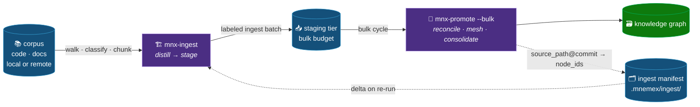

# 🏗️ Corpus Ingestion (bootstrapping the graph from an existing repo)

> Part of the **Mnemex Context Graph** standard. This document specifies **`mnx-ingest`**: how the durable
> knowledge already sitting in an existing **code or documentation repository** (local folder or git
> remote) is distilled into the knowledge graph as a one-time bootstrap — and kept in sync on re-run —
> **without a live session**. Episodic capture (Staging & Promotion) is unchanged and takes over afterward.
>
> See [`script-contracts.md`](script-contracts.md) for `mnx_ingest` / `mnx_er` / `mnx_glean` and the
> `mnx_stage` bulk profile. Read
> [`staging-and-promotion.md`](staging-and-promotion.md) (the capture/promote split this reuses),
> [`multi-graph-and-team-routing.md`](multi-graph-and-team-routing.md) (which-graph / which-team),
> [`link-reconciliation.md`](link-reconciliation.md) (the mesh), and
> [`script-contracts.md`](script-contracts.md) (`mnx_node`, `mnx_stage`, `mnx_binding`) first.
>
> The hard part is **not** walking files — it is producing a *high-quality, connected* graph from a **cold
> corpus** instead of a lived session. In both episodic capture and ingest the *agent* writes the
> `[[wiki-links]]` and the human only says **yes/no** on the uncertain ones; the difference is that episodic
> mines a transcript whose entity/relation structure is already in-context, while ingest must **reconstruct**
> that structure from scratch. §8–🔟 ground that reconstruction in current industry practice (Microsoft
> **GraphRAG** extraction, **wikification / entity-linking**, **Fellegi-Sunter entity resolution**, **Leiden**
> community detection) and show it emits into the *existing* mesh pipeline unchanged.

---

## 0️⃣ The model in one sentence

> [!IMPORTANT]
> 🧠 **Ingest is a new *source adapter*, not a new subsystem.** A live session is one producer of staged
> atoms; a corpus is a second. Ingest walks the repo, *distills* durable atoms, and stages them into the
> **same staging tier** — then the **existing** `mnx-promote` reconciles, meshes, consolidates, and pushes
> them. Promote stays the only writer to the graph.



The single most important consequence of reusing the pipeline: **dedup, MERGE/SUPERSEDE, contradiction
HITL, link reconciliation, decay/re-tier, the doctor, and push are all inherited unchanged.** Ingest adds
*only* the front half — walk, distill, stage — plus a scale-adapted promote mode and a delta manifest.

---

## 1️⃣ The one principle: distilled memory, not a mirror

> [!WARNING]
> 🚫 **Ingest is not RAG.** The graph is *distilled durable knowledge*, not a chunked search index over the
> corpus. If ingest transcribes the docs, the graph becomes a lossy copy of the repo and destroys the
> cheap-structural-retrieval thesis in [`overview.md`](overview.md).

Extraction is **LLM judgment** — *"is this a durable fact (the *what*) or a prescriptive pattern (the
*how*) that a future agent would want, months from now, without the source open?"* — never a mechanical
one-atom-per-heading or one-atom-per-function parser. The deterministic script *walks, classifies, chunks,
hashes, and diffs*; the skill's sub-agent *decides what is an atom*. A file may yield many atoms, one, or
zero. Zero is a valid and common answer (boilerplate, generated code, changelogs, lockfiles).

---

## 2️⃣ Source classification & extraction policy

`mnx_ingest.py` classifies every enumerated file into a **kind**, and each kind has an extraction policy.
Ingest mines **code and docs equally** (a deliberate scope choice), but code is extracted at
**symbol/interface granularity, never line granularity**, with value-gating to hold back the noise that
aggressive code mining otherwise produces.

| Kind | Examples | What becomes an atom | What is dropped |
|---|---|---|---|
| 📄 **doc** | `*.md`, `*.rst`, ADRs, wikis, specs, runbooks | domain facts from sections; **patterns** from ADRs / decisions / "gotchas" / CONTRIBUTING / runbooks | nav pages, changelogs, TOCs |
| 🧩 **interface** | public API signatures, `*.proto`, OpenAPI, GraphQL SDL, exported types, config schemas | the *contract* — the durable "what" of code | private helpers, bodies |
| 🧠 **code-doc** | docstrings, module/package headers, README-in-dir | the intent/semantics the author wrote down | inline line comments, TODOs |
| ⚙️ **config** | env schema, feature flags w/ rationale, IaC with comments | declared knobs + their meaning | secrets (never read), generated config |
| 🗑️ **skip** | lockfiles, `node_modules`, `dist/`, minified, binaries, vendored, generated | — | everything |

**Code value-gate (the noise control the aggressive-code choice demands).** A code-derived atom is staged
only if it clears a durability bar: it is a **public/exported contract**, *or* it carries an
author-written docstring/comment explaining *why*, *or* it is a config knob with a declared meaning. A bare
private function with no doc is **not** an atom. Function *bodies* are never transcribed — only the
distilled semantics. Symbol-level, doc-gated, contract-first: that is how "docs + code equally" stays out
of RAG territory.

Classification, include/exclude globs, per-file size caps, and the skip-list are config
(§7); the human sees and can override the classification map in the scope preview (§4).

---

## 3️⃣ Corpus provenance & the ingest manifest

A session atom's provenance is `{artifact, reviews, session, rationale}`. A **corpus atom** carries a
source-anchored provenance instead — self-sufficient to reconcile cold *and* to diff on re-run:

```yaml
provenance:
  source_repo: github.com/acme/payments-service   # or an absolute local path
  commit_sha: 9f3c1a…                              # the exact ref distilled from
  source_path: settlement/reconcile.md             # file within the corpus
  anchor: "## Cut-off handling" | "L120-168" | "sym:ReconcileBatch"
  ingest_batch: ing-2026-07-11-a1b2               # groups a run for reporting + rollback
  kind: doc | interface | code-doc | config
  rationale: "distilled from settlement design doc"
```

The **ingest manifest** is protocol state (not knowledge), committed into the graph beside the high-water
marks — mirroring the `.mnemex/highwater/` pattern in [`data-model-and-schemas.md`](data-model-and-schemas.md) §8:

```
<graph-root>/.mnemex/ingest/<source-slug>.json
{ "source_repo": "...", "last_commit": "9f3c1a…", "ingested_at": "...",
  "files": { "settlement/reconcile.md": { "hash": "sha1…", "nodes": ["settle-cutoff", "…"] }, … } }
```

Committing it in-graph (not in local staging) means **any clone knows the corpus was imported to commit X**,
so a re-ingest by a different author still diffs correctly. `<source-slug>` is derived from the source URL
or path the same way `mnx_binding.graph_slug` derives the staging slug.

---

## 4️⃣ The flow (`/mnemex:mnx-ingest <source> [--into <graph>]`)

```
PREFLIGHT   resolve/target graph (binding, or --into to create/select) → sync clone
SOURCE      clone remote to a read-only cache OR use local path in place (never mutate the source)
PROBE       enumerate + classify + size-estimate; load prior manifest → compute the DELTA set
SCOPE PLAN  ── STOP for the human (gate #1) ──
              • file counts by kind, est. atoms, est. cost, what is skipped
              • the SOURCE-TREE → CLUSTER MAP (see §5), pre-proposed from paths, editable
              • delta summary on re-run ("42 files changed, 900 unchanged skipped")
EXTRACT     per source-subtree, in bounded ingest batches: sub-agent distills atoms
            (kind-aware §2), stamps corpus provenance §3, embeds [[wiki-links]] by name,
            stages under a labeled ingest batch (bulk budget §6)
DRAIN       mnx-promote --bulk per batch  ── STOP only on contradictions / new clusters (gate #2) ──
MANIFEST    on confirmed persist, write source_path@commit → node_ids into the manifest
REPORT      created / merged / superseded / dropped-dup / held, by cluster
```

Two gates, matching the **summary + contradiction** HITL level: **gate #1** approves *scope + routing map*
once, up front; **gate #2** is the bulk-promote plan, which auto-accepts plain CREATEs and stops only for
contradictions and new-cluster creation. There is no per-atom review — infeasible at corpus scale.

`--dry-run` stops after the SCOPE PLAN (probe only, nothing staged). `--resume <ingest-batch>` continues
an interrupted run from the manifest + remaining staged atoms.

---

## 5️⃣ Routing at bulk scale — the source-tree → cluster map

Session capture defers team/domain to promote and decides it per atom. That does not scale to thousands of
atoms. Ingest exploits the fact that **a repo's directory structure is a strong routing signal**: it
proposes a small **source-subtree → cluster map**, the human approves/edits it once (gate #1), and then
every atom under a subtree inherits that `domain:`/team placement.

```
settlement/**        → team-payments/settlement
rails/**             → team-payments/rails
docs/risk/**         → team-risk/finality        (cross-team; needs default_team or existing cluster)
proto/**             → (classify per file — mixed)
```

Placement still flows through the normal promote routing (org→team index match, `default_team` fallback)
and every new cluster is surfaced at gate #2 — the map is a *bulk default*, not a bypass of routing.

---

## 6️⃣ Scale: bulk staging budget + bulk promote

Per-session staging refuses past **50 atoms / 512 KB** ([`staging-and-promotion.md`](staging-and-promotion.md) §Budgets) —
correct for episodic capture, fatal for a corpus. Ingest stages under a **labeled ingest batch** with a
**bulk budget profile** (large cap, drained continuously), so the per-session soft/hard nag does not fire
mid-import. The bulk batch is isolated from any hand-captured atoms in the same graph's staging (label
partition), so an in-flight import never entangles a user's ordinary captures.

**`mnx-promote --bulk --ingest-batch <id>`** IS the existing promote — literally the same
`mnx_promote.py begin/context/apply` engine transaction (onboarding + ingest plan, the O1 lift), just
given the labeled ingest batch instead of the unlabeled session batch, so it drains only that batch's
atoms and never touches a concurrently-staged hand-capture. There is no separate bulk code path to drift
from episodic promote:

1. **Fork reconcile per cluster** (a plan-drafting technique, unchanged: the sub-agent contract already
   permits forking — *plan in parallel, apply serially under the lock*). Each fork reconciles its
   subtree's atoms against one cluster's index.
2. **Summarized plan.** The approval plan collapses to per-cluster counts (`CREATE 214 · MERGE 31 · DROP-DUP
   57`) and lists *only* the exceptions in full: contradictions, ambiguous near-matches, and new-cluster
   creation. Auto-accept the plain CREATEs. Same plan JSON shape as episodic.
3. **One `apply()` call settles the whole batch.** Node writes → mesh links → consolidate → regen →
   doctor gate → persist → per-atom settle, in the fixed order episodic promote uses. Consolidation runs
   over the batch as landed by this one call — **not yet** chunked into incremental per-sub-batch
   checkpoints over a frozen view for an exceptionally large single-run corpus (that finer-grained
   checkpointing, needed only when a batch is too large for one consolidate pass to reason about
   sensibly, is sequenced as later work — see `docs/onboarding-and-ingest-plan.md` §3.4 "3.4b").

Everything else — link reconciliation (Step 2b), the doctor gate (E==0), kind-aware persist — is the
existing promote, unchanged. Exposed identically on **every** surface: the Claude `--bulk` skill mode and
the MCP `promote_begin`/`promote_context`/`promote_apply` tools (`ingest_batch=` parameter) call the exact
same engine functions.

### Ingest on non-Claude hosts (MCP)

Every step above is a real MCP tool, not Claude-only: `ingest_acquire` (materialize the source read-only)
→ `ingest_probe` (walk/classify/chunk; gate #1) → distill + stage atoms with
`capture_add(ingest_batch=<id>, provenance={...})` → `glean_coverage` (loop until complete/cap) →
`er_resolve` (CREATE/MERGE/COLLAPSE + the `possible` HITL band, over `{staged ∪ existing graph pages}` —
this is how a re-import merges instead of duplicating) → drain with `promote_begin`/`promote_context`/
`promote_apply(ingest_batch=<id>)` → `ingest_manifest_write` on confirmed persist (`ingest_delta` diffs the
next re-import). The judgment (is this a durable atom? which `[[link]]`? which merge?) still lives with the
host model — today via each ingest tool's description (they embed the compact ingest digest, e.g.
`ingest_acquire`'s), not yet a dedicated `ingest-procedure` MCP prompt the way read/capture/promote/curate
have one. **Deferred, not forgotten:** migrating `skills/mnx-ingest/SKILL.md` into the single-sourced
`templates/procedures/` core+fragments system (byte-for-byte drift-guarded, matching read/capture/promote)
so an `ingest-procedure` prompt renders from the same source — tracked as onboarding-and-ingest-plan.md
§3.1, sequenced after the load-bearing engine lift (§3.4) shipped in this same change.

---

## 7️⃣ Re-ingest — update, not re-create ("update or create")

Re-running ingest against the same source later must not re-create everything. Three layers, cheapest first:

1. **Manifest delta (skip unchanged).** Probe diffs each file's content hash against the manifest; atoms are
   extracted **only from added/changed files**. Unchanged files are skipped before the sub-agent ever runs —
   the dominant cost saver on re-run.
2. **Content-hash idempotency (staging).** A byte-identical re-extraction is a staging no-op (the existing
   `stg-<sha1>` provisional-id rule).
3. **Reconcile dedup (graph).** Lightly-reworded content that survives layers 1–2 is caught by reconcile as
   MERGE / DROP-DUP / SUPERSEDE against the existing node — the same machinery episodic promote already uses.
   A `simindex` near-match becomes a `⚠ suggested` merge at gate #2.

A file **deleted** from the source since last ingest surfaces its manifest node_ids as *orphan candidates*
in the report (never auto-tombstoned — deletion of a doc ≠ death of the knowledge; the human decides).

---

## 8️⃣ Link discovery — wikification, not authoring (the quality core)

> [!IMPORTANT]
> 🖋️ **The `[[wiki-links]]` are written by the *agent* in both episodic capture and ingest — the human only
> says yes/no on the uncertain ones.** What differs is the *input*: episodic mines a **lived transcript**
> (the agent already holds the entity/relation structure in context); ingest reads a **cold corpus** and
> must *reconstruct* that structure. So ingest's extraction sub-agent does the same job the capture agent
> does — emit `[[wiki-links]]` by name into the atom bodies — but it first has to *discover* the entity set
> the transcript would have handed it for free. That discovery is the classic **wikification /
> entity-linking** problem; its output flows into the *existing* Step 2b
> ([`link-reconciliation.md`](link-reconciliation.md)) **unchanged**.

This is the deliberate answer to "is the wiki approach the best way?" — **yes, the authoring *surface* is
right** (the Obsidian/Roam/Wikipedia model of inline `[[names]]` + red-links + backlinks, which
[`link-reconciliation.md`](link-reconciliation.md) implements well). What episodic leaves implicit — *how the
agent knows the entity set to link against* — ingest must make explicit, because a cold corpus gives it no
lived context. We borrow the standard automated pipeline for exactly that reconstruction and route its
output back into the same surface. Nothing downstream changes.

> [!NOTE]
> 👤 **The human's role is adjudication, not authoring — and only on the *uncertain* rows.** An **exact**
> catalog/phonebook resolution and a red-link flow through with no yes/no (shown for transparency); only a
> **fuzzy `⚠ suggested`** link or a contradiction asks the human to confirm. Ingest keeps this exactly — it
> just batches the yes/no into the gate-#2 summary (§6) instead of one plan per handful of atoms.

**Industry grounding.** The distillation + link-discovery step is the Microsoft **GraphRAG** pattern (an LLM
extracts entities + relationships + claims from each text unit, with multi-pass *gleanings* to catch missed
entities), and the name→page decision is **wikification / collective entity disambiguation** (AIDA-style:
mention detection → candidate generation → coherence-based disambiguation). We adopt the *structure* of
these, **not** their vector store — the mesh stays file-based and structural per [`overview.md`](overview.md).

### The two-pass pipeline (the key quality lever)

Resolving each name greedily as you meet it (episodic's model, fine for ~20 atoms) produces locally-optimal
but globally *inconsistent* links across thousands of atoms — a fragmented graph. GraphRAG's fix, adopted
here: build a deduped **entity catalog first**, then link every atom against that one coherent set.

```
PASS 1 — entity catalog (corpus-wide, before any atom body is finalized)
  for each source unit:  LLM extracts candidate entities (canonical name + aliases + type) + relations
  GLEAN: re-ask "what durable entity/fact did this unit contain that I did not extract?" (bounded passes)
  assemble an IN-BATCH ENTITY CATALOG across the whole delta corpus
  ENTITY-RESOLVE {catalog ∪ existing graph pages}  (§9)  → one canonical, deduped entity set

PASS 2 — wikify (rewrite the distilled atoms against that catalog)
  for each atom, for each mention of a catalog/graph entity in its body:
      emit [[canonical-name]]           (piped display if the surface form differs)
  a mention with NO catalog/graph entity → still [[bracket]] it → becomes a RED-LINK (heals later)
  Pass-1 relations become the [[links]]; typed only if the relation is one of the tiny vocab (untyped default)
```

`mnx_mesh.plan_links` **already accepts an in-batch catalog** ([`link-reconciliation.md`](link-reconciliation.md) §12,
`resolves … against the phonebook (+ in-batch catalog)`) — the hook for Pass 2 exists; ingest just populates it.

The **GLEAN** step is GraphRAG's *gleanings* technique — a bounded multi-pass "did I miss anything?" loop
that materially lifts extraction recall. It is a shared, source-agnostic recall pass that also improves
episodic capture; ingest is one of its consumers.

### Red-links are load-bearing here

Within one ingest run, early atoms reference entities that later batches will create. That is **exactly**
red-link + backfill ([`link-reconciliation.md`](link-reconciliation.md) §3): a bracketed name with no page
yet is kept latent and goes live the moment its page is created — so the mesh **knits itself within a single
import** as later batches land the targets. No new mechanism; the shipped red-link engine is what makes
bulk linking converge instead of fragmenting.

### Precision discipline (inherited, non-negotiable)

A wrong `[[link]]` is a **false edge** — it inflates structural strength (keeps junk alive) and misroutes
readers. So ingest holds Step 2b's exact-resolves/fuzzy-proposes line: an **exact** catalog/phonebook match
is emitted deterministically; a **fuzzy** semantic near-match (simindex) is a `⚠ suggested` link surfaced at
gate #2, never auto-written. High recall in Pass 1 (bracket generously — red-links are cheap); high
precision in Pass 2 (only *confident* links go live).

---

## 9️⃣ Entity resolution at bulk scale (dedup beyond exact + MinHash)

Episodic promote dedups with the phonebook (exact / alias / token) + `simindex` (MinHash fuzzy whisper) —
right for a handful of atoms. A corpus is redundant by nature (the same fact in a README, a design doc, and
a code comment), so ingest needs an explicit **entity-resolution (ER)** stage: the industry-standard
**blocking → pairwise scoring → clustering** pipeline — the **Fellegi-Sunter** probabilistic model as
implemented by **Splink / dedupe / Zingg**. We already ship the pieces; ingest just sequences them as ER:

```
BLOCK    generate candidate pairs from cheap keys — REUSE simindex MinHash-LSH bands + the phonebook
         token index. (Avoids the O(n²) all-pairs blow-up; blocking is the standard ER scaling move.)
SCORE    pairwise match probability per blocked pair — features: name/alias overlap, summary similarity,
         shared domain, shared links. Escalate only the ambiguous middle band to an LLM judge.
CLUSTER  transitive-close the high-confidence matches into canonical entities (connected components /
         correlation clustering); pick a canonical name; UNION the alias sets.
DISPOSE  each cluster → exactly ONE graph node:
             no match in graph      → CREATE
             matches an existing page → MERGE / UPDATE (fold; keep id)
             intra-batch duplicates  → collapse BEFORE staging (never stage 5 atoms for one entity)
```

This turns the corpus's redundancy from a liability into a strength: many corroborating sources **collapse
into one well-provenanced node** (each source kept in `provenance` §3), and the unioned alias set makes that
node maximally findable by the phonebook (which feeds better wikification in §8 — the two stages reinforce).
The Fellegi-Sunter three-way split (match / *possible* / non-match) maps to the HITL gate: the **possible**
band surfaces as `⚠ suggested` merges at gate #2; match and non-match are deterministic.

> [!NOTE]
> ER runs **once per delta batch over {new atoms ∪ existing graph pages}**, not globally over the whole
> graph every time — the manifest delta (§7) keeps the candidate set bounded, so ER stays a per-batch,
> blocking-bounded cost even on a large graph.

---

## 🔟 Community detection for cluster proposal (optional, guarded)

GraphRAG uses **Leiden** community detection to group entities into hierarchical communities (and summarize
each). Mnemex *could* use the same to **propose** the source-tree→cluster map (§5) or refine `domain:`
routing when a corpus has weak directory structure — run Leiden over the discovered entity graph and offer
the communities as candidate clusters at **gate #1**.

> [!WARNING]
> 🧭 **Proposal only — it never becomes the structure.** The architecture deliberately rejects structure
> derived from a global clustering of the store: structure is folder depth, split along *declared* keys, one
> chunked index read per level ([`overview.md`](overview.md) goal 6; [`invariants-and-failure-modes.md`](invariants-and-failure-modes.md)
> S2). So Leiden may *suggest* a folder map for the human to approve at gate #1, but path-based routing (§5)
> stays the default, and community detection **never runs at read time** and never mints structure on its own.

For most corpora the directory tree is a stronger, cheaper routing signal than a fresh clustering — treat
Leiden as an aid for the structure-poor case, not the default.

---

## 1️⃣1️⃣ Components: new vs reused

| Component | Status | Role |
|---|---|---|
| `mnx_ingest.py` | 🆕 new | walk/clone-to-cache · classify · chunk (headings/symbols) · hash · manifest read+write · `probe` (scope estimate) · delta diff. **No judgment, no graph writes.** |
| `mnx-ingest` skill + command | 🆕 new | orchestrator: preflight → probe → scope gate → **two-pass extract/wikify** (§8) → bulk drain → manifest → report |
| ER stage (blocking→score→cluster) | 🆕 new | §9 — a proposer feeding disposition; **reuses** `simindex` (MinHash-LSH blocker) + `phonebook` (token blocker); LLM judge only on the ambiguous band |
| `mnx_simindex` | ✳️ extend | expose LSH **candidate-pair generation** (the ER blocker), not just point queries |
| `mnx_stage.py` | ✳️ extend | ingest-batch label + bulk budget profile |
| `mnx-promote` | ✳️ extend | `--bulk` (forked reconcile, summarized plan, incremental consolidate) |
| `mnx_mesh`, `mnx_phonebook` | ♻️ reuse | `plan_links` already takes an **in-batch catalog** (§8 Pass 2) + red-link backfill — unchanged |
| `mnx_node`, `mnx_index`, `mnx_doctor`, `mnx-consolidate` | ♻️ reuse | unchanged — truth-writes, indexes, invariants, maintenance |
| `mnx_binding` | ♻️ reuse | binding resolve/sync/`probe-remote` patterns (source clone reuses the auth/probe approach) |

---

## 1️⃣2️⃣ Cross-cutting invariants

- Ingest **never writes the graph** — it only stages; `mnx-promote` remains the sole writer.
- Ingest **never mutates the source corpus** — clone to a read-only cache or read a local path in place.
- **Distill, never transcribe** — no file body is copied wholesale into a node; zero atoms from a file is valid.
- **Never read secrets** — the skip-list excludes credential files; a matched secret is never staged.
- A corpus atom must be promotable **cold** — source-anchored provenance is self-sufficient.
- Re-ingest is **idempotent** by construction (manifest delta → hash idempotency → ER/reconcile dedup); it
  never blindly re-creates.
- A source file's deletion **never auto-tombstones** its nodes — it is surfaced for human decision.
- Bulk atoms are **label-partitioned** from hand-captured atoms — an import never entangles episodic captures.
- The scope/routing map (gate #1) and every new-cluster creation (gate #2) are **shown before any write** —
  bulk auto-accept covers only plain CREATE/MERGE, never a contradiction or a new cluster.
- **Discovered links obey exact-resolves / fuzzy-proposes** (§8) — an exact catalog/phonebook match links
  deterministically; a fuzzy/semantic association is `⚠ suggested`, never auto-written. A wrong link is a
  false edge, so recall is generous (red-links are cheap) but *live* links are high-precision only.
- **One entity → one node** — ER (§9) collapses intra-batch duplicates *before* staging and merges into the
  existing page; the corpus's redundancy becomes provenance + aliases on a single node, never duplicate nodes.
- **No structure from a global clustering** — community detection (🔟) may *propose* a folder map at gate #1
  but never mints structure on its own and never runs at read time; path-based routing (§5) is the default.

---

## 1️⃣3️⃣ Open questions

1. **Language coverage for `interface`/`code-doc` classification** — start with a few (TS/Py/Go/proto) via
   lightweight per-language extractors, or a language-agnostic heuristic (exported-symbol regex + docstring
   blocks)? Affects how much the value-gate can rely on real parsing.
2. **Cost ceiling per run** — a hard atom/token budget with a "resume next run" cutoff, so a huge monorepo
   can't run away in one invocation. The LLM-judge escalation in ER (§9) is the main variable cost — cap it
   to the ambiguous band only.
3. **Cross-team corpora** — a monorepo spanning many teams needs `default_team` per subtree in the routing
   map; confirm the map schema carries a team column, not just a cluster.
4. **ER thresholds** — the Fellegi-Sunter match / possible / non-match cutoffs (§9): fixed defaults, or
   learned per-graph? Fixed-with-override is likely enough for v1; the `possible` band is HITL anyway.

### Design decisions

- **The GraphRAG machinery stays ingest-only — it is *not* adopted for episodic capture.** ER clustering,
  Leiden communities, and the two-pass catalog solve *cold-input + scale + redundancy* problems; episodic
  capture has none of them (it mines a lived transcript of ~5–30 low-redundancy atoms, and the agent
  already holds the entity/relation structure in context). Episodic keeps its phonebook + `simindex`
  dedup, which is correctly sized for that volume. Forcing ER/communities onto a continuously-updated
  episodic store would also reintroduce the batch-recompute maintenance cost the architecture avoids, and
  GraphRAG's vector/global-summary *retrieval* contradicts the no-vectors / structural-retrieval thesis
  ([`overview.md`](overview.md) goals 1 & 6). The differing front-ends are a feature: both converge on the
  same `staging → promote → mesh` backbone.
- **The one transferable technique — *gleanings* — IS backported**, but as a shared, source-agnostic
  recall pass (a bounded "what did I miss?" loop), not as the rest of the machinery. It benefits episodic
  capture and ingest equally and is built once.

---

## 📚 Industry grounding (sources)

The automated half of this design is deliberately standard practice, not invention:

- **GraphRAG** — LLM entity/relationship/claim extraction from a corpus + Leiden community summaries:
  [Microsoft GraphRAG overview](https://www.datacamp.com/tutorial/graphrag),
  [from-local-to-global with Neo4j/LangChain](https://neo4j.com/blog/developer/global-graphrag-neo4j-langchain/).
- **Entity resolution (Fellegi-Sunter; blocking→score→cluster)** —
  [Splink (probabilistic record linkage)](https://www.robinlinacre.com/introducing_splink/),
  [(Almost) All of Entity Resolution (survey)](https://arxiv.org/pdf/2008.04443),
  [open-source ER libraries: Splink / Zingg / dedupe](https://tilores.io/content/best-open-source-entity-resolution-and-record-linkage-libraries-splink-zingg-dedupe-and-when-to-move-beyond-them/).
- **Wikification / entity linking** — mention detection → candidate generation → collective disambiguation
  (AIDA-style), the classic "turn free text into `[[wiki-links]]`" pipeline.
```
