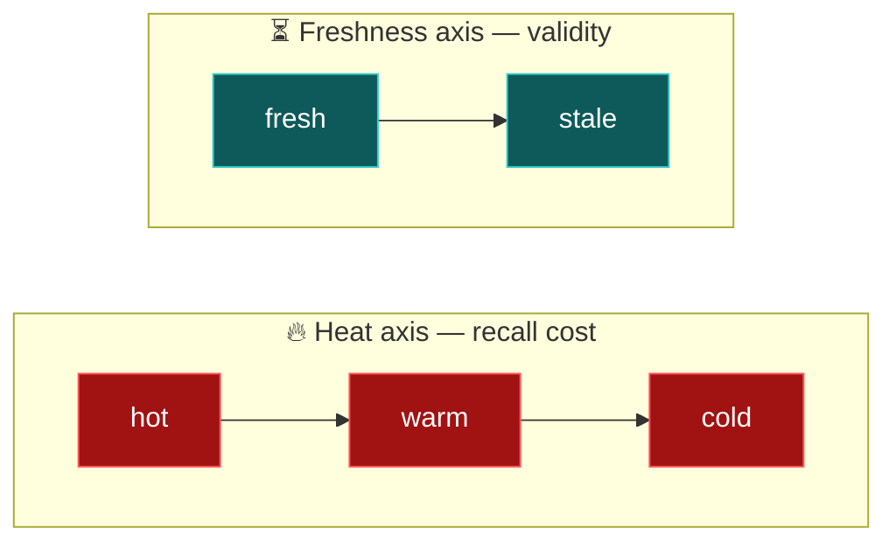
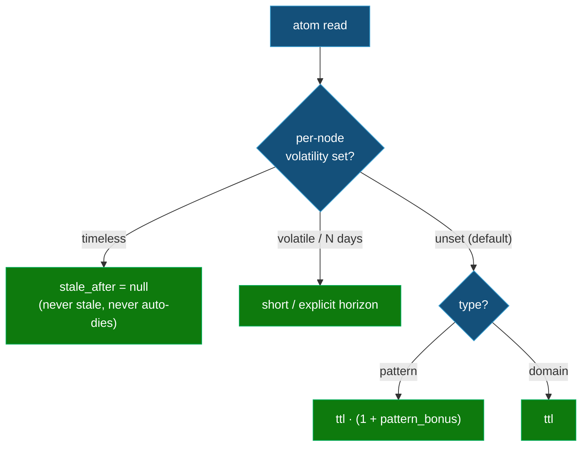

# ⏳ Freshness and Revalidation

Heat tells you whether to **surface** an atom. It says nothing about whether the atom is still **true**.
This document adds a second, orthogonal axis — **freshness** — and the **Revalidation-on-Read** mechanism
that signals the model to re-confirm a fact that was last verified too long ago.

> [!NOTE]
> 🔥 **Heat** (`hot/warm/cold`) = recall cost — *should I show this?* · ⏳ **Freshness** (`fresh/stale`)
> = validity — *should I still trust this?* The two never touch each other's math.

---

## 1️⃣ Why heat is not freshness

A node's heat is driven by **access** — every stamped read reinforces it (Architecture). But reading an atom
never makes it *true*; it only makes it *loud*. The failure this creates is specific and dangerous: a
frequently-read fact that was correct a year ago is now a **confidently-recalled, high-exposure, unverified**
claim. Heat actively **hides** staleness — the more an atom is used, the more the system vouches for it,
regardless of whether reality moved on.

So freshness must be an **independent clock**. It is not a second decay rate, it never feeds strength or
tiering, and a `hot`, `high`-confidence atom can be `stale`.

Every atom carries one label on **each** axis, independently — e.g. `hot` + `stale`:



---

## 2️⃣ Three truth clocks on a node

A node already carries two timestamps (Data Model & Schemas §2). Freshness adds a third. They answer different questions
and must not be conflated.

| Field | Set when | Answers |
|---|---|---|
| `created` | atom is born | when did this first exist? |
| `updated` | the **meaning** changes | when did this last *change*? |
| `verified` | the atom is **confirmed still true** | when was this last *checked against reality*? |

The `verified`/`updated` split is the whole trick. **Re-confirming an unchanged atom bumps `verified` only** —
`updated` stays put (preserving the meaning-change audit trail) and strength/tier are untouched (a
confirmation is not a usage boost). A change bumps *both*. `verified` is **monotonic** — it never regresses.
At birth, `verified = created`.

---

## 3️⃣ `stale_after` — the precomputed freshness horizon

Freshness is materialized in the index exactly like the Cold tier's `expires` column: a single
**precomputed timestamp**, `stale_after`, denormalized onto every index row. Read then needs no arithmetic —
it compares `now > stale_after ⇒ stale`. Chunk-1-visible, zero body loads.

```
resolve_horizon(node) → stale_after :
    if volatility(node) == timeless:        stale_after = null            # never stale
    elif volatility(node) is <int days> d:  stale_after = verified + d
    elif volatility(node) == volatile:      stale_after = verified + freshness_ttl_days · 0.15
    else:  # default → derive from type
        if type == pattern:  stale_after = verified + freshness_ttl_days · (1 + freshness_pattern_bonus)
        else:                stale_after = verified + freshness_ttl_days
```

`stale_after` is recomputed by consolidation whenever `verified`, `volatility`, or the config horizon
changes (Maintenance Pass Algorithm). Because it is precomputed, an edited `freshness_ttl_days` only takes effect at the next
consolidation — identical to how tier labels "may be stale since last gc" (Skills, Commands & Hooks §1) and guarded by the
same `config_version` re-normalization (Configuration).

---

## 4️⃣ The horizon: one knob, layered defaults

The user sets **one number**; three layers resolve it, in precedence order. ~99% of atoms carry nothing and
inherit from their type.



- **A — global default** (`freshness_ttl_days`, default **30**): asked at `mnx-init`, like `half_life_days`.
- **B — per-type derivation:** patterns (durable *how*) get the longer `freshness_pattern_bonus` horizon,
  domain facts get the base — derived from one number, the same rule shape as the half-life bonus (Configuration).
- **C — per-node override** (`volatility`): the escape hatch for outliers. `timeless` (definitions,
  invariants), `volatile` (URLs, versions, prices, on-call names), or an explicit day count.

**Who sets C:** `mnx-capture` **proposes** `volatility` from the atom's content shape; the human **overrides**
at the `mnx-promote` plan gate (Skills, Commands & Hooks). The author never has to remember to annotate — they wave through or
correct a suggestion.

---

## 5️⃣ Revalidation-on-Read (the signal)

`mnx-read` stays **pure w.r.t. knowledge** — its only write remains a registry append (Skills, Commands & Hooks §1). Freshness
adds a read-time *signal*, not a mutation:

1. For every atom in play, if `stale_after` is non-null and `now > stale_after`, mark it **`stale`** and
   attach a **refresh cue**: *"⏳ last verified 47d ago (horizon 30d) — re-derive from source and confirm
   before relying on this."* (When the atom's body is loaded, the cue enriches the message with the exact
   `verified` date; otherwise it states the overdue horizon.)
2. **Anti-nag.** Each atom's cue fires **at most once per session** (the same per-session-marker mechanism the
   Stop hook uses, Skills, Commands & Hooks). Across sessions it re-fires until `verified` advances.
3. The model, in the course of the task, decides one of the three outcomes below. If it **cannot** verify
   in-session (no source access), it emits nothing — the atom stays stale and the cue returns next session.

---

## 6️⃣ The three revalidation outcomes

| Outcome | What the model does | Effect | Path |
|---|---|---|---|
| ✅ **Still correct** | append a `revalidated` registry event `{id, ts, revalidated, 0}` | consolidation advances `verified` → recomputes `stale_after`; `updated` & strength **untouched** | registry stamp → consolidation (cheap, common) |
| ✏️ **Changed** | stage an update atom via `mnx-capture` | promote sets `updated = verified = now` | capture → promote |
| 🪦 **Obsolete** | supersede / tombstone via the existing death path | `stale_after → null` | promote |

The `revalidated` stamp is the cheap common case — an append, exactly like a usage stamp, so it honors read
purity. It carries **weight 0**: it is *not* a boost, it does not touch heat. It is consumed by consolidation
solely to advance `verified`. This is why "still true" costs one log line and never routes through promote.

---

## 7️⃣ `timeless` is permanence on both axes

`volatility: timeless` is not only "never stale" — it also **pins the atom against automatic death**. A
foundational definition that nobody has read in months has decayed in *heat* (it may sit in cold — that is
just read cost) but it must never be **tombstoned** by the cold-TTL gate. So consolidation exempts timeless
nodes from the death conjunction gate, alongside the sole-referrer reluctance (Maintenance Pass Algorithm §Phase A.4).

> [!IMPORTANT]
> Timeless blocks only *automatic* (TTL-driven) death. An eternal truth that genuinely gets **replaced** is
> still handled by the explicit **SUPERSEDE** path at the promote gate — so `timeless` never strands obsolete
> knowledge, it only refuses to let the garbage collector decide a definition has expired.

| `timeless` exempts from | but NOT from |
|---|---|
| refresh cues (never stale) | going cold in tier (heat still decays) |
| automatic cold-TTL death | explicit human SUPERSEDE / archive |

---

## 8️⃣ Consolidation's role (Maintenance Pass Algorithm)

Folded into the back-half-of-promote pass, against the frozen snapshot:

1. **Advance `verified`** from any `revalidated` registry event past the cluster high-water mark (same replay
   as usage stamps; `revalidated` events carry weight 0 so they never enter the strength fold).
2. **Recompute `stale_after`** for every touched node (and for *all* nodes on a `config_version` change,
   inside the re-normalization step).
3. **Death gate exemption:** never mark a `timeless` node for death (§7).

---

## 9️⃣ Invariants (Invariants & Failure Modes)

- **Denormalization fresh (extended):** `index.stale_after == resolve_horizon(node)` for every node — the
  same class of invariant that keeps `summary`/`aliases` in sync.
- **`verified` monotonic:** never regresses; `created ≤ verified`, `created ≤ updated`.
- **`stale_after` null iff** `volatility: timeless` **or** `status == dead` (retired).
- **Timeless never auto-tombstoned:** no consolidation pass marks a `timeless` node for death.

---

## 🔟 Explicitly out of scope

- **No proactive auto-refresh.** There is no background worklist that re-verifies atoms on a schedule.
  Revalidation is **read-triggered only** — the cue fires when a stale atom is actually surfaced.
- **No second decay rate.** Freshness never reads or writes `strength`, and never changes a tier.

---

## 1️⃣1️⃣ Scenario matrix

| Scenario | Behavior |
|---|---|
| Fresh read | no cue |
| Hot **and** stale | cue fires — heat does not mask staleness (the whole point) |
| Timeless atom, rarely read | may sit in cold; **never** a cue, **never** tombstoned |
| Volatile atom (URL/version) | short horizon, nags early |
| Pattern vs domain fact | pattern gets the derived longer horizon |
| Re-verify → unchanged | `revalidated` stamp; `verified` advances; `updated` & strength untouched |
| Re-verify → changed | capture → promote; `updated` **and** `verified` = now |
| Re-verify → obsolete | supersede/death; `stale_after → null` |
| Cold + stale + near-`expires` | independent: recall boost (heat) and refresh cue (freshness) may both fire |
| `freshness_ttl_days` edited | drift warning now; all `stale_after` recomputed next consolidation |
| New / merged atom | `verified = now`, fresh from birth |
| Model can't verify in-session | no stamp; stays stale; cue returns next session (once/session) |

---

*See also: [`data-model-and-schemas.md`](data-model-and-schemas.md) (fields + index column),
[`configuration.md`](configuration.md) (the horizon knob), [`skills-commands-hooks.md`](skills-commands-hooks.md)
(read cue, capture proposal, init prompt), [`maintenance-pass-algorithm.md`](maintenance-pass-algorithm.md)
(consolidation), [`invariants-and-failure-modes.md`](invariants-and-failure-modes.md) (invariants).*
