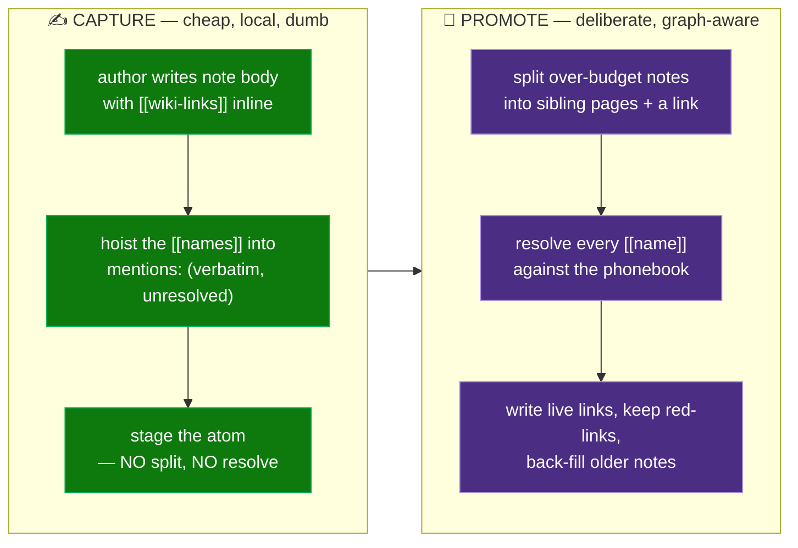
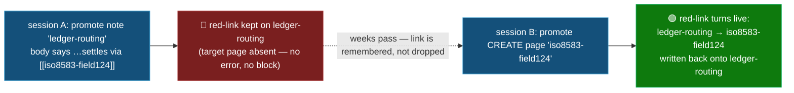
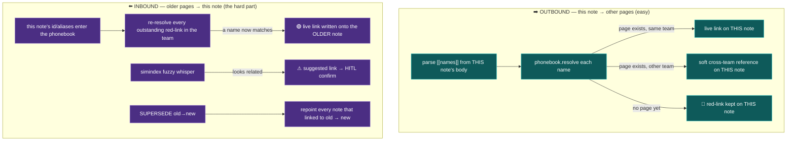
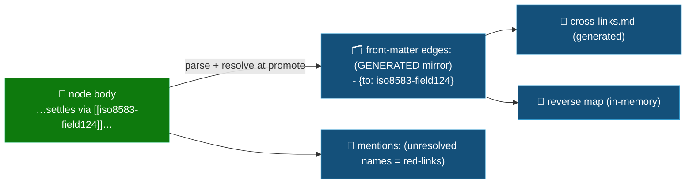

# 🕸️ Link Reconciliation (the wiki mesh, built at promote)

> Part of the **Mnemex Context Graph** standard. This document specifies **how a note becomes a *linked*
> node** — how the `[[wiki-links]]` an author embeds in a note body are resolved into a navigable mesh at
> promote time, how a link to a page that does not exist yet is remembered (a **red-link**) and healed
> later, and how a new note causes older notes to point at it. Mesh-building is a **deterministic,
> snapshot-driven, two-directional phase** of promote — *Step 2b*.
>
> Related reading: [`staging-and-promotion.md`](staging-and-promotion.md) (the promote cycle),
> [`data-model-and-schemas.md`](data-model-and-schemas.md) (node schema),
> [`script-contracts.md`](script-contracts.md) (`mnx_phonebook`, `mnx_simindex`, `mnx_resolve`) and
> [`maintenance-pass-algorithm.md`](maintenance-pass-algorithm.md).

---

## 0️⃣ The model in one sentence

> [!IMPORTANT]
> 🔗 **A node is a wiki page. You link to other pages by NAME, inline in the body, with `[[double
> brackets]]`. Promote resolves every `[[name]]` to a real page. A name with no page yet becomes a
> red-link that goes live the day that page is created.**

Everything below is the mechanics of that sentence. Two deliberate design commitments frame it:

1. **Wiki-first, not relationship-first.** The primary act is *"embed a link to another note and hop to
   it."* Links are **plain and untyped by default** — `[[iso8583-field124]]`. A type is **optional sugar**
   (`[[iso8583-field124|routes-through]]`) for the rare case where the relation matters; an untyped link is
   a first-class citizen, never degraded. We are building a wiki you can walk, not a typed knowledge graph.
2. **The body is the source of truth for links.** Links live **in the markdown body** where the author
   wrote them. The node front-matter `edges:` list is a **generated mirror** (denormalized for fast reverse
   lookups and death-severing), never hand-authored — exactly like the index is a generated mirror of the
   nodes.

---

## 1️⃣ The three things a mesh needs

Promote handles all three concerns of building a linked graph:

| # | Concern | Owner |
|---|---|---|
| 1 | **Placement** — which cluster/folder a node lands in | Staging & Promotion disposition + Multi-Graph & Team Routing |
| 2 | **Disposition** — CREATE / MERGE / SUPERSEDE / DROP-DUP / RESURRECT | Staging & Promotion §reconcile |
| 3 | **Linking** — resolving the note's `[[links]]`, and healing links *into* it from older notes | this doc (Step 2b) |

---

## 2️⃣ Division of labour: capture preserves, promote resolves



- **Capture** never touches the graph, never resolves a name, never splits. Its job is to keep the
  `[[links]]` the author embedded (hoist them to a `mentions:` list so promote doesn't have to re-parse
  prose). A re-capture of identical content stays idempotent (the links are part of the body hash).
- **Promote** owns everything graph-aware: splitting a too-big note, resolving names to real pages, writing
  live links, remembering red-links, and healing older notes that now point at a freshly created page.

---

## 3️⃣ Red-links — a link to a page that doesn't exist yet

The name comes straight from wikis. On Wikipedia, a link to a page that hasn't been created shows up **red**;
the day someone creates that page, every red link to it turns blue automatically. Mnemex does exactly this.



Why they matter: without red-links, a link whose target doesn't exist yet is **thrown away**, and when you
finally create that target nothing points to it — the graph stays a bag of disconnected notes. With
red-links, you **link freely by name now and the wiki wires it up whenever the page appears** — before,
after, or during the same promote. This is the single mechanism that lets the mesh knit itself together
across sessions with **no manual rework**. (Obsidian, Roam, and Wikipedia all work this way.)

Properties:
- **Never blocks, never errors.** An unresolved `[[name]]` is a normal, expected state. `mnx_doctor`
  invariant 19 already tracks red links / unresolved mentions — surfaced, not failed.
- **Resolves lazily and deterministically.** Any `CREATE`/`RESURRECT` that introduces a new page id (or a
  `MERGE`/`UPDATE` that adds an alias) triggers a **back-fill**: every outstanding red-link whose name now
  matches becomes a live link, written onto its source note, in the same apply transaction.

---

## 4️⃣ The two directions of a link

Both directions must be **systematic**, not accidental. They differ because a link is stored on the note
that *contains* it (the source), never on the target.



- **Outbound** is easy: the note names its targets; we resolve and store the links on the note itself.
- **Inbound** has one **deterministic** engine and one **judgment** engine, and both edit the *older* note
  (never the new one):
  - *Deterministic:* **red-link back-fill** (§3). Older notes that already named this concept now resolve.
  - *Judgment:* `mnx_simindex` whispers "this older note looks related" → a `⚠ suggested link` the human
    confirms in the plan. Similarity **never** becomes a link on its own.

---

## 5️⃣ What we reason over — "knowing the pages"

Link reconciliation reads a **frozen snapshot** of four sources (same discipline as the consolidate pass —
never read state you have already mutated):

| Source | Script | Role | Authoritative? |
|---|---|---|---|
| **Team phonebook** | `mnx_phonebook.resolve(name, team)` | exact name→page id (`id → alias → summary → ranked token candidates → red_link`) | **yes** — the deterministic resolver |
| **Similarity index** | `mnx_simindex.query(text, scope)` | fuzzy MinHash whisper: "looks like a link to / dup of `<id>`" | **no** — proposes; HITL disposes |
| **Reverse map** | `mnx_resolve.build_reverse_map(scope)` | who currently links to each page (all tiers + tombstones) | yes — integrity substrate |
| **Structural strength** | `mnx_decay.struct_g` | link-count → survival ballast; keeps a well-linked page alive | yes — computed in consolidate |

**Scope rule (the scaling property, from `mnx_phonebook`): resolution scope = link scope.** Live links live
inside a **team**, so the workhorse phonebook is team-sized; cross-team links stay **soft `references`** with
a disclaimer (Data Model & Schemas §5). There is deliberately **no** org-wide page index — that would re-introduce the
global write-path index the architecture rejects (Invariants & Failure Modes S2).

> [!NOTE]
> 🧮 **Importance-counting needs only "is there a link," not its type.** Structural strength counts how many
> notes link to a page. That is why untyped wiki-links cost the system nothing: the survival math, the
> death-severing, and the reverse map all work on the *existence* of a link, never its label. Types are pure
> author/agent convenience.

---

## 6️⃣ Links are untyped by default (types are optional sugar)

The authoring surface is a plain wiki-link in the body:

```markdown
Settlement legs are posted only after the batch reconciles against [[iso8583-field124]], and the
routing topology itself lives in [[ledger-routing]]. Legacy layouts are in [[de124-legacy-map]].
```

- **Untyped is the default and the backbone.** `[[name]]` — hop-able, counts toward importance, feels like
  Obsidian. Most links are this.
- **The pipe means DISPLAY text, exactly like a real wiki** — `[[iso8583-field124|Field 124]]` renders
  "Field 124" but links to the `iso8583-field124` page. The body stays 100% wiki-native; the pipe is never
  overloaded to mean a relationship type. In practice `[[Field 124]]` resolving via alias is the common
  case and no pipe is needed at all.
- **A link `type` is an optional, rare escape that lives in front-matter, never inline.** If a relation
  genuinely matters, `mentions[].type` on the node carries it (§11) — this keeps the authoring surface pure
  wiki while still allowing the odd typed link. Tiny vocabulary (unknown → treated as untyped, never
  rejected): `routes-through`, `depends-on`, `governs`, `defined-in`, `same-as`, `relates-to`.
  `superseded-by` is **system-set** by SUPERSEDE, never hand-authored.

---

## 7️⃣ Step 2b — the algorithm

Inserted into the promote cycle **after** dispositions are assigned and **before** consolidate, inside the
**same plan / lock / transaction**:

```
flush usage stamps
  → Step 2  reconcile + assign dispositions (CREATE/MERGE/SUPERSEDE/DROP-DUP/RESURRECT)   [Staging & Promotion]
  → Step 2b LINK RECONCILIATION  (this doc)
  → Step 3  consolidate the post-merge graph (re-tier, death, edge hygiene, budget)        [Maintenance Pass Algorithm]
  → Step 4  ONE approval plan (human gate) — merge + LINKS + consolidate together
  → Step 5  apply serially under the lock → doctor → persist → clear staging
```

Like consolidate, it runs **MARK (read-only, parallel) → propose**. It **writes nothing**; it emits a link
plan folded into promote's single approval plan. Application is in Step 5 alongside the merge.

### Phase L0 — Split over-budget notes, then freeze the link view
```
for each staged note whose body > node_body_max_chars:
    SPLIT into sibling pages (promote's job, not capture's); insert a [[sibling]] link between them
regenerate/read phonebook for every AFFECTED team          # mnx_phonebook.entries / regenerate
REVERSE   = mnx_resolve.build_reverse_map(scope)           # who links TO each page (all tiers + dead)
RED_LINKS = mnx_phonebook.red_links(team)                  # outstanding unresolved [[names]]
SIM       = mnx_simindex snapshot over summary + aliases
```
All later phases read only this frozen view.

### Phase L1 — Outbound (resolve THIS note's links)
```
names = parse_wikilinks(note.body) ∪ note.front_matter.mentions   # [[name]] / [[name|type]] + hoisted
for n in names:
    r = mnx_phonebook.resolve(n.name, team)
    if r.resolved and r.same_team:  propose  LINK  source=this_note  to=r.id   type=n.type or untyped
    elif r.resolved:                propose  REF   source=this_note  to=r.id   team=r.team   (soft)
    else:                           keep     🔴 RED-LINK on this_note  name=n.name  type=n.type
```

### Phase L2 — Inbound (heal OLDER notes that point at this one)
```
for each disposition that introduces or renames an id (CREATE / RESURRECT / MERGE-adds-alias):
    # deterministic — red-link back-fill
    for rl in RED_LINKS where rl.name matches new_page.id or new_page.aliases:
        propose  BACK-LINK  source=rl.source_note  to=new_page.id  type=rl.type or untyped
        #  ^ edits the OLDER note, turning its red-link live

    # judgment — fuzzy inbound whisper (HITL)
    for c in mnx_simindex.query(new_page.summary + aliases, scope).candidates:
        if c.id → new_page not already proposed:
            propose  ⚠ SUGGESTED BACK-LINK  c.id → new_page   (confirm; edits older note c)

for each SUPERSEDE(old → new):
    for r in mnx_resolve.referrers(old, REVERSE, cross_links):     # cold + dead included
        propose  REPOINT   r's link(old) → new       # fold with Maintenance Pass Algorithm sever/repoint
```

### Phase L3 — Validate + dedup
```
drop  self-links, duplicate links, links to a dead page (except a superseded-by repoint)
collapse  a [[name]] that resolves to a page THIS note already links (idempotent)
an unknown type annotation → downgrade to untyped (never reject the link)
```

### Phase L4 — Surface in the ONE plan (STOP for the human)
The link plan is a **`LINKS`** section inside promote's single approval plan (Staging & Promotion §Step 4). Deterministic
rows (resolved links, red-links, back-fills, repoints) are shown for transparency; **fuzzy `⚠` suggestions
require explicit human confirm** — unconfirmed suggestions are dropped, never guessed in.

```
PROMOTE PLAN  (staged: 14 notes)
  MERGE
  CREATE   domain iso8583-field124  in team-payments/settlement          (from stg-d3d3…)
  …
  LINKS
  🔗 link       ledger-routing   → iso8583-field124     (wiki-link, resolved)
  🟢 back-link  rails-topology   → iso8583-field124     (RED-LINK healed ✓ deterministic)
  🌐 ref        iso8583-field124 → risk-settle-finality  (team-risk, soft cross-team)
  🔴 red-link   iso8583-field124 → [[de124-legacy-map]]  (no page yet — kept, latent)
  ⚠ suggested  iso8583-field124 → settle-cutoff-time     (simindex 0.71)  → CONFIRM or DROP
  ↪ repoint    3 notes linking old-routing-note → iso8583-field124        (SUPERSEDE)
  CONSOLIDATE
  …
```

### Phase L5 — Apply (Step 5, serial, under lock, one txn)
```
write outbound LINKS/REFS into THIS note (body [[links]] are truth; mirror into front-matter edges:)
write BACK-LINKS into each older source note (its red-link turns live)
apply REPOINTs (fold with Maintenance Pass Algorithm transactional sever)
keep still-unresolved RED-LINKS on their source notes (latent)
regenerate  phonebook + cross-links + reverse map  (derived — mnx_regen driver owns conflicts)
# structural strength is recomputed by consolidate (Step 3) over the now-linked graph, so a freshly
# back-linked page enters its FIRST tiering with real link-count, not as a struct=0 orphan.
doctor: invariants 18 (phonebook completeness/paths), 19 (unresolved mentions/red links) must pass
```

---

## 8️⃣ Where links live: body is truth, front-matter is a mirror



- **`[[links]]` in the body are the source of truth.** An author (or promote's splitter) writes them there.
- **`edges:` in front-matter is a generated denormalized mirror** — regenerated from the body at promote and
  by `mnx_doctor fix`, never hand-edited. It exists so the reverse map, `cross-links.md`, structural
  strength, and death-severing stay cheap (they never have to re-parse prose).
- **`mentions:` in front-matter** holds every `[[name]]` with its resolution: `resolved_id` set → mirrored
  as a live edge; `resolved_id: null` → an outstanding red-link.
- The doctor keeps them consistent (§10): `edges` == the resolved subset of `mentions` == the resolved
  `[[links]]` in the body.

---

## 9️⃣ Worked example — the mesh forms across two blind sessions

**Session A** (in `payments-service/`, promote): a `ledger-routing` note's body says *"…forwards to
`[[iso8583-field124]]` for the routing instructions…"*. No such page exists yet.
→ L1 resolves the name: **no page → red-link** kept on `ledger-routing`. Promote succeeds; no error. The
note also links `[[settlement-batch-model]]` (exists) → **live link stored**.

**Session B** (weeks later, same graph, promote): an `iso8583-field124` note is **CREATE**d.
→ L1 resolves *its* own `[[links]]`. → **L2 back-fill**: `iso8583-field124` enters the phonebook;
`ledger-routing`'s outstanding red-link now matches → **live link `ledger-routing → iso8583-field124`
written back onto `ledger-routing`** (the older note). → simindex whispers `rails-topology` also looks
related → `⚠ suggested`, human confirms → back-link on `rails-topology` too.

Result: `iso8583-field124` enters its **first consolidation with two inbound links**, not as a struct=0
orphan — so it is *not* a death candidate, and the mesh is bidirectional. **Neither session's author knew
the other's page existed, or edited the other's file by hand.** Every promote both resolves its own links
and heals every red-link the new page completes.

---

## 🔟 Invariants

- **Body `[[links]]` are truth; `edges:`/`cross-links.md`/reverse map are generated mirrors** — never
  hand-edited; regenerated from the body (`mnx_regen` driver resolves conflicts by regeneration).
- **Links are untyped by default.** A type is optional metadata; an unknown type downgrades to untyped and
  is never a reason to drop a link. Importance/survival math never depends on a link's type.
- **Resolution scope = link scope.** Live links are team-scoped (phonebook); cross-team is soft
  `references` with a disclaimer. No org-wide page index.
- **A link is stored on the source note.** Inbound links are formed by editing the *older/source* note — only
  via deterministic red-link back-fill or an HITL-confirmed suggestion. The new page is never edited to fake
  an inbound link.
- **Exact resolves, fuzzy proposes.** A phonebook exact match becomes a link deterministically and
  idempotently; a simindex similarity is never a link without human confirm.
- **Red-links never block and never error.** They are a normal latent state (doctor inv 19), healed lazily
  on a future CREATE / alias-add. Promote never waits on one.
- **Never link to a dead page** except a `superseded-by` repoint.
- **Capture never splits or resolves.** It only preserves the author's `[[links]]`. Splitting and resolving
  are promote's job.
- **Structural strength is recomputed *after* linking**, so a back-linked page is tiered with its real
  link-count on the very first pass.

---

## 1️⃣1️⃣ Schema (detail in Data Model & Schemas)

Absent fields default empty.

- **Node body:** may contain inline `[[name]]` / `[[name|type]]` wiki-links. This is the authoring surface.
- **Node front-matter `mentions:`** — generated from the body at promote:
  ```yaml
  mentions:
    - { name: iso8583-field124, resolved_id: iso8583-field124, type: null }   # live link (untyped)
    - { name: de124-legacy-map, resolved_id: null,             type: null }   # 🔴 red-link (latent)
  ```
- **Node front-matter `edges:`** — the **generated mirror** of the resolved `mentions` (shape `{to, type}`).
- **Staged-atom front-matter `mentions:`** — capture hoists the body's `[[names]]` here verbatim
  (`resolved_id` always null at capture; promote resolves).

---

## 1️⃣2️⃣ Script contracts

Follows Script Contracts conventions (`STATUS=OK|FAIL` + JSON; mutating ops no-op without the team lock; pure
proposers never write).

```
# mnx_common.py
parse_wikilinks(body) -> [{name, type?, display?}]        # [[name]] / [[name|type]] / [[name|type|display]]

# mnx_phonebook.py
resolve_batch(names, team) -> {resolved:{name:id}, red:[name], cross:[{name,id,team}]}
red_links(team) -> [{source_id, source_path, name, type?}]                 # outstanding unresolved mentions
backfill(team, new_id, aliases) -> [{source_id, source_path, name, type?}] # red-links this id resolves

# mnx_mesh.py  (the Step 2b proposer; pure/read-only, mirrors consolidate MARK)
plan_links(notes, team) -> {
    links:[{source_id, to, type|null, origin:'wikilink'|'backfill'}],
    red_links:[{source_id, name, type}],
    backlinks:[{source_id, to, name, type, origin:'backfill'}],
    counts }
    # notes: [{id, body, aliases?, disposition?, mentions?}]. Resolves each note's inline [[wiki-links]]
    # against the phonebook (+ in-batch catalog); keeps red-links; back-fills older notes. Writes NOTHING.
apply_links(plan, team)                              # Step 5: writes body links + edges/mentions mirror; LOCK-gated
# NOTE: splitting an over-budget note is JUDGMENT (where to cut) — it is the promote SKILL's job, not a
#       deterministic script function; the sub-agent inserts the [[sibling]] link, then plan_links resolves it.
# Fuzzy inbound/outbound suggestions come from mnx_simindex.query (HITL-gated), not mnx_mesh.

# mnx_doctor.py  (asserts in the pass)
# inv 18: phonebook completeness + path accuracy   |  inv 19: unresolved mentions / red links
# inv:    edges == resolved subset of mentions == resolved [[links]] in the body (mirror consistency)
```

---

## ➡️ Where this plugs in

- The promote cycle and its single approval plan: [`staging-and-promotion.md`](staging-and-promotion.md)
- Node / edge / reference / cross-links schema: [`data-model-and-schemas.md`](data-model-and-schemas.md)
- The consolidate back-half (struct strength, sever/repoint): [`maintenance-pass-algorithm.md`](maintenance-pass-algorithm.md)
- The mesh scripts' contracts: [`script-contracts.md`](script-contracts.md) §Mesh & derived-file scripts
- The S2 cross-cluster duplication limit this bounds: [`invariants-and-failure-modes.md`](invariants-and-failure-modes.md)
