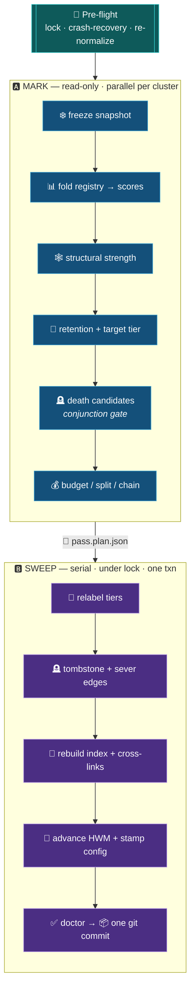

# ♻️ The Maintenance Pass Algorithm

`mnx-consolidate` carries three coupled jobs — **compaction, re-tiering, budget handling** — plus death
and edge hygiene. It is **not a user command**: it is the **back half of `mnx-promote`**, run over the
post-merge graph inside promote's single plan / lock / transaction (so the doctor + commit at the end
belong to promote). Coupling makes ordering critical. The whole algorithm is built on one principle:

> [!IMPORTANT]
> 🧊 **Snapshot-then-apply.** Compute *every* decision against a single frozen view of the graph, then
> apply them all. **Never read state you have already mutated within the same pass.**

This one rule resolves the ordering-corruption, the structural-strength-staleness, and most of the
concurrency hazards catalogued in [`invariants-and-failure-modes.md`](invariants-and-failure-modes.md).

Acronyms: **HWM** = High-Water Mark; **TTL** = Time-To-Live.



---

## 🔐 Pre-flight

```
acquire team.lock                        # one mutating op per team (Architecture §9)
if pass.plan.json exists AND tree dirty:  # crash recovery (Architecture §10)
    offer `git checkout .`; on confirm, restore last good commit
if config_version/λ changed since .mnemex/config_version:
    RE-NORMALIZE: recompute every node's stored strength so that
        score_new(now) == score_old(now)   (continuity across the parameter change)
    if freshness_ttl_days / freshness_pattern_bonus changed:
        recompute stale_after for every node from its verified + the new horizon   # Freshness & Revalidation §8
    stamp new config_version/λ
```

Re-normalization runs **before** any tier decision, so the pass never mixes old-λ strengths with
new-λ decay. The freshness horizon recompute rides the same guard, so an edited `freshness_ttl_days`
re-flags staleness gradually at the next pass rather than reinterpreting the index in place.

---

## 🅰️ Phase A — MARK  (read-only; parallelizable across clusters)

No file in the graph is mutated in Phase A. Sub-agents may run one cluster each, all reading the same
shared `cross-links.md`.

```
SNAPSHOT = freeze( all clusters in scope , team/cross-links.md )

# 1. Compaction (in-memory): fold the registry tail into strengths
for each cluster C in SNAPSHOT:
    deltas = registry(C).lines_after( HWM[C] )
    for each node X in C:
        s = materialized_strength(X) · exp(−λ(type(X)) · (now − last_update(X)))   # decay to now
        for d in deltas where d.id == X.id and d.role not in {'flag','revalidated'}:
            s = min(STRENGTH_MAX, decay(s, d.ts→now) + boost(d.role) · recall_bonus(X, s))
        score[X] = s

        # 1b. Freshness (independent of strength; Freshness & Revalidation): fold revalidation events, recompute horizon
        verified[X] = X.verified or X.updated                 # migration backfill if absent
        for d in deltas where d.id == X.id and d.role == 'revalidated':
            verified[X] = max(verified[X], d.ts)              # monotonic; weight 0 — never touches strength
        stale_after[X] = resolve_horizon(X, verified[X])      # null for volatility:timeless / dead

# 2. Structural strength (deterministic counterweight)
REVERSE = build_reverse_map(SNAPSHOT)        # who points AT X: intra-cluster + cross-links
for each node X:
    struct[X] = g( in_degree_local(X, REVERSE) + in_degree_cross(X, cross-links) )
    # soft cross-TEAM `references` contribute NOTHING here

# 3. Retention and target tier
for each node X:
    retention[X] = combine( score[X] , struct[X] )
    target_tier[X] = tier_of( score[X] , hot_k , warm_band )   # hot = top-K by score within C

# 4. Death candidates (CONJUNCTION gate + edge safety)
for each node X in cold tier:
    if volatility(X) == 'timeless':
        continue                                              # PINNED: timeless never auto-dies (Freshness & Revalidation §7)
    if score[X] low AND struct[X] weak AND (now > expires[X]):
        if X is the SOLE referrer of any still-active node D:
            demote-reluctant: keep X warm (its structural role to D protects it)   # no orphan cascade
        else:
            mark X for death

# 5. Budget
for each cluster C:
    if active_node_count(C) > node_budget:
        plan: sweep cold nodes out of the active index sections   # logical, not a move
        split the index along the declared `domain:` sub-key      # mnx_index.shard_index
        if still > node_budget on a single domain sub-key:
            CHAIN the index into index.NNN.md continuation chunks  # B-tree leaf; regenerate_index does it
            ESCALATE_TO_HUMAN(C, sub-key) only if chaining is undesirable   # genuine last resort

write pass.plan.json  ← every decision above, addressed by id + path
```

Key guarantees from operating on `SNAPSHOT`:

- **Order independence.** `struct[X]` is measured once, for everyone, against the frozen graph. Node
  A's later demotion cannot retroactively change a `struct` value that node B's decision already used.
- **No orphan cascade.** The sole-referrer check in step 4 runs against the snapshot, so demoting/killing
  one node cannot silently orphan a live node mid-pass.

---

## 🅱️ Phase B — SWEEP  (serial; under the lock; one transaction)

Apply the plan exactly. Order within Phase B is fixed so derived files are rebuilt *after* the truth
they derive from is final.

```
for each decision in pass.plan.json:        # 1. truth-level mutations first
    relabel tier in the (in-memory) index model
    if death:
        tombstone X via mnx_node.tombstone   # status: dead, KEEP body, set died, keep id+front-matter;
                                             #   refuses a timeless node; hard-delete only if --purge
        SEVER incident edges TRANSACTIONALLY:
            for each referrer R of X (from REVERSE + cross-links, COLD INCLUDED):
                rewrite R.edges to drop (R→X)   # or repoint to X.superseded-by
        # never leave an edge pointing at a tombstoned/removed node
    for X in revalidation plan (step 1b):
        mnx_node.revalidate(X, ts)          # verified = max(current, ts), monotonic; updated/strength untouched

# 2. derived navigation, rebuilt from the now-final nodes
regenerate affected index.md sections (HOT/WARM/COLD), denormalizing summary+aliases+stale_after
delta-update team/cross-links.md from changed boundary edges

# 3. telemetry checkpoints
advance HWM[C] for every compacted cluster      # checkpoint, do NOT truncate (Architecture §2)
stamp .mnemex/last_compaction[team], config_version/λ

# 4. verify + commit
run mnx-doctor   → must pass
git add -A && git commit -m "mnx-promote: <summary of merge + consolidation>"   # promote owns the commit
remove pass.plan.json
release team.lock
```

The single commit makes the whole pass atomic from git's perspective: either the commit exists (pass
succeeded and validated) or it does not (recover from the plan on next run).

---

## 🧮 Why each ordering choice matters (quick reference)

| Choice | Prevents |
|---|---|
| Re-normalize before tiering | Nodes flash-cold when half-life is edited (retroactive drift). |
| Mark is read-only; struct measured once | Order-dependent, non-deterministic tier outcomes. |
| Sole-referrer reluctance in mark | Orphan cascade — killing a node that is some live node's only inbound. |
| Timeless exemption in mark | Auto-death of a foundational fact that decayed in heat but is permanently true (Freshness & Revalidation). |
| Truth mutations before derived rebuild | Index/cross-links rebuilt from stale node state. |
| Sever edges transactionally, cold included | Dangling edges to tombstoned nodes; cold nodes missed by a partial reverse map. |
| HWM advance, not truncate | Lost stamps from a read racing the compaction window. |
| Validator before commit | Committing a corrupt graph. |
| One commit + plan file | Half-applied pass after a mid-sweep timeout. |

---

## ⚡ Parallel mark, serial sweep

Phase A is embarrassingly parallel (read-only per cluster). Phase B must be serial because tombstoning
a node in one cluster rewrites referrer nodes in sibling clusters (cross-cluster severing), and two
concurrent sweeps could race on a shared referrer. The team lock enforces this; reads continue
unblocked throughout (registry appends are commutative).
