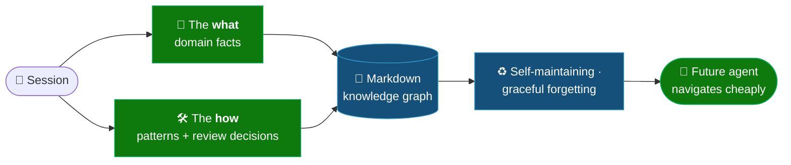
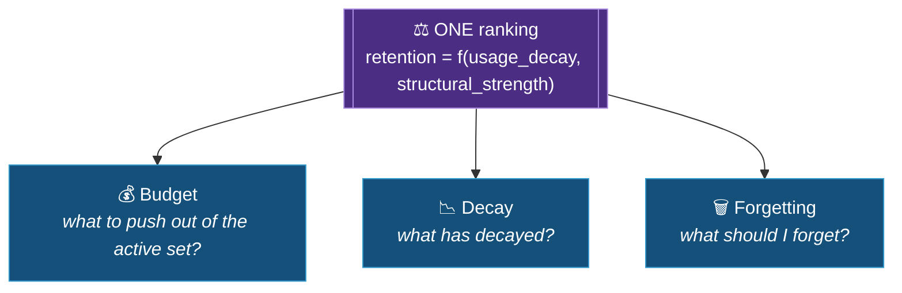

# 🧭 Overview

> Part of the **Mnemex Context Graph** standard. Read the documents in `docs/` in order; this one states
> the thesis and the design goals in brief, and the rest expand each piece.

## 🎯 The thesis

An agent that builds something — a service, a spec, an analysis — generates two kinds of durable
knowledge in the process:

- **Domain knowledge (the *what*):** facts about the business and the system. *“ISO 8583 Field 124 is
  used to carry stablecoin routing instructions.”*
- **Patterns (the *how*):** the prescriptive, hard-won procedural knowledge — often surfaced in human
  review and correction during the build. *“When curating a settlement spec, reconcile field
  semantics against the ISO message dictionary before trusting the values.”*

Both evaporate at the end of a session. Mnemex captures them into a **file-based knowledge graph**
that a future agent can navigate cheaply, that maintains itself, and that forgets gracefully.

## 🏗️ Design goals

1. **No vectors, no server, no embedding pipeline.** Retrieval is *structural* — folder routing plus
   small index files read in chunks — not semantic search. This is a hard requirement: the cost of
   standing up and operating an embedding/vector stack is exactly what we are avoiding.

2. **Context-budget-aware retrieval.** A read must be able to stop early. The system is shaped so the
   cheapest-to-reach knowledge is also the most-used knowledge, and a reader pays only for the tiers
   it actually opens.

3. **Human-memory behavior.** Frequently used knowledge stays *visible* (few read-hops away);
   unused knowledge sinks and eventually dies. Recall *strengthens* — a fact rescued from the brink
   becomes harder to lose next time. This is the *Ebbinghaus forgetting curve* implemented as
   *spaced repetition*.

4. **Cheap maintenance.** No background decay loop. Relevance is computed on demand from a stored
   strength and a timestamp. Reads do not write knowledge. Time passing does not write anything.

5. **Reviewable and recoverable.** Every change is a git commit. The plan that produces a change is
   shown to a human before it is applied. Deletion is tombstoning, not destruction.

6. **Scales by adding levels, not by sharding a store.** Org → team → domain → node is just folder
   depth; each step is one chunked index read. Growth is handled by *splitting folders along declared
   keys* and *splitting generated indexes*, never by moving the knowledge into a different kind of
   system.

## 💎 The one idea to take away

> [!IMPORTANT]
> **Budget, ranking, and forgetting are a single subsystem.** When a cluster grows past its size
> budget, the question “what should I push out of the active set?” has the same answer as “what has
> decayed?” which has the same answer as “what should I forget?” **One ranking, computed one way, drives
> all three.**

Getting a graph (creating or connecting one) is a separate, lighter step from filling it — binding
never reads a repo or costs a token on its own; filling, bulk or session-by-session, always happens
in-session, because deciding what's worth remembering is irreducibly an LLM judgment call.

> [!IMPORTANT]
> **You can bootstrap the whole graph from an existing repo — not just grow it session by session.**
> [`mnx-ingest`](corpus-ingestion.md) reads an entire code/doc repository and **distills** its durable
> knowledge — the facts, decisions, and API contracts a future agent will want — into the graph, collapsing
> redundant restatements into one well-sourced node and wiring the `[[links]]` between them. A live session
> and a corpus are just two producers of atoms; both converge on the **same** promote → mesh → consolidate
> backbone. The day-one graph and the hand-grown graph are the same shape — **no vectors, no server, no
> global index, no RAG.**

The same engine is reachable through **three surfaces**: the **Claude Code plugin** (the full
experience — skills plus auto-capture hooks), the **MCP server** (the same loop for any other
agent), and the **Console** (`uvx openmnemex`) — a local web app that is the *human's* surface
and the journey's starting point: open it, add/connect your agents from its UI, then browse the
graph the agents built — what's hot, what's going stale, how it connects. Agents write; over
knowledge the Console only shows. See [`console.md`](console.md).

Where a subsystem reads the same state it is mutating, consistency breaks subtly. The protocol
forecloses that with one principle: **snapshot-then-apply** — compute every decision against a
frozen view, then apply.

See [`architecture.md`](architecture.md) for the subsystem, and
[`maintenance-pass-algorithm.md`](maintenance-pass-algorithm.md) for the principle in code-shape.
