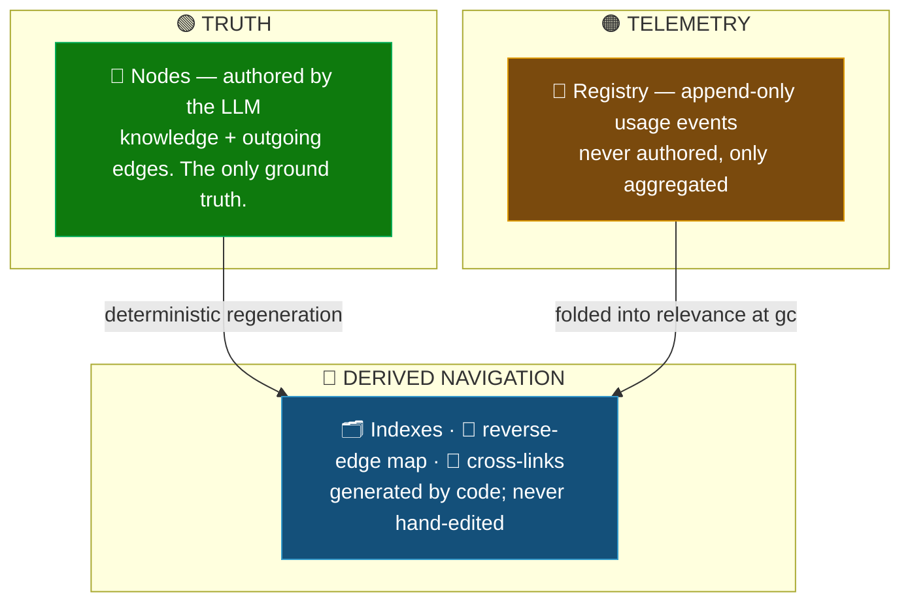

# 🧩 Rationale and Core Concepts

This document defines every core concept and explains *why* it is shaped the way it is. Acronyms are
expanded on first use.

---

## 1️⃣ The three-layer separation (truth / navigation / telemetry)

The single most important structural decision: **separate what the agent authors from what code
derives from what the system measures.** Collapsing these into one layer is the root cause of nearly
every consistency problem in an agent-maintained graph.



| Layer | What it is | Who writes it | If it drifts |
|---|---|---|---|
| 🟢 **Truth** | The nodes | The LLM | It *is* the truth — fix by re-authoring |
| 🔵 **Derived** | Indexes, reverse map, cross-links | Deterministic code | Wrong by definition → validator regenerates |
| 🟠 **Telemetry** | The registry | Append-only stamps | Replayed, never reasoned over for truth |

> [!IMPORTANT]
> **Why:** an LLM hand-maintaining nodes *and* indexes *and* usage counters will silently desync them.
> By making navigation and telemetry *derived*, desync becomes a **detectable, auto-healable** condition
> rather than an invisible corruption.

---

## 2️⃣ Two node types: domain and pattern

A node is one of two `type`s:

- **`domain`** — a fact about the business/system (the *what*).
- **`pattern`** — prescriptive procedural knowledge (the *how*), almost always mined from the human
  review and clarification points during a build. A pattern carries a **`trigger`**: the *when*
  clause — the condition under which the pattern applies (*“when curating a settlement spec…”*).

A pattern links to the domain it governs (`pattern --governs--> domain`). At retrieval, loading a
domain node lets you pull its governing patterns in the same hop, so the agent gets *what* and *how*
together.

**Why two types and the trigger field:** domain facts deduplicate cleanly; “how” advice phrased three
different ways does not. Matching patterns on their **trigger** (a structured condition) rather than
on their prose keeps pattern reconciliation tractable and prevents pattern sprawl.

---

## 3️⃣ Edges live in nodes; vocabulary lives in the skill

There is **no central relationship file** as graph state. Edges are stored **in the node that owns
them**, in front-matter, as the node's *outgoing* edges. That node is the single source of truth for
those edges.

Two different things are easy to conflate and must be kept apart:

- **Edge type (the vocabulary):** the controlled set of predicates — `routes-through`, `governs`,
  `defined-in`, `supersedes`, `same-as`, etc. This lives in the **write skill's definition**, not in
  a data file in the graph. It is configuration, not graph state. You essentially never delete from
  it.
- **Edge instance:** *node A → node B via type T*, owned by A. This is what gets created and severed.

**Why this dissolves the “shared relationship” problem:** there is no such thing as a *shared edge
instance* — only a shared edge *type*. Deleting node X only ever severs instances *incident to X*.
Edges between other nodes are untouched by construction. The fear “if I delete this relationship it
might break other nodes” simply cannot occur.

The one derived global artifact is **`cross-links.md`** (see §8): the set of edge instances that
cross folder boundaries, materialized so cross-cluster operations stay cheap.

---

## 4️⃣ The id is the spine

Every node has a stable, slug-style **id**, assigned at creation and **never changed**, decoupled
from the title. Edges resolve to ids. Registry stamps reference ids. Supersession points old→new by
id. The id is what lets a node be retitled, or moved between folders, without breaking a single edge.

**Why not key off filename or title:** a rename would silently break every edge pointing at the node.
Ids are non-negotiable, and not primarily for usage tracking — they are the referential integrity of
the whole graph.

---

## 5️⃣ Indexes, chunked reads, and the “read a little, then decide” guarantee

Navigation is the **filesystem plus one `index.md` per folder.** A folder's index describes (a) its
child folders and (b) the nodes directly inside it. Navigation = directory traversal: deterministic
and free. No vectors, because routing is *structural*, not semantic.

Every file — index or node — has an **enforced shape**: a cheap routing/summary *head* first, then a
delimited *body*. The read skill uses **ranged reads** (offset/limit): it reads the head, decides,
and only loads the body on commit.

**Why the enforced shape:** “read in chunks” only works if the decision-making content is *always at
the top and cheap*. Without a mandated layout, “chunked read” silently degrades into “read the whole
file anyway.”

`aliases` on a node (a curated list of the other names a concept goes by) does the job a vector index
would do for matching: it is the curated surface that lets the agent recognize “this new thing is
about an existing node” by reasoning over the index, instead of embedding-searching.

---

## 6️⃣ Usage: the graded manifest, and what “used” means

Reads are pure with respect to knowledge, with exactly one deferred side effect: **stamping**. The
read skill instructs the model that, at the **end** of the task, it must emit a **usage manifest** —
a list of `{id, role, why}` — under a strict rule:

> If you cannot state in one line *how* a node informed the output, it was **not** used.

`role` is graded, because the memory model wants a weighted signal:

- **`contributed`** — the node materially shaped the artifact. Strong stamp.
- **`consulted`** — informed reasoning or research but did not directly enter the output. Medium stamp.
- **`traversed`** — passed through during routing; not relied upon. No stamp.

A forcing rule closes the “forgot to mention it” gap: **if a node's body was loaded (not just its
index line), the model must classify it** as one of the three. Loading a body is itself evidence of
intent, so a disposition is mandatory; `traversed` is still allowed (and unstamped), but a body-load
can never be *silently* omitted.

**Why graded and justification-gated:** the failure mode is the model stamping everything it loaded,
flattening the signal. The one-line *why* is the test — an unused node cannot produce a defensible
justification. The graded weight is exactly the boost signal the tiering needs.

**Honest limit:** usage quality depends on model discipline across many sessions. There is no
deterministic backstop for “did it *really* use this.” The mitigation is to lean on *structural
strength* (§9), which **is** deterministic, as ballast — so the system never bets everything on
self-reported usage.

---

## 7️⃣ Memory tiers are logical, not physical

Knowledge has a **memory tier**: **hot / warm / cold** (and finally **dead**). The tier is **a
property recorded in the index, not a physical location.** Nodes do not move between folders when
their tier changes.


> [!NOTE]
> **Tier = read cost, not location.** All nodes stay in one flat cluster folder; the tier is just which
> *section of the index* (and which *chunk* of a chunked read) a node lands in. A demotion is one edit to
> one index file — no folder moves, no path rewrites.

Tier maps directly to **read-cost**, expressed through chunked reads of the index:

- **Hot** — listed in the index's **chunk 1** (the routing head). Zero extra hops. “Tip of the
  tongue.” Hot is a **capacity bound (top-K by live score)**, not a threshold, so chunk 1 is always
  small no matter how big the folder grows.
- **Warm** — in the index's **chunk 2** node table. One hop, only if routed to. “Recallable with a
  cue.”
- **Cold** — in a later **chunk 3+** section of the same index. More hops; reached on a deliberate
  deep search or by following an edge from a live node. “Have to dredge it up.”
- **Dead** — tombstoned after its time-to-live (TTL) expires in cold with no revival.

**Why logical over physical:** moving cold nodes into a separate `cold/` folder would be pure
overhead — every demotion would rewrite two indexes, repair cross-link paths, and risk the validator
not scanning the separate folder (the “cold-tier edge hygiene” problem). With edges resolving by
**id**, a node's physical path is never load-bearing. Making tier a *label in the index* and keeping
all nodes in one flat cluster:
- turns a tier change into **one edit to one index file**;
- keeps every node **equally visible to the validator** regardless of tier — which *eliminates the
  cold-edge-hygiene problem entirely*; and
- preserves “tier = read cost” through index section ordering + chunked reads.

Logical tiering also lets the node be **pure knowledge**: `strength`, `last_used`, and `tier` live in
the index, not in the node. The node's git history is then the evolution of *meaning*, never polluted
by decay bookkeeping.

---

## 8️⃣ Coarse routing vs. memory tier vs. index sharding — three distinct mechanisms

Once tier is logical, three things that are easy to conflate become cleanly separate:

- **Coarse routing** — `org → team → domain` **folders**. Physical, human-meaningful, rarely changes.
  This is how you “target the right cluster to start.”
- **Memory tier** — hot/warm/cold **sections inside an index file**. Logical, churns constantly,
  never moves a node.
- **Index sharding at scale** — when a single `index.md` itself grows past budget, split *the index*
  by a declared sub-domain key. The index is generated, so re-sharding is free and safe — still
  without moving any node.

---

## 9️⃣ Two forces of retention: usage decays, structure protects

A node's retention is **not** usage alone:

```
retention = f( usage_strength , structural_strength )
```

- **`usage_strength`** — the decayed, boosted relevance from the registry (§ Architecture).
- **`structural_strength`** — in-degree / centrality from the reverse-edge map and cross-links. A hub
  that everything *reaches through* but nothing recently hits *at* still holds its tier.

A node is a demotion/death candidate only when **both** its decayed usage is low **and** it is
structurally weak (few/no incoming edges). That conjunction is the safety gate against deleting
foundational-but-quiet knowledge.

**Why:** a cache may evict because it can recompute on miss; a knowledge graph **cannot recompute a
deleted fact.** Pure age- or usage-based eviction will happily delete a load-bearing hub. Structural
strength is the deterministic counterweight, and it is also true to human memory: densely associated
memories consolidate and persist.

---

## 🔟 Death, TTL, and spaced-repetition resurrection

In the cold tier a node carries `expires = last_used + grace`. But **recall resets and over-rewards**:
using a *cold* node grants a **larger** boost than using a warm one (the testing/salience effect). A
node that keeps getting rescued from cold becomes progressively *harder* to kill — each near-death
lengthens its next interval. That is the spaced-repetition curve, and it falls out naturally from
“boost is larger when the prior score was lower.”

**Death is tombstoning, not destruction** (default). A dead node's status is set to `dead` while its
**body is retained** — kept for audit, supersession history, and possible resurrection; hard deletion
from git is opt-in (`--purge`). Severing a dead node's edges is transactional (§ Maintenance Pass).

**An honest consequence to accept:** a node that is *cold and has no incoming edges* is, by
construction, reachable only by brute-force search — which means it is effectively already forgotten.
That is not a bug; it is the definition of forgetting. Resurrection works *through associations* (a
live node links to it) — again, like human memory.

---

## 1️⃣1️⃣ Budget: what it really bounds

Budget covers two distinct jobs, and they are handled in different places:

- **Retrieval budget (job 1)** — handled by tiering + chunking + **top-K hot**. A reader opens hot,
  maybe warm, and stops. Solved on the **read path**.
- **Reconciliation budget (job 2)** — *not* solved by tiering. When the write skill checks a new
  candidate against existing nodes to avoid duplicates, it may need to see *cold* nodes (matching a
  candidate against a cold node is precisely the **resurrection** trigger). So total index size still
  governs **write** cost.

**Conclusion:** budget is real, but it is **index size (logical)**, justified by **reconciliation**,
and it bites on the **write path** — not folder node-count, not retrieval. The **budget-driven split**
(split a folder along a declared `domain:` sub-key when its node table exceeds budget) is therefore
the *same machine* as tier demotion viewed twice: relieving an over-budget cluster = sweeping its
cold nodes down + (if still over budget on a single sub-key) escalating to a human for a partition
decision. The machine never invents folder structure on its own.

---

## 1️⃣2️⃣ Cross-team links are *soft* (a deliberate boundary)

Edges are **intra-team**. A relationship from a node in `team-payments` to a node in `team-risk` is
represented as a **soft `references` pointer** that **does not participate in `structural_strength`
and is not subject to transactional death-severing.** It is informational only, and the protocol
treats it with an explicit **disclaimer**: cross-team pointers may dangle and are not integrity-
guaranteed.

**Why soft:** hard cross-team edges would force the maintenance snapshot and the lock to become
org-global, destroying the team-level locality that keeps the whole system cheap. Keeping them soft
preserves the “lock one team, snapshot one team” model. Convergence of duplicated concepts across
teams is handled as a **human ritual**, not an automated guarantee — the architecture *enables* it
(stable ids, aliases, `same-as` edges) without pretending to prevent divergence.

---

## 1️⃣3️⃣ What stays deliberately soft

Two things cannot be hardened:

- **Self-reported usage quality** (§6) — mitigated by deterministic structural strength as ballast.
- **Cross-cluster / cross-team duplication** (§11–12) — the same concept may be authored independently
  in two clusters; intra-cluster dedup is reliable, cross-cluster convergence is a periodic human
  review, enabled by `same-as` edges and shared ids. The protocol does **not** claim global
  deduplication.

Everything else in the standard hardens cleanly; these two are the known soft edges.
