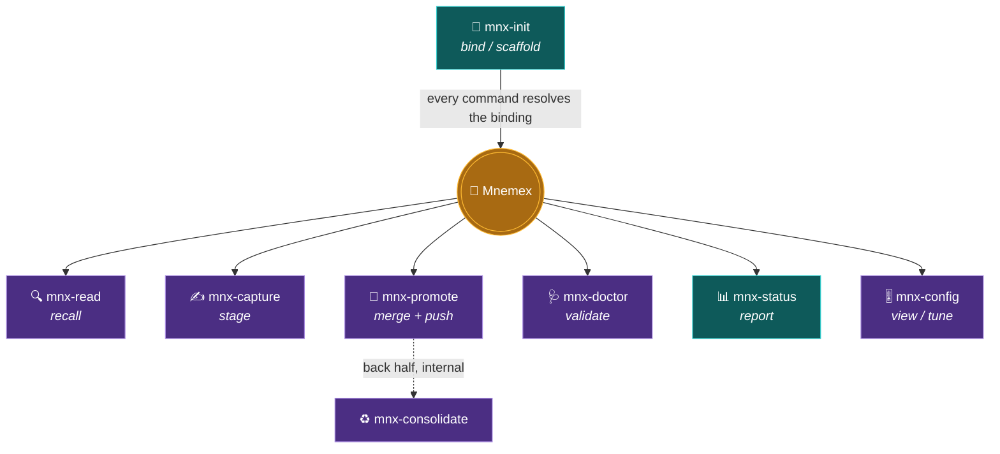
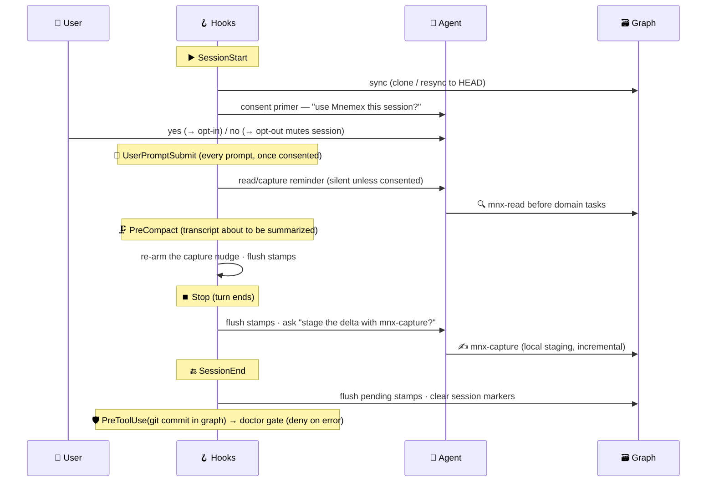

# 🎛️ Skills, Commands, and Hooks

Mnemex ships **seven user-facing skills** (the agent-facing playbooks — `mnx-read`, `mnx-capture`,
`mnx-promote`, `mnx-doctor`, `mnx-init`, `mnx-status`, and `mnx-config`) plus one **internal** skill
(`mnx-consolidate`, the maintenance pass invoked by `mnx-promote` — no slash command), **seven commands**
(the slash-command surface), and a small set of **hooks** (deterministic event handlers that do what a
skill cannot). The authoritative skill text lives in `skills/<name>/SKILL.md`;
the command stubs in `commands/`; the hooks in `hooks/hooks.json`.

Knowledge writing is split **capture / promote** (the `git commit` vs `git push`/PR of memory): see
[`staging-and-promotion.md`](staging-and-promotion.md) for the full model. `mnx-capture` stages
atoms locally; `mnx-promote` reconciles, merges, consolidates, and pushes them.

A note on division of labor: **skills reason; scripts decide deterministically.** Anything that must
be exact — decay math, id→path resolution, index regeneration, invariant checks, locking — is a
script (Script Contracts), not skill prose. The skill calls the script and reasons about the result.

---

## 1️⃣ `mnx-read` — retrieval (pure w.r.t. knowledge)

**Command:** `/mnemex:mnx-read <question or task>`

**Phases:**

1. **Overdue check.** Call the cadence helper; if compaction is overdue or `config_version`/`λ` has
   drifted, emit a one-line notice (and optionally append a `__maintenance-due__` registry marker).
   Never compact here.
2. **Route.** Read the org `index.md` chunk 1 → pick team(s). Read team `index.md` chunk 1 → pick
   domain cluster(s). Pure directory + head reads.
3. **Scan tiers in chunks.** In each chosen cluster read **Hot** (chunk 1). If hot is insufficient,
   read **Warm** (chunk 2). Fall to **Cold** (chunk 3+) only on a deliberate deep search *or* when
   reconciling intent suggests a dormant concept. Fold in the registry tail if a true current score is
   needed (labels may be stale since last `gc`).
3b. **Overlay staging.** For each routed cluster, also pull the local **staged** atoms
   (`mnx_stage.py overlay`): newest-wins, mark them `staged/unpromoted`, flag (never resolve)
   contradictions against graph nodes, never body-merge, never stamp. See
   [`staging-and-promotion.md`](staging-and-promotion.md).
4. **Expand on commit.** Resolve candidate ids → paths via the resolver (local index for intra-cluster,
   `cross-links.md` for cross-cluster). Load **only** the bodies you commit to. Follow edges within a
   frontier budget (max nodes / max tokens per hop) — beam search, not BFS-load-everything.
5. **Emit usage manifest.** At the end, output `{id, role, why}` for every node whose **body was
   loaded**. Rule: no defensible one-line *why* ⇒ `traversed` (unstamped). Body-load ⇒ a disposition
   is mandatory.
5b. **Freshness check + refresh cue.** For every atom in play, read its `stale_after` from the index row
   (no body load). If `stale_after` is non-null and `now > stale_after`, mark the atom **`stale`** in the
   returned context and attach a **refresh cue** — *"⏳ last verified Nd ago (horizon Md); re-derive from
   source and confirm before relying on this."* Cue each atom **at most once per session** (per-session
   marker, same mechanism as the Stop hook). This is a *signal*, not a mutation — see Freshness & Revalidation §5. If, during
   the task, the model re-derives the fact and finds it **still correct**, it appends a `revalidated` stamp
   in step 6; if it **changed**, it stages an update via `mnx-capture`; if it **cannot verify** in-session,
   it does nothing (the atom stays stale, the cue returns next session).
6. **Stamp.** Append `{id, ts, role, weight}` to **the home cluster's registry** for each `contributed` /
   `consulted` node (a cross-cluster use stamps the *foreign* cluster's registry), **and** a
   `revalidated` line (weight `0`) for each stale atom the model re-confirmed as still true. Append-only; no
   lock.

> [!CAUTION]
> **Never:** rewrite a node, rewrite an index, or compact. The only write `mnx-read` performs is the
> registry append — including the `revalidated` freshness stamp, which is an append like any other, so read
> stays pure w.r.t. knowledge (consolidation, not read, advances `verified`).

---

## 2️⃣ `mnx-capture` — stage the session locally (cheap, no mutation)

**Command:** `/mnemex:mnx-capture [--drop <id> | --discard-all]`

Runs **in the same session** that built the artifact, so it can read the artifact *and* the human
review/clarification points from context (those are where the *how* lives and exist only in the
conversation). Capture is the **local `git commit` half**: it stages atoms and **never touches the
graph** — no reconcile, no lock, no push. Full model: [`staging-and-promotion.md`](staging-and-promotion.md).

Run it **incrementally at checkpoints**, not only at the end: because the transcript shrinks at every
compaction, one end-of-session dump is the most loss-exposed way to capture. Capture consults what is
already staged (Phase 0b) and stages only the delta — re-staging identical content is an idempotent
no-op (content-hash id) — so capturing the newest keypoints whenever a sub-task lands, a review settles,
or a compaction is imminent (see the **PreCompact** hook below) is cheap and safe.

1. **Preflight + budget pre-check.** Resolve the binding (note `staging_root`). `mnx_stage.py status` —
   `hard` budget ⇒ stop (backpressure: run promote); `soft` ⇒ warn.
1b. **Delta ledger.** `mnx_stage.py list` — read the already-staged atoms (`id · type · score · summary ·
   age`) as the record of keypoints captured this session, so extraction targets only the delta.
2. **Extract the delta.** Decompose artifact + transcript into candidate atoms **not already staged**;
   tag `domain` or `pattern`; mine
   review corrections/rejected alternatives into patterns with a `trigger`. Honor the node-size budget
   (split oversized atoms + an edge; never truncate). **Propose `volatility`** from the atom's content shape
   — a body that is a URL / version / price / on-call name ⇒ `volatile`; a definition / invariant ⇒
   `timeless`; else `default`. This is a *suggestion* the human confirms or overrides at the promote gate
   (Freshness & Revalidation §4).
3. **Score** each atom `now | later | not-needed` — intrinsic importance, **not** novelty. `now` ⇒ stage
   `--urgent`; `later` ⇒ stage; `not-needed` ⇒ **silent drop**.
4. **Stage** (the only write). `mnx_stage.py add` writes each kept atom with **self-sufficient
   provenance** and a content-hash provisional id. Never reconcile, never open cluster indexes, never
   commit/push.

---

## 3️⃣ `mnx-promote` — merge staging into the graph (gated, atomic, total)

**Command:** `/mnemex:mnx-promote [--dry-run]`

The deliberate **`git push`/PR half**. Every staged atom reaches a terminal disposition in one cycle;
any contradiction is a **hard HITL block** (resolve in-cycle or abort). The order:

1. **Flush usage stamps** (`mnx_stamp.py flush`) so reconcile/consolidate see current usage.
2. **Reconcile + merge** staged atoms via a **clean-context reconcile sub-agent** — input
   `{staged atoms, graph_root}`, returns *plan + HITL items only*, may fork per cluster (plan in
   parallel, apply serially). Each atom → CREATE / MERGE / DROP-DUP / SUPERSEDE / RESURRECT.
3. **Consolidate** the post-merge graph by invoking the internal **`mnx-consolidate`** skill (§3a),
   folded into the **same** approval plan.
4. **Plan** (the human gate) — one combined plan covering the merge **and** the consolidation. The plan
   surfaces each atom's **proposed `volatility`** for the human to confirm or override. CREATE / MERGE /
   RESURRECT atoms get `verified = now` (they were just re-derived under the gate). `--dry-run` stops here;
   any unresolved contradiction ⇒ abort.
5. **Apply** serially under the lock; run `mnx-doctor` (must pass); **persist** (commit + push by kind);
   **clear staging** only on a confirmed persist (abort leaves staging untouched).

**`--bulk --ingest-batch <id>`** is the volume-adapted variant that [`mnx-ingest`](#3️⃣🅱️-mnx-ingest--bootstrap-the-graph-from-an-existing-repo) hands off to — **the same engine transaction as episodic promote**
(`mnx_promote.py begin/context/apply`, just given the labeled batch instead of the unlabeled session
batch; onboarding + ingest plan, the O1 lift), not a separate bulk code path: forked per-cluster reconcile
(a plan-drafting technique), a per-cluster-count plan that auto-accepts plain CREATE/MERGE and stops only
on exceptions (gate #2), and an ingest-manifest write on confirmed persist. It drains only the labeled
batch, never a user's hand-captures. Exposed identically over MCP (`promote_begin`/`promote_context`/
`promote_apply` with `ingest_batch=`) — a foreign host runs the identical transaction, not a Claude-only
path. See [`staging-and-promotion.md`](staging-and-promotion.md) and [`corpus-ingestion.md`](corpus-ingestion.md).

---

## 3️⃣🅱️ `mnx-ingest` — bootstrap the graph from an existing repo

**Command:** `/mnemex:mnx-ingest <local-path|git-url> [--into <graph>] [--dry-run] [--resume <ingest-batch>]`

A **source adapter**, not a new subsystem: a corpus (code/docs) is a second producer of staged atoms
alongside a live session. It walks the source, **distills** durable atoms (never transcribes — zero atoms
from a file is valid), discovers a deduped entity catalog, wikifies `[[links]]`, and stages a **labeled
bulk batch** — then `mnx-promote --bulk` merges it. **Two gates only:** gate #1 approves scope + the
source-tree→cluster map up front; gate #2 is the bulk-promote summary. No per-atom review. The flow:

1. **Acquire** (local in place / remote → shallow clone to a read-only cache) + **probe** (walk · classify
   `doc|interface|code-doc|config|skip` · chunk along structure · hash) → scope estimate; on re-ingest,
   **delta** against the manifest so only added/changed files are extracted.
2. **Gate #1** — scope counts + the editable source-tree→cluster map (`--dry-run` stops here).
3. **Pass 1** — distil kind-aware atoms (code **value-gate**: public/documented/config-only), run the
   bounded **glean** loop (`mnx_glean` checklist mode) over the unit set, then **entity-resolve**
   (`mnx_er`) → CREATE/MERGE/COLLAPSE + a `possible` HITL band (one entity → one node).
4. **Pass 2** — wikify each atom against the catalog ∪ phonebook (exact → live link, fuzzy → `⚠ suggested`,
   unmatched → red-link) and **stage** under the bulk label with source-anchored provenance.
5. **Drain** via `mnx-promote --bulk`; **report** created/merged/superseded/dropped-dup/held + orphan candidates.

Ingest **never writes the graph** (staging only; promote is the sole writer), **never mutates the source**,
**never reads secrets**, and is **idempotent** on re-run (a deleted source file is an *orphan candidate*,
never auto-death). The deterministic front-end (acquire/probe/delta/manifest-write, `mnx_glean.coverage`,
`mnx_er.resolve`) is exposed as real MCP tools too, not Claude-only — see
[`corpus-ingestion.md`](corpus-ingestion.md) "Ingest on non-Claude hosts". `skills/mnx-ingest/SKILL.md`
itself is still hand-authored prose (not yet migrated into the single-sourced `templates/procedures/`
system the way read/capture/promote are — deferred, onboarding-and-ingest-plan.md §3.1). Full model:
[`corpus-ingestion.md`](corpus-ingestion.md).

---

## 3️⃣🅰️ `mnx-consolidate` — the maintenance pass (INTERNAL; promote's back half)

**No slash command.** Invoked by `mnx-promote` over the post-merge graph, contributing its decisions to
promote's single plan / lock / doctor / push. (Runnable standalone only for deliberate forced
maintenance.) The algorithm is **snapshot-then-apply**, specified in full in
[`maintenance-pass-algorithm.md`](maintenance-pass-algorithm.md). In brief:

- **Re-normalize first** if `config_version`/`λ` changed (continuity across a parameter change).
- **Phase A — MARK (read-only, parallelizable):** freeze snapshot + `cross-links.md`; replay registry
  deltas since high-water; compute decayed scores, structural strengths, retention, target tiers, and
  death candidates. Write `pass.plan.json`. **No mutation.**
- **Phase B — SWEEP (serial, locked):** apply tier relabels, tombstone dead nodes, **transactionally
  sever** their incident edges (intra + cross-cluster via the reverse map / cross-links), delta-update
  cross-links, advance high-water marks, stamp `last_compaction` + `config_version`; promote then runs
  `mnx-doctor` and the **one git commit**.
- **Budget:** if a cluster index exceeds `node_budget`, split along the declared `domain:` sub-key; if a
  single sub-key still overflows, **chain the index** into `index.NNN.md` continuation chunks
  (B-tree-leaf style) — human escalation only as the genuine last resort.

**Death policy:** tombstone-and-retain by default (`purge_dead: false`); `--purge` hard-deletes.

---

## 4️⃣ `mnx-doctor` — the validator (and self-healer)

**Command:** `/mnemex:mnx-doctor [--fix] [--team <name>]`

Checks every invariant (full list in [`invariants-and-failure-modes.md`](invariants-and-failure-modes.md)):
edge targets exist; front-matter schema valid; index node-set matches folder; `summary`/`aliases`
denormalized copies fresh; reverse-edge map consistent; no dangling edges (incl. cold and tombstoned);
`hot` section ≤ `hot_k`; cross-links complete and path-accurate; orphans flagged. With `--fix` it
**regenerates derived files** (indexes, reverse map, cross-links) from the nodes — the nodes are truth,
so regeneration is always safe. Runs automatically at the end of every `mnx-promote` apply (which
includes its folded consolidate), `--staging` runs the staged-integrity check (`check-staging`), and is
available as a pre-commit hook.

---

## 5️⃣ `mnx-init` — preflight setup and binding

**Command:** `/mnemex:mnx-init [--create | --bind | --user] [--team <name>]`

The preflight authority. An author works in a **project** repo while knowledge lives in a **separate
graph** repo, so init establishes the **binding** between them that every other skill resolves first.
It detects current state (`mnx_binding.py resolve`) and branches over two independent axes:

- **Mode** — *create* a new graph, *bind* this project to an existing graph (`<project>/.mnemex.md`),
  or set a *user*-level default (`~/.claude/mnemex/config.md`). A `--create`/`--bind`/`--user` flag
  preselects it; otherwise the skill asks.
- **Kind** — the graph can be a **git remote** (`graph_remote` — cloned, synced, pushed) or a **local
  folder** (`graph_path` — used in place, for authors with no git repo). Exactly one is set.

On *create* it scaffolds the graph (org `index.md`, `mnemex.config.md` from `config/mnemex.config.md`
defaults, `.mnemex/` state, a first `team-<name>/` skeleton) and writes the binding pointing at it; on
first contact with a graph that has no `mnemex.config.md` it writes one from defaults. At create it states
the two time-horizon defaults for the user — *"unused facts halve in relevance every `half_life_days` (180);
facts go **stale** and get re-checked after `freshness_ttl_days` (30) — patterns get +30% on both"* — so both
clocks are a conscious choice, not a silent default (Configuration, Freshness & Revalidation). It never writes
graph-behavior parameters into a binding (those live only in the graph's `mnemex.config.md`), never
overwrites an existing binding without confirmation, and never clones by hand — `sync` does that. Full
spec: [`binding-and-graph-sync.md`](binding-and-graph-sync.md).

For a **git remote** it runs a read-only pre-flight (`mnx_binding.py probe-remote --remote <url>`,
a `git ls-remote` with interactive prompts disabled) *before* writing the binding: on an
auth/not-found/network failure it surfaces categorized remediation and offers the no-auth local-folder
fallback, instead of letting the user hit a bare `sync` error after a wasted clone.

---

## 6️⃣ `mnx-status` — at-a-glance status (read-only)

**Command:** `/mnemex:mnx-status`

The status/browse surface, distinct from `mnx-doctor` (a validator/repair tool). It calls
`mnx_status.py status`, which aggregates read-only signals into one JSON object: the binding +
graph kind, per-team node/cluster and hot/warm/cold tier counts, pending (un-pushed) usage stamps,
last gc per team, and a doctor health summary (error/warning counts). Every section is guarded, so a
partial or broken graph still yields a useful status. It never syncs, commits, or repairs — it only
reports, and recommends `/mnemex:mnx-doctor` (health) or `/mnemex:mnx-promote` (staged-pending or
consolidation-overdue) when warranted.

---

## 7️⃣ Hooks — what skills cannot do

Skills run when the model chooses to consult them; hooks run **deterministically on events**. Mnemex
uses hooks only where determinism or guaranteed firing matters. All hook scripts use
`${CLAUDE_PLUGIN_ROOT}` for portable paths.

| Hook event | Purpose | Why a hook, not a skill |
|---|---|---|
| **SessionStart** | Resolve the binding and **sync the graph** (blocking — clone/resync a remote, verify a local folder), then inject a **consent primer**: the sync status plus an instruction to ask the user ONCE, up front, whether to use Mnemex this session — if yes, run `opt-in` (records consent, which arms the per-prompt reminder) then `mnx-read` before domain tasks and `mnx-capture` to stage knowledge; if no, run `opt-out` (the command is handed over with this session's id baked in) so Mnemex goes silent for the session. Also emits **nag-only** lines for staged-pending / consolidation-overdue (never auto-runs). If no graph is bound, emit a **one-time onboarding notice** (fires once ever) pointing at `/mnemex:mnx-init`. Silent if the session is already muted. | Sync must be guaranteed before any skill runs; asking once at turn zero sets read context on consent and lets the user drop Mnemex for the session in one move, instead of being nudged every turn. |
| **UserPromptSubmit** | Once the user has **consented** (opt-in recorded a per-session consent marker), inject a short **read-before-domain-work / capture reminder on every prompt**, so the routing stays in front of the agent across a long session. **No-op** when muted or when the consent question has not been answered yet (the SessionStart primer owns the one-time ask), and when no graph is bound. | Consent is asked once; this keeps the read/capture routing live per turn without re-asking — the counterpart to the one-time SessionStart primer, gated on an explicit yes. |
| **Stop** | When the agent wraps up a turn, batch-flush this turn's usage stamps, then **block once per session** (and **once more after each compaction** — see PreCompact) with a reason that has it ask the user whether durable knowledge should be staged with `/mnemex:mnx-capture`. Loop-safe (a per-session marker plus `stop_hook_active` prevent re-nudging); the reason sharpens to "stage the delta from the window that was just summarized" when a compaction re-armed it; **no-op when the session is muted**; never auto-writes. | Fires while the session is still live, so unlike SessionEnd it can hand the agent a turn to actually ask the user. |
| **PreCompact** | Fires right before the transcript is summarized — the one moment session detail is actually **lost**. PreCompact cannot inject context or block, so it **re-arms the Stop capture nudge** (clears the once-per-session marker and records the compaction) so the next Stop re-asks the agent to stage the **delta** from the compacted window, and best-effort flushes pending stamps. **No-op when muted**; never auto-writes. | Ties re-nudging to a real transcript-loss event rather than a timer; guaranteed to fire exactly at the moment uncaptured knowledge is at risk, which a skill would miss. |
| **SessionEnd** | Flush any pending usage stamps, then **prompt** to stage durable knowledge with `/mnemex:mnx-capture` and emit staged-pending / consolidation-overdue nags (advisory; never auto-writes, never auto-promotes). Tidies the session's stop-nudge, mute, and consent markers so the next session re-asks consent. **No-op when muted.** | A reliable end-of-session nudge the model might otherwise skip, plus per-session marker cleanup. |
| **PreToolUse** (Bash) | If the pending command is a `git commit` **inside the bound graph repo**, run `mnx_doctor.check` and **deny** the commit on error-level findings, so a structurally broken graph cannot be committed. Scoped to the graph repo only — a commit in the author's project repo is never touched — and **fails open** on any internal error. | A skill can be skipped; a gate must be deterministic. |
| **PostToolUse** (Bash) | After a Mnemex mutation command (matched on `mnx_`/`mnemex` in the command), surface a stranded `pass.plan.json` / unreleased team lock — a crashed `gc`/`write` — with the recommended recovery (rollback vs. replay). Advisory; never blocks. | Cleanup must run regardless of model attention. |

These hooks are **safe**: they sync, warn, prompt, or gate — they never mutate knowledge on their own.
With the single exception of the PreToolUse commit **deny**, they are advisory; every hook exits cleanly
(never raises) and the gate fails open, so a failing hook can never disrupt a session. The two Bash gates
are deliberately narrow — PreToolUse only acts on a `git commit` whose effective directory is the graph
repo, and PostToolUse only scans when the command references Mnemex — so neither taxes ordinary Bash use.
Note: the primary read trigger remains the agent invoking `mnx-read` (by skill description or the
SessionStart consent primer) or an author composing it into their own skill — no hook auto-runs a skill.
Consent is captured once at session start via two paired markers. On **yes** the agent runs
`mnx_hooks.py opt-in --session <id>`, which sets a per-session **consent** marker that arms the
UserPromptSubmit reminder (a short read/capture nudge injected on every prompt for the rest of the
session). On **no** it runs `mnx_hooks.py opt-out --session <id>`, which sets a per-session **mute**
marker that UserPromptSubmit, SessionStart, Stop, PreCompact, and SessionEnd all honor — effectively
dropping Mnemex for the session without unregistering the skills (the user can still invoke `/mnemex:*`
explicitly). opt-in/opt-out are inverses: each sets its own marker and clears the other. Until the user
answers, neither marker exists, so the per-prompt reminder stays silent. Both markers are cleared at
SessionEnd, so the next session asks again.

> **Lifecycle note:** changes to a `SKILL.md` take effect immediately; changes to `hooks/`, `.mcp.json`,
> or `agents/` require `/reload-plugins` or a restart.
