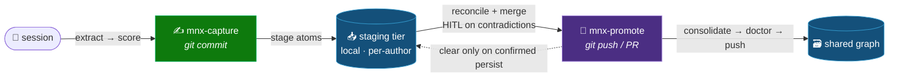
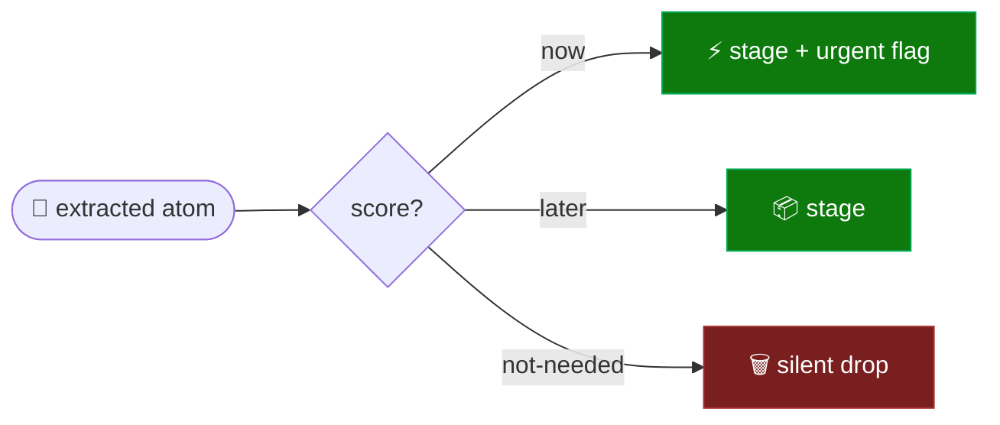

# 📥 Staging and Promotion (capture / promote)

> Part of the **Mnemex Context Graph** standard. This document specifies the **capture / promote split**:
> how durable knowledge produced in a session is first *staged* locally (cheap, frequent), and later
> *promoted* into the shared graph (reconciled, consolidated, deliberate). It defines the staging folder
> layout, the staged-atom schema, the budgets, the read overlay, the reconcile sub-agent contract,
> promote's atomicity, and the chained index.

## 🪞 The shape: commit-vs-push for memory



Doing extract → reconcile → plan → apply → push in a single in-session pass would put the
attention-demanding **merge** inside the creative session. Mnemex separates the two halves:

| Verb | When | Cost | What it does |
|---|---|---|---|
| **`mnx-capture`** | end of most sessions | cheap, local, no lock | extract (dirty context) → score → **stage** raw atoms locally. No reconcile, no graph mutation. |
| **`mnx-promote`** | occasionally, when nagged | heavy, batched, deliberate | flush stamps → **reconcile + merge** staged (HITL) → **consolidate** → doctor → push → clear staging. |

The analogy the design protects: **`git commit`** (capture — local, cheap, frequent) vs **`git push`/PR**
(promote — shared, reconciled, deliberate). `mnx-consolidate` (the maintenance pass: decay,
re-tier, death, edge hygiene, budget) is **not a user command** — it is the **back half of
`mnx-promote`**, run over the post-merge graph in the same plan / lock / transaction.

## 📁 Staging folder layout

Staging is **one folder per graph**, keyed by the graph slug, living **outside** the graph clone (under
the user's `~/.claude/`), so a remote clone's session-start hard-resync never destroys un-promoted work.
It is **per-author and local** — never pushed, never part of the shared graph.

```
~/.claude/mnemex/staging/<graph-slug>/
  atoms/
    stg-<sha1[:12]>.md      # one staged atom (provisional id = content hash)
    ...
  stamps.jsonl              # the read-stamp spill (co-located for tidiness; see mnx_stamp)
```

`<graph-slug>` is `mnx_binding.graph_slug(binding)` — keyed on the remote URL (remote graphs) or the
absolute folder path (local graphs). The same slug is used for the usage-stamp spill, so one folder per
graph holds both. `mnx_binding.py staging-path` (and `staging_root` in `resolve`/`status` JSON) exposes it.

## 🧬 Staged-atom schema

A staged atom is Markdown with a YAML front-matter block, written/parsed by `mnx_stage`. The body holds
the atom's knowledge; the front-matter is **self-sufficient to reconcile cold** (the transcript is gone
by promote time).

```markdown
---
provisional_id: stg-d3d3ad9d7fbe   # content hash. NEVER enters the graph or a read stamp.
type: domain                       # domain | pattern
summary: One line — the match + routing surface.
aliases: [field 124, DE124]
domain: [settlement]               # routing key(s)
score: now                         # now | later   ('not-needed' is dropped, never staged)
urgent: true                       # sharpens the nag; NEVER inline-pushes
volatility: default                # LLM-proposed freshness horizon; human confirms/overrides at promote
trigger: "reviewing a settlement spec"   # REQUIRED for type: pattern
mentions:                          # GENERATED from body [[wiki-links]] at capture; resolved_id null until promote
  - { name: iso8583-field124, resolved_id: null }
provenance:
  artifact: tap-vic-settlement-spec
  reviews: [r3, r7]                # the specific human-review ids that fed it
  rejected: ["post-then-reconcile (orphans legs)"]   # rejected alternative(s)
  session: 2026-06-29T09:12:00Z
  rationale: "human correction in review r7"
staged_at: 2026-06-29T10:11:21Z
---

The atom's knowledge body. May carry inline [[wiki-links]] (Link Reconciliation) — capture hoists them to `mentions:`
and preserves them; promote resolves them and splits an over-budget body into sibling pages + a link.
```

**Provisional ids** are a content hash (`stg-` + first 12 hex of the SHA-1 of `type|summary|body|
aliases|domain|trigger`). Re-capturing identical content is idempotent (same hash → same file). They
**must never** enter the real graph's nodes or the read-stamp registries; **promotion mints a real slug
id** (`mnx_common.slugify`). Staged atoms are **never usage-stamped**.

## 🎚️ Scoring



`mnx-capture` scores each extracted atom `now | later | not-needed` — a **momentary judgement of
intrinsic importance, not novelty**. Drift between sessions is fine; there is no rigid rubric.

- **`now`** → stage **with the `urgent` flag** (sharpens the nag only — promote remains the only writer).
- **`later`** → stage.
- **`not-needed`** → **silent drop** (no staging, no audit, no user involvement).

Because **novelty/dedup is decided later at promote** (reconcile may drop an atom as a duplicate),
`not-needed` is conservative: only the clearly ephemeral or trivially derivable — **never** "probably
already known."

## 💰 Budgets (per-author, local — NOT in the graph config)

Staging budgets live in **plugin defaults** (overridable in the **user** config,
`~/.claude/mnemex/config.md`), never in the graph's shared `mnemex.config.md` — staging is local.

| Bound | Trigger | Effect |
|---|---|---|
| **Soft** | `≥ 20 atoms` **or** oldest `≥ 7 days` | capture **warns**; session-start / -end **nag** |
| **Hard** | `≥ 50 atoms` **or** oldest `≥ 21 days` **or** `> 512 KB` total | capture **refuses to stage** (backpressure) until a promote runs |

`mnx_stage.py status` returns `budget.level` ∈ `ok | soft | hard` with reasons. A re-stage of
already-present content is always allowed, even past the hard cap (it changes nothing).

**Escape valve at the hard bound.** The hard cap is backpressure, not a trap. There are **two** ways
to clear it: run `mnx-promote` (merge + drain), **or** discard un-promoted captures you no longer want.
Discard is the cheap, local relief — no merge, no lock, no graph mutation (see *Reviewing and discarding
staged atoms*). Capture's refusal message and the session nags surface both options.

## 🧹 Reviewing and discarding staged atoms

Staging is **inspectable and prunable** before promote — the `git status` / `git restore --staged` of
memory. The substrate ops live in `mnx_stage.py` (`list`, `clear-one --id`, `clear`, `clear-merged`, and
the held-queue ops `hold` / `held-list` / `release-held` / `drop-held`); the user surfaces:

| Want | Surface | Underneath |
|---|---|---|
| **See** what is staged (+ held) | `/mnemex:mnx-status` (read-only) | `mnx_stage.list_atoms` / `held_status` |
| **Drop one** atom | `/mnemex:mnx-capture --drop <provisional-id>` | `mnx_stage.clear_one` |
| **Discard all** staging | `/mnemex:mnx-capture --discard-all` (confirms first) | `mnx_stage.clear` |
| **Resolve a held** contradiction | at the next `/mnemex:mnx-promote` (release) or discard it | `mnx_stage.release_held` / `drop_held` |

Discard lives on **capture** (the only writer of staging), not on status (which stays strictly
read-only). It touches **only** the local staging tier — never the graph, never the stamp spill. This is
what makes a bad capture recoverable without a full promote, and what relieves hard-cap backpressure.

## 👓 Read overlay (mnx-read)

`mnx-read` always **overlays** staged atoms for any routed cluster (`mnx_stage.py overlay --domain …`):

- **Newest-wins** — a staged atom is more recent than the graph node it concerns.
- Results are marked **`staged/unpromoted`** in the answer (not yet reconciled or peer-reviewed in).
- **Contradictions are flagged, never resolved** — surface both the staged atom and the graph node;
  never body-merge, never silently pick a winner (that is promote's job).
- Staged atoms are **never stamped** and **never** added to the usage manifest.
- Routing stays correct between consolidations via the existing registry tail-fold (`mnx_decay`); the
  overlay is additive, not a substitute for reading the graph tiers.

## ⚛️ Promote: per-atom terminal disposition + the held queue

> [!IMPORTANT]
> 🎯 **Per-atom, not all-or-nothing.** Each *clean* atom reaches a terminal disposition in the cycle and
> is cleared on confirmed persist; a *contradicting* atom is moved to a local **held queue** for HITL
> rather than aborting the whole batch (one contentious atom must not starve a growing batch — a liveness
> bug). Held state lives **entirely in the local staging tier** — never any in-flight state on the graph.

Every non-contradicting staged atom reaches a **terminal disposition** in one cycle — *created / merged /
dropped-as-dup / superseded* (or *resurrected* from cold) — and those atoms are cleared per-atom on a
confirmed persist (`mnx_stage.clear_merged`). A staged atom whose reconcile flags a **contradiction** is
**held**, not force-resolved: `mnx_stage.hold` moves it to the local held queue with a reason + the graph
id it contradicts, keeping its self-sufficient provenance so it can be re-promoted **cold** once the human
resolves the contradiction (`release_held` → re-reconciled next promote, or `drop_held` if the graph
wins). Held atoms are bounded by `held_max_age_days` (default 14); a held atom lingering past that nags at
session start/end. The human may still **abort** the whole promote (staging untouched); the held queue is
the softer default so clean atoms are not starved by an unresolved one. There is no in-flight state on the
graph side — a held atom is purely local until a future promote resolves it.

### 🔢 Order

```
flush usage stamps
  → reconcile + merge staged atoms (clean-context sub-agent; HITL on contradictions)
  → LINK RECONCILIATION (Step 2b, Link Reconciliation): split over-budget notes, resolve [[wiki-links]] → live links,
        keep red-links, back-fill older notes the new pages heal (mnx_mesh + mnx_phonebook)
  → consolidate over the POST-MERGE graph (re-tier, death, edge hygiene, budget — in the SAME plan)
  → ONE approval plan (human gate)  — merge + LINKS + consolidate together
        (contradictions surface as HELD proposals: hold that atom, promote the rest)
  → apply serially under the lock  → doctor (must pass)  → persist (commit + push by kind)
  → clear the promoted atoms (clear_merged) + hold the contradicting ones — only on confirmed persist
```

**Node persistence is deterministic.** The LLM decides the disposition (CREATE / MERGE / SUPERSEDE /
RESURRECT); the node file itself is written by `mnx_node` — it mints the real slug, stamps
`created`/`updated`/`verified` from the one clock, and enforces the front-matter shape — so the freshness
invariants hold by construction and no timestamp/id is ever hand-authored (docs/script-contracts.md §mnx_node).

Consolidation runs over the post-merge graph and is shown in the **same** approval plan, so its one HITL
escape — a budget overflow that even index chaining cannot resolve — is handled by the human who is
already present. That is why consolidate is promote's back half, not a separate command.

### 🔁 Persist failed after commit (retry-push, not re-merge)

Persist **commits the merge, then pushes**. If the push fails (conflict / offline / rejected after the
bounded retry), the merge is already committed in the clone but staging is **not** cleared. Re-running a
full promote here would re-apply the still-full staging *on top of* that commit — a **double-apply**. So
this state has a dedicated recovery: `mnx-promote --retry-push` pushes the **existing** commit (no
re-merge) and, only on a confirmed push, runs the deferred `clear`. The state is detected deterministically
by `mnx_binding.unpushed_state` (`ahead > 0`); a fresh promote is refused while `unpushed` is true, and
session start / end nag about it. See [`binding-and-graph-sync.md`](binding-and-graph-sync.md).

### 🤝 The reconcile sub-agent contract

Reconciliation runs as a **clean-context sub-agent** (the live session's dirty context is irrelevant —
atoms carry self-sufficient provenance):

- **Input:** `{ staged atoms (with provenance), graph_root }`.
- **It reads** the routed cluster indexes + a few node bodies *in its own context*.
- **It returns only** the change plan + the HITL items (contradictions, ambiguous near-matches). It
  does **not** apply.
- **It may fork** per cluster / per org for scale. **Plan in parallel; apply serially under the team
  lock** (mirrors consolidate's MARK/SWEEP).

## 📏 Node-size budget (completeness-of-atom)

A soft per-node body cap (`node_body_max_chars`, default ~6000) keeps atoms complete but not sprawling.
Over budget → **split into sibling pages + a `[[wiki-link]]`** (good hygiene) — **never truncate**. The
split is **promote's** job, not capture's (splitting is graph-aware judgment; capture stages the note
whole — see Link Reconciliation §2). The doctor flags an over-budget body (invariant 14, severity W); promote resolves
it during Step 2b link reconciliation.

## 🌲 Chained index (B-tree leaf)

When a cluster outgrows `node_budget`, consolidation first **splits the index along the `domain:`
sub-key**. If a single sub-key still overflows, instead of escalating to a human it **chains the index**:
the head `index.md` keeps Hot + Warm + the first cold chunk and records the continuation count; the
overflow spills into ordered continuation files:

```
team-payments/settlement/
  index.md          # head: hot + warm + first cold chunk + a "## Continuations" list
  index.001.md      # cold continuation chunk (## Cold table); points to the next
  index.002.md      # …last chunk
```

`index_chunk_rows` (default 60) bounds cold rows per file. One head-read still routes (Hot/Warm and the
continuation count are in the head); a deep cold search walks the chain. `mnx_index.index_node_ids`
merges head + continuations, so the doctor's node-set invariant (8) sees the full set; continuation files
are derived navigation, excluded from `iter_node_files`. Human escalation is the **genuine last resort**.

## 🔔 Session start / end (nag only)

Session start syncs to HEAD and emits **one-line nags** — staged-pending (sharper past the soft bound or
with any `urgent`), a **held-contradiction lingering** past `held_max_age_days`, and consolidation-overdue
— and **never auto-runs** capture, promote, or consolidate
(HITL intrusion + violates deliberate-promote; read's tail-fold keeps routing correct meanwhile). Read
stamps keep their **session-end batched flush** (one batched append + push per session), unchanged.

## ⛓️ Cross-cutting invariants

- Promote is the **only writer** to the graph; capture never mutates it.
- Never overwrite on contradiction — supersede or HITL-block.
- Never store decay state (`strength`/`tier`) in a node — it lives in the index.
- Never put a provisional `stg-` id into a real node or a read stamp; never stamp a staged atom.
- Never invent folder structure on overflow — split by sub-key, then chain; escalate last.
- Every staged atom must be promotable **cold** (self-sufficient provenance) — including a held atom.
- Clear a promoted atom only on a confirmed persist (`clear_merged`); a full abort leaves staging
  untouched. A contradiction **holds** the offending atom (local queue), it does not force an abort.
- A held atom carries no graph-side state — it lives entirely in the local staging tier until a later
  promote releases (re-reconciles) or drops it.

> [!NOTE]
> `mnx-promote` with empty staging is just "consolidate the graph" — carried by nag wording, not a
> separate verb. There is no standalone consolidate command; consolidation is the internal back half of
> promote.
