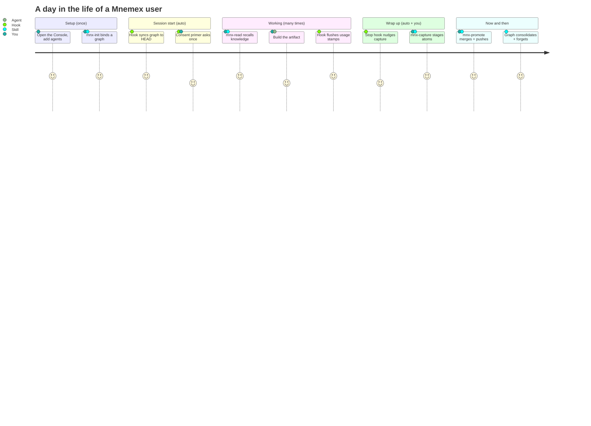
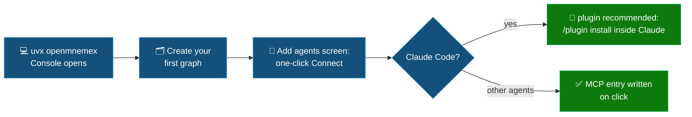
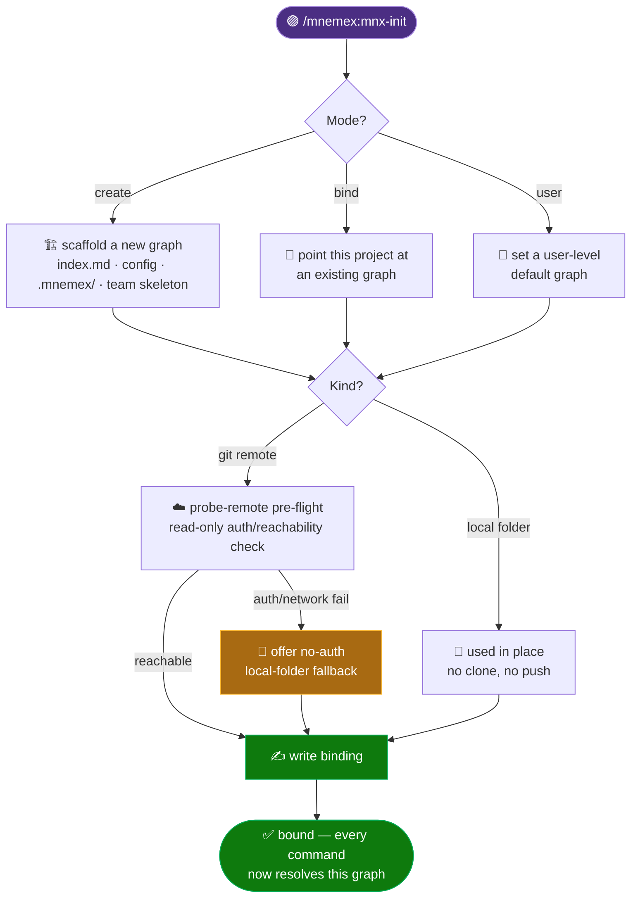
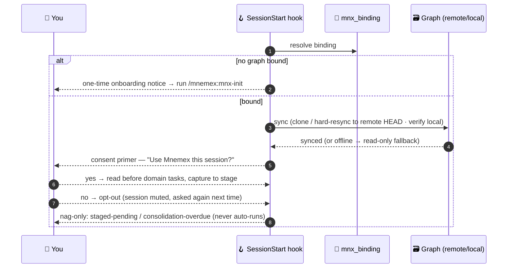
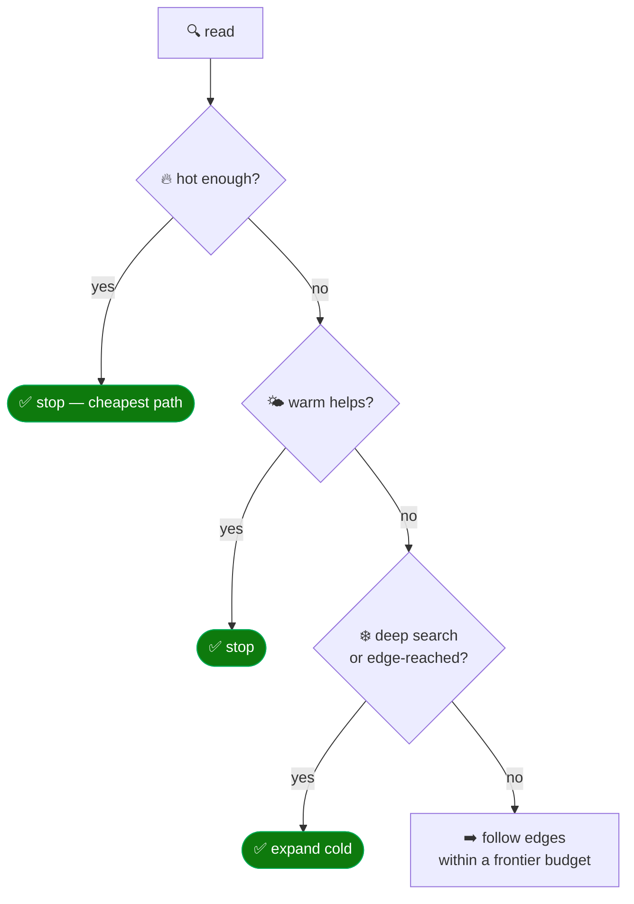
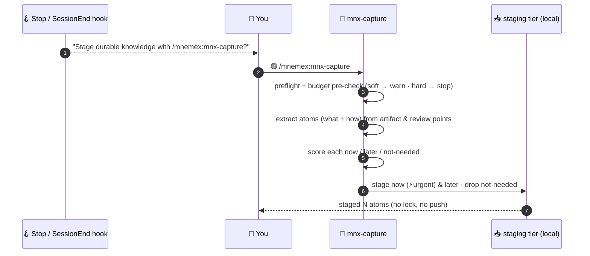
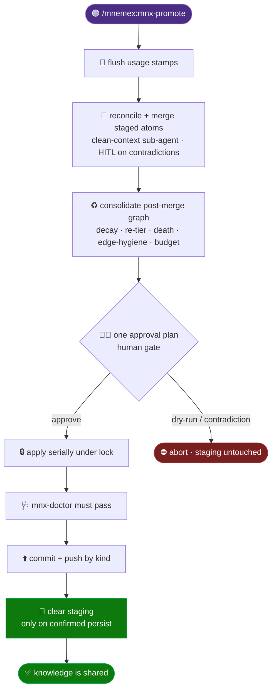
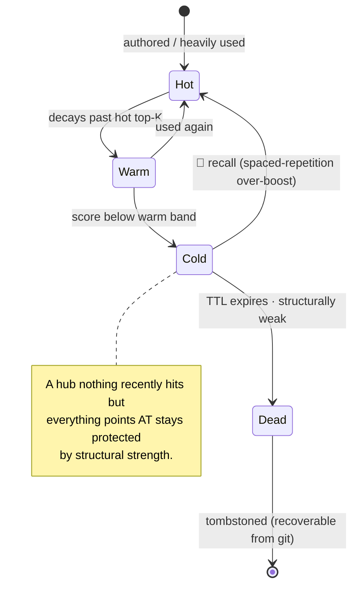
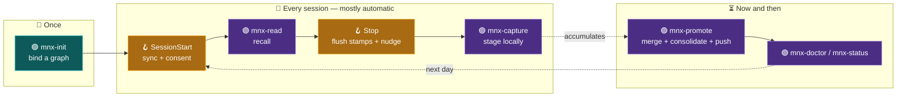

# 🧭 The User Journey (install → daily use)

> Part of the **Mnemex Context Graph** standard. The other docs specify *what each piece is*; this one
> walks the **whole arc end-to-end** — from `pip install` to a routine working day — and marks every
> **touchpoint**: where *you* act (a slash command), where a **skill** reasons, and where an **auto-hook**
> fires on its own. If you read only one doc to "get" how Mnemex feels in practice, read this one.

> [!TIP]
> 🟣 **Slash command** = you type it · 🧠 **Skill** = the agent's playbook that runs · 🪝 **Hook** =
> deterministic, fires on an event with no prompting. The whole point of the hooks is that the good
> habits (sync, stamp-flush, capture nudges, commit gate) happen **without you remembering them**.

---

## 🗺️ The journey at a glance



---

## 1️⃣ Stage one — Installation (once per machine): start at the Console

The journey starts with the **OpenMnemex Console** ([`console.md`](console.md)) — one command,
opens in your browser, and guides everything that follows:



```bash
# 1. Open the Console (Python 3.10+). Run it without installing…
uvx openmnemex
#    …or install it once, then run it (two steps — `pip` only installs):
pip install openmnemex
openmnemex

# 2. In the Console: create your first graph, then "Add agents" — one click per agent.
#    For Claude Code the Console recommends the plugin and shows these to run inside it:
/plugin marketplace add kritird/OpenMnemex
/plugin install mnemex@mnemex-marketplace
```

| Touchpoint | Kind | What happens |
|---|---|---|
| `uvx openmnemex` | 🧑‍💻 shell | Installs (first run) and opens the Console — the front door. |
| Console → *Create your first graph* | 🖥️ Console | Scaffolds a doctor-clean graph in a fresh folder (same `mnx_init` engine as every surface). |
| Console → *Add agents* → **Connect** | 🖥️ Console | Writes the agent's machine-level MCP entry — the same thing `openmnemex install --agent <a> --user` does. |
| `/plugin marketplace add …` + `/plugin install mnemex@…` | 🟣 command | The recommended Claude Code path (richer: skills, commands, 7 auto-hooks) — run inside Claude Code; the Console shows these exact commands. |

> [!NOTE]
> The **skills** and **commands** are live immediately after install. The **hooks** (`hooks/hooks.json`)
> take effect after `/reload-plugins` or a restart — see [`skills-commands-hooks.md`](skills-commands-hooks.md).

---

## 2️⃣ Stage two — Binding a graph (`/mnemex:mnx-init`)

You work in a **project repo**; your knowledge lives in a **separate graph repo**. `mnx-init` is the
preflight that connects the two — and it is the **one command every other command resolves first**.



| Touchpoint | Kind | What it does |
|---|---|---|
| `/mnemex:mnx-init` | 🟣 command → 🧠 skill | Detects state, branches on **mode** (create / bind / user) × **kind** (git-remote / local). |
| `probe-remote` | 🧰 script | Read-only `git ls-remote` *before* binding; categorizes auth / not-found / network failures and offers a fallback. |
| binding file | 📄 output | `<project>/.mnemex.md` (repo) or `~/.claude/mnemex/config.md` (user). Never carries graph-behavior params. |

> [!IMPORTANT]
> 🧱 **The binding answers "which graph, as whom."** The graph's *behavior* (half-life, tiers, budgets)
> lives only in `mnemex.config.md` **inside the graph** — never duplicated into the binding, so two
> authors can't decay one graph differently. Full model: [`binding-and-graph-sync.md`](binding-and-graph-sync.md).

---

## 3️⃣ Stage three — A session begins (auto-hooks kick in 🪝)

From here on, you barely touch setup. When a session starts, the **`SessionStart` hook** fires
**before any skill runs** and does the boring-but-critical things for you.



| Touchpoint | Kind | What it does | Why a hook |
|---|---|---|---|
| **SessionStart** | 🪝 hook | Syncs the graph to HEAD, then asks **once** whether to use Mnemex this session. | Sync must be guaranteed before any skill runs; one consent question beats a nudge every turn. |
| consent → **no** | 🟣 `opt-out` | Mutes Mnemex for this session (you can still call `/mnemex:*` explicitly). | One move to drop Mnemex for the session without unregistering anything. |
| onboarding notice | 🪝 hook | Fires **once ever** if no graph is bound, pointing at `mnx-init`. | A reliable first-run signpost. |

> [!NOTE]
> 🔐 For a **remote** graph the clone is hard-reset to remote HEAD here — which is exactly why your
> local staged captures and un-flushed stamps live **outside** the clone and survive the resync. See
> [`staging-and-promotion.md`](staging-and-promotion.md).

---

## 4️⃣ Stage four — The daily loop: recall → build → stamp

This is the heartbeat of a working day. You ask; `mnx-read` recalls; you build; a hook quietly records
what was actually used.

```mermaid
flowchart LR
    Q([🟣 /mnemex:mnx-read<br/>question or task]) --> ROUTE[🧭 route<br/>org → team → cluster]
    ROUTE --> TIERS[📚 read tiers in chunks<br/>🔥 hot → 🌤️ warm → ❄️ cold]
    TIERS --> OV[👓 overlay local<br/>staged atoms]
    OV --> EXP[🔎 expand only<br/>committed node bodies]
    EXP --> ANS([💡 answer / artifact])
    ANS --> MAN["🧾 usage manifest<br/>{id, role, why}"]
    MAN -. 🪝 Stop hook flushes .-> REG[(📝 registry stamps)]
    classDef read fill:#4b2e83,stroke:#a98ce0,color:#fff;
    classDef out fill:#0e7a0d,stroke:#0a5,color:#fff;
    classDef tel fill:#7a4a0d,stroke:#d90,color:#fff;
    class Q,ROUTE,TIERS,OV,EXP read;
    class ANS,MAN out;
    class REG tel;
```



### How a recall walks the tiers



| Touchpoint | Kind | What it does |
|---|---|---|
| `/mnemex:mnx-read <task>` | 🟣 command → 🧠 skill | Route → chunked tier reads → overlay staged atoms → expand only needed nodes → emit a usage manifest. |
| usage manifest | 🧾 model output | `{id, role, why}` for every body loaded. **No defensible one-line *why* ⇒ `traversed` (unstamped).** |
| **Stop hook** stamp-flush | 🪝 hook | Batch-flushes this turn's `contributed`/`consulted` stamps to the registry (+ push for remote). |

> [!CAUTION]
> 🚫 `mnx-read` **never** rewrites a node, rewrites an index, or compacts. Its only write is the
> append-only registry stamp — that is what keeps recall effectively *pure* while still feeding relevance.

> [!TIP]
> 🌱 **First read on an empty graph?** `mnx-read` notices (`read_frontier`'s `empty` flag) and offers a
> fork right there instead of just returning nothing: **seed it now** from a repo/docs — hands off to
> `mnx-ingest`, its own consent gate still applies — or **just keep working**, and episodic capture
> fills the graph as the session goes. Already staged atoms without promoting? It nudges you to promote
> instead of re-pitching bulk import. Same fork on Claude and on a foreign MCP host — see
> [`corpus-ingestion.md`](corpus-ingestion.md) and [`staging-and-promotion.md`](staging-and-promotion.md).

---

## 5️⃣ Stage five — Wrapping a session: capture (stage locally) ✍️

When the turn winds down, the **`Stop` hook** nudges you (once per session) to preserve the durable
knowledge this session produced. Saying yes runs `mnx-capture` — the cheap, local **`git commit`** of
memory. It **never touches the shared graph**.



| Touchpoint | Kind | What it does |
|---|---|---|
| **Stop / SessionEnd** | 🪝 hooks | Fire while/just-after the turn so the agent can actually *ask* you to capture. **No-op when muted; never auto-writes.** |
| `/mnemex:mnx-capture` | 🟣 command → 🧠 skill | Extract → score → **stage** atoms locally with self-sufficient provenance. Cheap, local, no lock. |
| `--drop <id>` / `--discard-all` | 🟣 command | The local **un-stage** — prune staging (review it first via `/mnemex:mnx-status`). Also the hard-cap escape valve. |

> [!IMPORTANT]
> 🧠 Capture runs **in the same session that built the artifact**, because the *how* — the patterns and
> review corrections — only exist in that live conversation. It records them while they are still there.

---

## 6️⃣ Stage six — Now and then: promote (merge + push) 🚀

Occasionally — when nagged, or before you want others to see your knowledge — you run `mnx-promote`: the
deliberate **`git push` / PR** of memory. It is the heavy, batched, gated step, and it is the **only**
writer to the shared graph.



| Touchpoint | Kind | What it does |
|---|---|---|
| `/mnemex:mnx-promote` | 🟣 command → 🧠 skill | Flush → reconcile + merge → consolidate → one plan → apply → doctor → push → clear staging. |
| **PreToolUse** commit gate | 🪝 hook | If a `git commit` inside the graph repo would land an invariant **error**, the hook **denies** it. |
| `--retry-push` | 🟣 command | If push failed *after* commit, lands the existing commit (never re-merges — avoids a double-apply). |

> [!WARNING]
> 🧯 Promote disposes **per-atom**: every clean atom reaches a terminal disposition and clears **only** on
> a confirmed persist. A **contradiction** is a hard human block — resolve it in-cycle, **hold** that atom
> in the local queue (the rest still promotes), or abort the whole promote. Held state is purely local, so
> there is no half-merged limbo on the graph. Full contract: [`staging-and-promotion.md`](staging-and-promotion.md).

---

## 7️⃣ Stage seven — The graph remembers and forgets (over weeks)

You never run a decay loop. Relevance is computed lazily, and the **back half of every promote**
(`mnx-consolidate`) re-tiers, ages, and forgets — so the knowledge you keep using stays cheap to reach
and the knowledge you stop using quietly sinks.



| Mechanism | Kind | What you experience |
|---|---|---|
| lazy decay | 🧮 math | Nothing is written as time passes; a node's score is `strength · exp(−λ·Δt)` at read time. |
| consolidation | 🧠 internal skill | Folded into promote — re-tiers, tombstones the truly dead, severs their edges transactionally. |
| structural strength | 🛡️ deterministic | Well-connected hubs survive even when rarely hit directly — the safety gate against deleting load-bearing knowledge. |
| `/mnemex:mnx-status` | 🟣 command | At-a-glance: what's bound, tier counts per team, pending stamps, last gc, health. |
| `/mnemex:mnx-doctor` | 🟣 command | Validate every invariant; `--fix` regenerates derived files from the nodes (truth is never auto-edited). |

---

## 🖥️ Stage seven-and-a-half — *You* look at what the agents built (back in the Console)

Everything above is the agents' loop. The Console you started the journey in is also **your**
window into it — browse the graph without touching it, and garden it with informed eyes:

```bash
uvx openmnemex        # opens http://127.0.0.1:8765 (bare command = the Console)
```

**The browse journey** — pick a graph from the welcome screen (every graph on the machine is
discovered automatically), then wander: the tree scopes the canvas to a team or cluster, node
size/color shows what's hot, rings show what's going stale, clicking a node lights up its mesh,
and the full atom opens with rendered markdown and clickable `[[wiki-links]]`. URLs are shareable
— `?scope=` and `?sel=` restore the exact view.

**The gardener journey** — open the **Queue** for "what needs re-checking, soonest first"; toggle
**Health** to see doctor findings pinned where they live; drag the **Time** scrubber to preview
which knowledge goes stale over the next quarter if nobody re-verifies it. Then act through the
normal surfaces — `mnx-revalidate`, `mnx-doctor --fix`, a capture/promote — and refresh: over
knowledge the Console never mutates anything ([`console.md`](console.md), `LIMITATIONS.md` #5).

---

## 🔁 The full loop, on one page



---

## 🧾 Touchpoint cheat-sheet

| When | You do | Skill / script runs | Auto-hook fires |
|---|---|---|---|
| **Install** | `pip install pyyaml` · `/plugin install` | — | — |
| **First run** | `/mnemex:mnx-init` | `mnx-init` · `mnx_binding` | onboarding notice (if unbound) |
| **Session start** | answer consent once | — | 🪝 **SessionStart** (sync + primer + nags) |
| **Doing work** | `/mnemex:mnx-read <task>` | `mnx-read` · `mnx_resolve` · `mnx_decay` | — |
| **Turn ends** | answer "capture?" | — | 🪝 **Stop** (flush stamps + capture nudge) |
| **Preserve knowledge** | `/mnemex:mnx-capture` | `mnx-capture` · `mnx_stage` | — |
| **Commit in graph** | (any graph commit) | `mnx_doctor.check` | 🪝 **PreToolUse** (deny on error) |
| **Share knowledge** | `/mnemex:mnx-promote` | `mnx-promote` → `mnx-consolidate` · `mnx-doctor` | 🪝 **PostToolUse** (stranded-pass cleanup) |
| **Check in** | `/mnemex:mnx-status` · `/mnemex:mnx-doctor` | `mnx_status` · `mnx_doctor` | — |
| **Session end** | (nothing) | — | 🪝 **SessionEnd** (flush + nudge + tidy markers) |

> [!NOTE]
> 🛡️ Every hook is **safe**: it syncs, warns, prompts, or gates — it never mutates knowledge on its own.
> The single exception is the PreToolUse commit **deny**, and even that **fails open** on any internal
> error, so a misbehaving hook can never disrupt your session.

---

## ➡️ Where to go next

- 🧩 The *why* behind every concept here: [`rationale-and-concepts.md`](rationale-and-concepts.md)
- 🎛️ Skill/command/hook specifics: [`skills-commands-hooks.md`](skills-commands-hooks.md)
- 📥 The capture/promote split in depth: [`staging-and-promotion.md`](staging-and-promotion.md)
- 🔗 How binding & sync actually work: [`binding-and-graph-sync.md`](binding-and-graph-sync.md)
